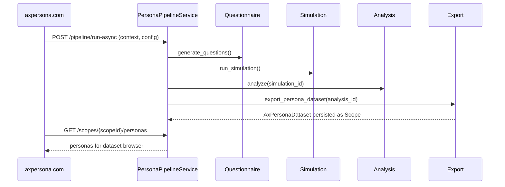

## AxPersona Research-to-Persona Pipeline Service

This document describes the standalone microservice that automates the complete research-to-persona pipeline for **axpersona.com**, reusing the existing AxWise Flow components.

---

### 1. Service Overview

**Service name (conceptual):** `PersonaPipelineService`

**Responsibilities:**
- Generate stakeholder-based questionnaires from business context
- Run synthetic interview simulations (Simulation Bridge)
- Perform conversational analysis (themes, patterns, personas, insights, PRD)
- Export production-ready persona datasets for the axpersona.com browser

**Key dependencies (reused code):**
- `backend/api/research/conversation_routines/` – questionnaire generation
- `backend/api/research/simulation_bridge/` – simulation & persistence
- `backend/api/research/simulation_bridge/services/conversational_analysis_agent.py` – analysis
- `backend/domain/models/production_persona.py` – production persona & API response

The service is exposed under the base prefix:

- **`/api/axpersona/v1`**

---

### 2. Core API Endpoints

#### 2.1 Questionnaire Generation

- **POST `/questionnaires`**
  - Input: `business_context: BusinessContext`
  - Output: `QuestionsData` (primary/secondary stakeholders, `timeEstimate`)
  - Implementation: wraps `ConversationRoutineService` & its `generate_stakeholder_questions` tool.

#### 2.2 Synthetic Interview Simulation

- **POST `/simulations`**
  - Input: `SimulationRequest` (`questions_data`, `business_context`, `config`)
  - Output: `SimulationResponse` (`people`, `interviews`, `simulation_id`, `simulation_insights`)
  - Implementation: wraps `SimulationOrchestrator.run_simulation`.

- **POST `/simulations/async`**, **GET `/simulations/{simulation_id}`**
  - Async variant with progress tracking via `SimulationProgress`.

#### 2.3 Analysis Pipeline

- **POST `/analysis`**
  - Input: `simulation_id` or raw interview text
  - Output: `DetailedAnalysisResult`
  - Implementation: wraps `ConversationalAnalysisAgent.process_simulation_data`.

#### 2.4 Persona Dataset Export

- **POST `/exports/persona-dataset`**
  - Input: `DetailedAnalysisResult` or `analysis_id`
  - Output: `AxPersonaDataset` (personas, interviews, analysis, quality)
  - Implementation: maps analysis personas to `ProductionPersona` and then to frontend-ready dicts.

#### 2.5 End-to-End Pipeline

- **POST `/pipeline/run-async`**
  - Input: business context + simulation config + export options
  - Output: `run_id`, status URLs, final `scope_id` for axpersona.com
  - Implementation: orchestrates questionnaire → simulation → analysis → export.

---

### 3. Data Flow & Schema Mapping

1. **Business Context → Questionnaire**
   - Input: `BusinessContext` (business_idea, target_customer, problem, industry, location)
   - Output: `QuestionsData` with `stakeholders["primary"]` and `stakeholders["secondary"]`.

2. **Questionnaire → Synthetic Interviews**
   - Input: `SimulationRequest` (wraps `QuestionsData` + `BusinessContext` + `SimulationConfig`)
   - Output: `SimulationResponse` (`people: List[SimulatedPerson]`, `interviews: List[SimulatedInterview]`).

3. **Interviews → Analysis**
   - Input: concatenated interview text + `simulation_id`
   - Output: `DetailedAnalysisResult` (themes, patterns, personas, insights, stakeholder intelligence).

4. **Analysis → Production Personas**
   - Input: personas and patterns from `DetailedAnalysisResult`
   - Output: `List[ProductionPersona]` + `PersonaAPIResponse` for API compatibility.

5. **Production Personas → AxPersona Dataset**
   - Input: `ProductionPersona.to_frontend_dict()` + simulation + analysis metadata
   - Output: `AxPersonaDataset` persisted as a **scope** for the axpersona.com browser.

---

### 4. AxPersona Dataset Shape (Backend View)

Conceptual Pydantic model (implemented in the router as a stub):

- `scope_id: str`
- `scope_name: str`
- `description: str`
- `personas: List[Dict[str, Any]]` – from `ProductionPersona.to_frontend_dict()`
- `interviews: List[Dict[str, Any]]` – from `SimulatedInterview`
- `analysis: DetailedAnalysisResult`
- `quality: Dict[str, Any]` – interview count, stakeholder coverage, geo distribution, entropy score.

This structure is what the frontend reads via `/scopes`, `/scopes/{scopeId}`, `/scopes/{scopeId}/interviews`, `/scopes/{scopeId}/personas`.

---

### 5. Sequence Diagram (High-Level)

