# AxWise cognitive orchestration development roadmap

## Purpose and authority

This document translates `AXWISE_ORQALY_COGNITIVE_ORCHESTRATION.md` into development work for this repository. It is the engineering roadmap; `AXWISE_ORCHESTRATION_TECHNICAL_BACKLOG.md` is the issue-ready implementation checklist.

The product boundary is fixed:

> **AxWise recommends the agent, team, context, controls, and recovery plan. Orqaly authorizes and executes it.**

The roadmap must not move tenant authority, tool credentials, workflow execution, or final side effects into AxWise.

## Executive conclusion

The repository contains a useful research/evidence foundation plus the Phase 1–3 domain-neutral decision, value-of-information routing, multi-agent planning, immutable recovery layers, and the Phase 4 outcome/evaluation/governed-learning mechanism. The remaining differentiation proof is statistically meaningful superiority over simpler baselines in real pilots; those responsibilities must not be forced into the current A+B endpoint or persona resolver.

The critical path is:

1. Restore a trustworthy build and test baseline.
2. Publish a versioned generic task and decision contract.
3. Implement deterministic direct assignment with explainable scoring.
4. Make evidence retrieval and A+B optional tools selected by uncertainty.
5. Add multi-agent planning, approval annotations, fallbacks, and replanning.
6. Ingest Orqaly outcomes and prove improvement against simpler routing baselines.

## Repository audit baseline

Baseline observed on 2026-07-16. These are repository findings, not claims about any deployed environment.

| Area | Present now | Development gap |
|---|---|---|
| Orqaly API | `backend/api/routes/orchestration.py` publishes authenticated decision create/retrieval, research refresh, immutable replan, Phase 4 outcome ingestion/listing, and request/outcome schemas. `backend/api/routes/orqaly_integration.py` publishes Conditions and durable A+B routes. | The integration file still contains legacy demo implementation that should eventually be removed or moved to an example module. |
| Durable work | `backend/services/orqaly_hybrid_run_service.py` provides tenant-scoped idempotency, persistence, worker claiming, stale recovery, cancellation, result delivery, and signed terminal webhooks. | It is specialized for `hybrid_a_plus_b`; orchestration decisions and execution outcomes need separate lifecycle models. |
| Assignment | Phase 1 applies hard eligibility and weighted scoring. Phase 2 selects direct, evidence, research, or clarification. Phase 3 deterministically constructs and validates single, sequential, parallel, supervisor, human-controlled, and recovery plans with collaboration, separation-of-duty, approval, graph, tool, and budget checks. | Calibration is rule-band regression rather than outcome-calibrated probability. Team selection is greedy rather than globally optimized; learned outcome features and baseline evaluation remain open. |
| Conditions | The Conditions gateway supplies rule/fuzzy-based governance, injection checks, finance classification, grounding, and advisory outputs. | Logic is largely hard-coded, idempotency is in memory, prior conversation history is unused, and no measured policy-quality or false-positive evaluation exists. |
| Research | Pipeline B, Pipeline A evidence analysis, and closed-loop A+B exist. Phase 2 wraps explicit existing evidence and durable A+B behind typed ports and invokes A+B only after a bounded value-of-information decision. | Independent A versus B versus A+B method selection, broad knowledge retrieval, atomic enqueue/outbox coordination, and stronger scientific calibration/bias evaluation remain open. |
| Persistence | `PipelineRun` and tenant mapping support A+B. Immutable decision snapshots preserve routing assessments, evidence, complete plans, linked context/research/replan parents, rankings, learned-feature provenance, and audit events. Phase 4 adds immutable outcomes, node receipts, derived evaluations, scorer versions, and outcome audit events. | Plans remain inside immutable decision JSON. Dedicated replay-run, materialized performance-snapshot, and delivery-outbox tables remain open. |
| Worker | `backend/scripts/run_orqaly_hybrid_worker.py` runs durable A+B work outside FastAPI, and `docker-compose.yml` now starts a health-checked worker after the backend is healthy. | No general decision/replanning worker or durable outbox exists; a clean-stack tenant-scoped A+B smoke run remains required. |
| Orqaly execution handoff | A+B accepts server-supplied agent candidates and requires Orqaly authorization. Phase 3 emits a typed feasibility request. Phase 3.1 conditionally selects research and links context to planning. Phase 4 accepts explicit authorization status, structured outcomes, and per-node execution receipts. | A production remote live-state adapter, streaming progress, and durable outbox remain open. |
| MCP | `packages/axwise-mcp-connector` exposes `axwise_evaluate_conditions`, preserves tenant scope, and calls the implemented Conditions route with `x-axwise-key`. | Phase 1–3 decision create/inspection/research/replan tools and outcome submission are not exposed through MCP yet. |
| Frontend | Research UI and A+B documentation pages exist. | No decision inspection, plan graph, factor explanation, comparison, outcome, override, or evaluation UI exists. |
| Backend test health | 492 tests collect without errors. The supported default contract gate is self-contained and passes 101 tests: 14 Phase 1 cases, 39 Phase 2 cases, and 23 Phase 3 cases covering team templates, plan validation, feasibility, approvals, cross-domain execution doubles, immutable recovery, compatibility, isolation, and failure injection, alongside the existing Conditions/A+B contracts. | The explicitly invoked historical audit still contains superseded repository/evidence/V2 suites and unintended live-LLM behavior; it is documented and not counted as release coverage. |
| Frontend test health | Type-check, the supported four-test Vitest stabilization suite, and a production build pass without a backend or font download. | Historical co-located tests are quarantined and need behavior-by-behavior rewriting; frontend types are still handwritten rather than generated from OpenAPI. |
| MCP test health | Build and three connector contract tests pass against the real Conditions request shape and tenant boundary. | Tool-discovery, HTTP authentication-header, backend-error, and full in-process MCP protocol tests remain to be added. |

## Target architecture

```mermaid
flowchart LR
    O["Orqaly verified task, agents, tools, policies and budget"] --> API["Orchestration API v1"]
    API --> DS["Decision service"]
    DS --> C["Task, stakeholder, risk and uncertainty classification"]
    C --> R["Routing-mode selection"]
    R --> S["Explainable agent scoring"]
    R --> E["Optional evidence or A+B research adapter"]
    E --> S
    S --> P["Team and execution-plan builder"]
    P --> V["Policy annotation and plan validation"]
    V --> D[("Immutable decision store")]
    D --> OX["Orqaly authorization and execution"]
    OX --> OUT["Outcome and override receipt"]
    OUT --> M[("Outcome and evaluation store")]
    M --> EV["Offline evaluation and scorer versioning"]
    EV --> S
```



AxWise policy checks annotate the recommendation and can require escalation. Orqaly remains the authoritative enforcement point because it owns current tenant, RBAC, budget, agent availability, and tool state.

## Proposed repository structure

New orchestration code should be separated from the legacy integration route:

```text
backend/
  api/routes/orchestration.py
  domain/orchestration/
    models.py
    enums.py
    ports.py
    validation.py
  services/orchestration/
    decision_service.py
    task_classifier.py
    uncertainty_router.py
    assignment_scorer.py
    team_planner.py
    policy_annotator.py
    replanning_service.py
    outcome_service.py
  infrastructure/persistence/
    orchestration_repositories.py
  tests/orchestration/
    unit/
    contract/
    integration/
    evaluation/
```

Existing A+B, evidence, and persona services should be consumed through adapters. They should not be copied into the new package.

## Versioned API surface

### Create a decision

```text
POST /api/orqaly-axwise/v1/orchestration/decisions
```

The request must include a verified tenant, task objective, desired outcome, constraints, context references, available agents, available tools, policy context, and budget. The response must include:

- immutable `decision_id`, contract version, scorer version, and creation time;
- task class, uncertainty, risk, and selected routing mode;
- recommended agent or team and explicit assignment factors;
- typed plan nodes, dependencies, input/output contracts, and reviewers;
- context packages and evidence references;
- guardrails, approval requirements, fallbacks, and escalation conditions;
- confidence and calibration metadata;
- `requires_orqaly_authorization: true`.

### Retrieve a decision

```text
GET /api/orqaly-axwise/v1/orchestration/decisions/{decision_id}
```

Retrieval must be tenant-scoped and return the immutable input snapshot and decision version used for audit reconstruction.

### Refresh terminal research evidence

```text
POST /api/orqaly-axwise/v1/orchestration/decisions/{decision_id}/research/refresh
```

The implemented Phase 2 refresh returns the unchanged parent while research is pending and creates an idempotent, linked immutable decision after a terminal A+B result. It records provenance, terminal failure state, refreshed rankings, and rank/score changes. This evidence refresh is narrower than the general failure/change replan planned for Phase 3.

### Replan after a change or failure

```text
POST /api/orqaly-axwise/v1/orchestration/decisions/{decision_id}/replan
```

A replan must reference the prior decision, state what changed, preserve the audit chain, and produce a new immutable decision rather than mutating history.

### Submit an execution outcome

```text
POST /api/orqaly-axwise/v1/orchestration/decisions/{decision_id}/outcomes
```

Outcomes should include authorization result, execution status, quality, cost, latency, rework, escalation, human override, stakeholder acceptance, failures, and per-plan-node receipts. Outcome ingestion must be idempotent.

## Persistence required

Create separate tables rather than adding more unrelated JSON fields to `pipeline_runs`:

| Table | Purpose |
|---|---|
| `orchestration_decisions` | Immutable tenant-scoped request snapshot, decision, versions, confidence, and status. |
| `orchestration_plan_nodes` | Queryable nodes, dependencies, assigned agents, tools, approvals, and fallback relationships. |
| `orchestration_outcomes` | Idempotent Orqaly execution receipts and human feedback. |
| `orchestration_evaluation_runs` | Dataset, baseline, scorer version, metrics, and regression result. |
| `agent_performance_snapshots` | Time-bounded, tenant-scoped performance features used by a decision. |
| `orchestration_events` | Append-only audit and outbox events for reliable delivery. |

Raw secrets and unrestricted source documents must not be stored in decision JSON. Persist references, authorized excerpts where necessary, data classification, retention metadata, and content hashes.

## Development phases and gates

### Phase 0 — trustworthy development baseline

Goal: make every later claim verifiable.

Development:

- Remove or repair the 14 backend test imports and classify tests as unit, integration, live, manual, or LLM-dependent.
- Convert Conditions tests to FastAPI `TestClient`/ASGI tests; keep separately marked live-server smoke tests only where useful.
- Fix frontend TypeScript errors, align frontend API types with generated OpenAPI types, add a real Vitest configuration, and standardize Vitest rather than mixed Jest globals.
- Add orchestration-focused MCP contract tests and stop advertising tools backed by nonexistent routes.
- Add the A+B worker to local Compose and add health/readiness checks for database schema and workers.
- Add CI gates for backend collection, backend unit/contract tests, frontend type-check/test/build, MCP build/test, migration upgrade/downgrade, and Compose configuration.
- Move legacy mock `/twins/*` endpoints behind an explicit demo flag or remove them from the production router.

Exit gate:

- Backend collection completes with zero errors.
- Self-contained Orqaly unit and contract tests pass without a separately running server.
- Frontend type-check, unit tests, and production build pass.
- MCP build and contract tests pass against real test routes.
- Compose starts database, backend, frontend, and worker; one tenant-scoped A+B smoke run completes.

### Phase 1 — generic contract and direct assignment

Goal: deliver the smallest domain-neutral product slice without research or multi-agent complexity.

**Repository status (2026-07-16): implemented and contract-tested.** See `AXWISE_ORCHESTRATION_PHASE_1.md` for the shipped boundary, API, weights, benchmark scope, and explicit non-goals. Deployment verification and PostgreSQL migration rehearsal remain environment-specific gates.

Development:

- Add Pydantic models for the task envelope, agent/tool catalogue, policy, budget, evidence reference, assignment factor, decision, and outcome.
- Publish `POST` and `GET` decision routes with M2M authentication, tenant mapping, durable idempotency, request hashing, and immutable persistence.
- Implement task normalization and a deterministic direct-versus-escalate router.
- Implement a versioned weighted scorer using required capabilities, allowed tools, availability, performance, cost, risk, and policy eligibility.
- Return factor-level explanations and distinguish missing data from negative evidence.
- Start with configuration-driven capability vocabularies, aliases, and domain packs; do not hard-code domains into the top-level schema.

Exit gate:

- One contract handles software incident, customer escalation, compliance review, marketing preparation, and finance-analysis fixtures.
- Deterministic replay of the same input and scorer version returns the same ranked result.
- Ineligible agents can never win through a high semantic score.
- Every decision is tenant-isolated, auditable, idempotent, and marked as requiring Orqaly authorization.
- Direct-path target is measured at p95 latency and cost; the team sets the release SLO from benchmark data rather than inventing it in marketing copy.

### Phase 2 — uncertainty and evidence-aware routing

Goal: choose when extra context or research is worth its cost.

**Repository status (2026-07-16): implemented and contract-tested.** See `AXWISE_ORCHESTRATION_PHASE_2.md` for signal formulas, budgets, adapter boundaries, refresh semantics, provenance, failure behavior, and explicit limitations. PostgreSQL/deployed verification and statistical outcome calibration remain open.

Development:

- Classify task ambiguity, evidence sufficiency, stakeholder sensitivity, consequence, reversibility, and deadline pressure.
- Implement direct, evidence-assisted, research-assisted, and human-clarification modes.
- Wrap existing evidence retrieval and A+B research behind typed orchestration tool adapters.
- Add routing budgets and stop conditions so research cannot expand without limit.
- Re-run assignment after evidence acquisition and record what changed in the ranking.
- Calibrate uncertainty and confidence on labeled fixtures rather than exposing raw model confidence as truth.

Exit gate:

- Clear deterministic tasks never invoke A+B.
- Research is invoked only when a configured value-of-information rule is met.
- Tests prove budget, timeout, cancellation, no-evidence, contradictory-evidence, and research-failure fallbacks.
- Decision records distinguish source provenance, inference, synthetic evidence, and verified operational facts.

### Phase 3 — team planning, approvals, and recovery

Goal: recommend executable teams and plans rather than only one agent.

**Repository status (2026-07-18): implemented and contract-tested.** See `AXWISE_ORCHESTRATION_PHASE_3.md` for additive planning inputs, templates, graph/policy/budget validation, feasibility handoff, failure paths, immutable replan semantics, Phase 3.1 conditional context routing, test evidence, and explicit limitations. Orqaly now links its pre-planning and final decisions; target-environment deployment verification remains open.

Development:

- Add typed plan nodes with owners, required capabilities, dependencies, expected outputs, tools, review rules, and budgets.
- Implement sequential, parallel, supervisor, and human-controlled plan patterns.
- Validate acyclic graphs, complete inputs/outputs, policy eligibility, budget feasibility, and reachable fallbacks.
- Add collaboration compatibility and separation-of-duty constraints.
- Implement replanning for unavailable agents, failed tools, rejected output, changed budget, and human override.
- Build an Orqaly adapter that validates the recommendation against current execution state and returns structured rejection reasons.

Exit gate:

- Plans execute end to end in Orqaly test doubles for at least three domains.
- Every plan node has an owner, contract, completion signal, and failure path.
- Replanning creates a linked decision version and never rewrites the original decision.
- Human approval is mandatory for configured consequential actions.

### Phase 4 — outcomes, evaluation, and safe learning

Goal: prove that AxWise improves assignments and learns safely.

**Repository status (2026-07-18): the outcome, receipt, evaluation, governed promotion/rollback, tenant-scoped learned-feature, and Orqaly completion-feedback mechanisms are implemented and contract-tested.** Scheduled production-like datasets, operator UI, PostgreSQL/deployed verification, and pilot superiority against the named baselines remain open; therefore the market proof exit gate is not yet claimed.

Development:

- Implement idempotent outcome ingestion and per-node execution receipts.
- Define task-success, quality, rework, latency, cost, escalation, override, and stakeholder-acceptance metrics.
- Build offline replay datasets and baselines for manual, round-robin, capability-only, and general LLM routing.
- Add scorer calibration, shadow evaluation, version promotion, rollback, drift detection, and fairness slices.
- Begin with offline weight updates reviewed by humans. Do not allow uncontrolled online self-modification.
- Add evaluation reports to CI for golden fixtures and scheduled production-like datasets.

Exit gate:

- A scorer version cannot be promoted when a safety, tenant, minority-task, or cost regression crosses its threshold.
- Every production decision identifies the model/configuration versions and features used.
- A later assignment can improve from earlier outcomes in a controlled, reproducible test.
- Pilot results beat agreed baselines on customer-relevant metrics.

### Phase 5 — ecosystem, enterprise hardening, and market proof

Goal: turn the working mechanism into defensible open-source and commercial products.

Development:

- Publish adapter SDKs, JSON Schema/OpenAPI artifacts, domain-pack interfaces, evaluators, and a working MCP orchestration connector.
- Add an operator UI for decisions, plan graphs, evidence, factors, approvals, overrides, outcomes, comparisons, and replay.
- Implement key rotation, webhook outbox delivery, replay protection, retention/deletion, rate limits, audit export, incident runbooks, and independent security testing.
- Publish sources, limitations, uncertainty, bias analysis, and validation for OCEAN and synthetic-persona methods.
- Run paid pilots in three deliberately different domains and document economic results.
- Define the OSS/managed boundary around governance, managed connectors, hosted evaluation, observability, policy packs, and tenant-specific outcome intelligence.

Exit gate:

- External developers can add an agent adapter, tool adapter, domain pack, and evaluator without modifying the orchestration core.
- Operators can reconstruct a decision and execution outcome from audit records.
- Security, privacy, and failure-recovery exercises pass.
- Multiple pilots demonstrate material benefit over simpler routing.

## Indicative delivery shape

This is a planning range, not a commitment. With three focused engineers plus product/evaluation support:

| Work | Indicative range |
|---|---:|
| Phase 0 | 1–2 weeks |
| Phase 1 | 3–5 weeks |
| Phase 2 | 3–5 weeks |
| Phase 3 | 4–6 weeks |
| Phase 4 | 4–6 weeks |
| Phase 5 pilot hardening | 6–8 weeks |

Several workstreams can overlap after the Phase 1 contract stabilizes. A credible cross-domain pilot is roughly a four-to-six-month program; trustworthy outcome learning and enterprise proof continue beyond the first pilot.

## Required engineering roles

- Backend/domain engineer for contracts, decision services, persistence, workers, and tenancy.
- Applied AI/evaluation engineer for classification, scoring, uncertainty, calibration, datasets, and baselines.
- Orqaly/integration engineer for agent/tool catalogues, plan feasibility, execution receipts, and end-to-end recovery.
- Frontend/product engineer for operator inspection and evaluation workflows.
- Security/privacy review and domain experts for consequential pilot domains.

One person may cover multiple roles, but evaluation and security responsibilities must not disappear from the plan.

## Definition of 10/10 development readiness

Development reaches the strategic 10/10 bar only when all of the following are demonstrated:

- One stable contract works across materially different domains.
- AxWise selects direct versus evidence/research-assisted work economically.
- Assignment is explainable, calibrated, policy-aware, and better than simple baselines.
- Multi-agent plans execute and recover from realistic failures through Orqaly.
- Outcome feedback changes later decisions through a versioned and reversible process.
- Tenant isolation, authorization boundaries, audit reconstruction, privacy, and replay protection are tested.
- Scientific and synthetic methods publish their evidence, limitations, and uncertainty.
- External adopters can extend the OSS interfaces without forking the core.
- Paid pilots show improvements in quality, time, cost, rework, escalation, or stakeholder acceptance.

Feature completion alone is insufficient. The final gate is measured operational advantage.
