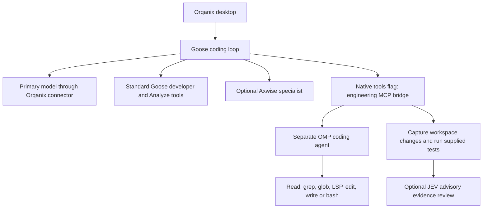
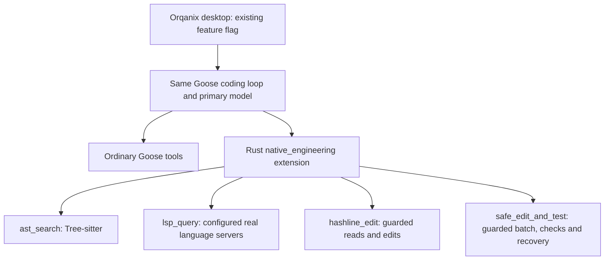

# Orqanix engineering tools: experiments, tests and observations

Status as of September 30, 2026. This report consolidates the Goose engineering-tool optimization work, benchmark reconciliation, Rust candidates and final checks of the installed Orqanix 2.4.2 application. Results describe the recorded workloads and configurations; they do not establish general superiority over other coding agents.

## Outcome

**We implemented and tested useful capabilities, but have not delivered a consistently faster replacement for installed 2.4.2.** One experimental Rust build, v4, passed its exploratory speed screen with 21.1% less total time. Later candidates did not reproduce a uniform improvement. The latest Rust candidate remains experimental and has an additional functional-validation failure.

Installed **Orqanix 2.4.2 (5707)** remains the working reference. It passed the latest twelve tasks with Native tools both off and on, but selected the engineering bridge zero times. A separate explicit-use check then proved that its OMP-backed inspection, editing, test execution and evidence review work on one synthetic task. That check exposed an unconfigured LSP path.

Neither “2.4.2 is SOTA” nor “Native tools universally improve speed or reliability” is supported by these tests. No matched pristine upstream Goose comparison establishes the user's original superiority target.

## Original thesis and hypotheses

The thesis was to take useful OMP capabilities, put them directly into the Goose coding loop under the existing Native tools feature flag, remove OMP, and obtain the same or better quality at the same or better speed.

| Hypothesis | Intended benefit | What the evidence says |
|---|---|---|
| Real AST queries find relevant syntax precisely | Fewer exploratory reads; avoid comments, strings and unrelated callbacks | Implemented and functionally tested. Natural selection was inconsistent; no isolated end-to-end speed benefit established. |
| Real LSP queries and rename plans resolve bindings | Preserve aliases, unrelated identifiers and external contracts during larger refactors | Works in configured Rust-candidate fixtures. Scope and request-schema gaps were found and addressed. Installed OMP LSP remained unconfigured in the final check. |
| Hashline edits guard exact file/range identity | Reject stale edits and reduce patch failures | Guard behavior tested. Verbose anchors, repeated reads and newline handling introduced workflow costs. |
| Safe batch edit-and-test reduces round trips | Apply a coherent change, validate once and recover explicitly on failure | Functional batches and rollback receipts demonstrated. Passing a supplied command does not prove that the command checks the intended contract. |
| Direct Rust integration removes delegation overhead | No second coding agent, extra model request or OMP startup | Candidate architecture implements this. Model context and extra primary-agent turns can still outweigh local execution savings. |
| Optional selection preserves simple-task speed | Ordinary tools for simple work; semantic tools when useful | Guidance was implemented. No automatic classifier or dynamic schema hiding was implemented; simple-task penalties remained in several screens. |

The weak starting premise was attributing earlier reported speed gains to the engineering tools before proving that those tools executed in the measured coding loop. Availability, actual invocation, correct output and performance benefit are separate claims.

## Architecture: installed application versus candidate

### Installed 2.4.2

The flag mounts `orqanix-engineering`, exposing `orqanix_engineering_status`, `orqanix_engineering_inspect`, `orqanix_engineering_edit` and `orqanix_engineering_exec`. It does not install or enable the newer Rust extension in this application.

The OMP agent has mode-specific tools: inspect allows reads/search/LSP; edit adds edit/write; exec allows bash. The bridge's edit path can run the supplied test argv after editing and capture changes and actual test output. JEV performs advisory evidence review; Axwise is a separate optional specialist path. Goose chooses whether to delegate.

In the final installed checks, the main model used alias `orqaly-gemini` with low thinking effort. The shipped OMP bridge used the same alias with high thinking effort. The alias alone does not verify the resolved upstream model.

### Experimental Rust Native tools mode

There is no OMP agent in this candidate path. Language-server subprocesses start on demand and are reused; they are not extra coding models. AST matches syntax, while LSP coverage depends on the server's project graph and configuration. Neither guarantees complete understanding of an arbitrary repository.

The host controls `nativeGemsEnabled`, mounts the extension with the session workspace and retains normal approval/cancellation handling. The flag remains optional and off by default. Source retirement of OMP and builds of separate test packages do not change the installed 2.4.2 archive.

## What we tried

1. **Audited earlier scripts and release identity.** Distinguished helper timings, direct model requests, full coding-loop runs, local modified binaries and the actual installed release. Reconciled misleading attribution without assuming all historical output was fabricated.
2. **Implemented the four real Rust tools.** Replaced token/regex approximations with Tree-sitter and actual LSP; added guarded edits, literal test argv, cancellation and conditional rollback. Exercised both Goose loop implementations and host-controlled mounting.
3. **Changed selection guidance and output size.** Tried stronger tool guidance, batched reads, post-edit context, compact snapshot handles, conditional semantic-tool guidance and preserving ordinary developer instructions.
4. **Added semantic refactoring operations.** Added AST presets, named/qualified LSP lookup, paginated references and reviewable rename plans followed by separate guarded apply/test. Fixed the TypeScript partial-semantic-server path that could omit unopened consumers.
5. **Expanded project scope.** Replaced the restrictive rename-scope design with larger bounded project analysis, paginated previews and separate analysis/edit limits. A real-server fixture covered 1,000 source files, 100 unopened consumers and a 101-file rename.
6. **Reduced repeated editing/checking.** Tried one coherent batch followed by necessary checks, avoiding optional diagnostics/formatting loops after success. No automatic test-success cache or task classifier was added.
7. **Fixed whole-line boundaries.** v8 preserves LF/CRLF and appropriate range terminators by default; explicit exact mode preserves deliberate byte-level joins. Added middle-file, EOF, deletion and exact-mode checks.
8. **Recompiled and tested separate applications.** Rust candidates were built and exercised in temporary desktop packages; installed Orqanix was preserved.
9. **Retested the running installed application.** Twelve on/off tasks, followed by one explicit four-tool functional check, without installing or restarting the app/backend.

Goose documentation informed the efficient ordinary-tool workflow, existing Analyze reuse, compact output and possible Code Mode discovery. Code Mode discovery/integration tests passed, but no live Code Mode speed win was established. DeepSeek/Hermes were proposed as harness references; this report contains no measured comparison against either agent. Interactive what-if projections were hypothetical simulations, not benchmark evidence.

## Why the historical benchmark claims differed

The inspected committed native-gems scripts did not recompute a comparison of two complete Goose coding workflows. Some timed local JavaScript helpers, some printed fixed comparative scorecards, and one direct-generation matrix discarded AST results before sending the task prompt to Gemini. Its quality scoring used keywords rather than executing the generated implementation.

The original helper called AST search searched token-containing lines; its LSP helper used regex extraction rather than a language-server protocol. A benchmark launched from Goose can therefore produce a file containing real helper timings without measuring Goose's full task latency.

Fixed numbers in a saved report are normal. Literal scorecard constants could also originate from previous measurements. The underlying run provenance for the user's specific historical output was not located, so it remains unresolved. The supported criticism is a mismatch of measured execution paths and missing reproducible attribution, not a finding that every older result was invented.

The older helper also had concrete verification/concurrency defects, including a dry-run verified claim and a missing fresh preimage check after awaiting review. Those defects did not establish that the entire older Goose build was generally unreliable.

One historical script requested `gemini-3-flash-preview` despite a Gemini 3.8 banner. Instrumented later Orqanix experiments verified returned `gemini-3.8-flash`; this discrepancy does not establish that the hosted Orqanix route used the older model. The final unchanged live-app checks preserved the alias and did not instrument upstream identity.

Evidence: [benchmark reconciliation](/Users/admin/axwise-opensource/axwise-flow-oss/BENCHMARK_RECONCILIATION_2026-09-29.md).

## Benchmark record

Percentages below mean change in **elapsed time**. A negative value means less time. Each comparison uses its own recorded control; absolute timings across batches are not a controlled comparison of versions. Small screens do not establish statistical equivalence or broad reliability.

### Earlier integration and release comparisons

| Experiment | Recorded result | Interpretation |
|---|---|---|
| Initial native integration: eight forced-use trials across both loops | Four native runs completed with actual AST/LSP and valid fixes; mean 32.46 s. Only one control completed under the strict allowlist, at 18.69 s. | Tools functioned. Three control approval-policy failures made speed/reliability comparison unsuitable. |
| Initial selection-policy screen: twelve attempts in two budget regimes | Native adoption rose, but capped runs, an authentication interruption and a signed-zero contract defect prevented a clean pooled comparison. | More native calls did not ensure correct or faster work. Generated tests could endorse an incorrect requirement interpretation. |
| Efficiency candidate: twelve backend trials, four tasks × three arms | Candidate took 668.598 s versus 515.388 s with tools off: **+29.7%**. All resulting code passed checks, but the previous native arm had one model-budget stop: 11/12 clean completions. | The “previous” binary was locally modified Rust code, not untouched released 2.4.2. AST/LSP/safe-edit were not selected. |
| Actual 2.4.2 release comparison: twelve backend trials | Release off 550.432 s; release on 520.840 s; candidate 693.359 s. Candidate **+26.0%** versus release off, **+33.1%** versus release on; 12/12 quality and clean completion. | Candidate won the large task but lost overall. Release-on invoked OMP zero times, so its timing cannot be credited to OMP execution. |
| Semantic v3: twelve desktop trials | 387.178 s baseline versus 539.486 s candidate: **+39.3%**; 12/12 quality. AST selected in 1/2 structural trials, LSP in 2/2 rename trials. | Real semantic tool use occurred, but extra context, reads, edits and model turns outweighed the cheap local queries in this screen. |

The 29.7% figure means the candidate took 29.7% more time; equivalently the control took 22.9% less time. Describing both directions as “30% faster” was incorrect. The control in those experiments was an Orqanix configuration, not a separately measured pristine upstream Goose release.

Evidence: [initial integration](/Users/admin/axwise-opensource/axwise-flow-oss/NATIVE_ENGINEERING_REPORT_2026-09-29.md), [selection screen](/Users/admin/axwise-opensource/axwise-flow-oss/ORQANIX_NATIVE_SELECTION_BENCHMARK_2026-09-29.md), [efficiency screen](/Users/admin/axwise-opensource/axwise-flow-oss/ORQANIX_NATIVE_EFFICIENCY_BENCHMARK_2026-09-29.md), [actual release comparison](/Users/admin/axwise-opensource/axwise-flow-oss/ORQANIX_RELEASE_242_COMPARISON_2026-09-29.md), [semantic v3](/Users/admin/axwise-opensource/axwise-flow-oss/ORQANIX_NATIVE_SEMANTIC_2026-09-29.md).

### Rust candidates v4–v8: matched mode off/on screens

Each full batch used three task types × two arms × two repetitions, for twelve trials. Task columns compare per-task medians; the aggregate compares sums across six trials per arm. All twelve timed quality grades passed in each full batch. This does not include separate functional recipes, some of which failed.

| Candidate and main change | Simple/control | Structural repair | Cross-file rename | Aggregate time change | Speed screen |
|---|---:|---:|---:|---:|---|
| v4: compact guarded operations and batching | −6.9% | −22.9% | −24.5% | **−21.1%** | Passed this exploratory batch |
| v5: conditional semantic selection guidance | −20.3% | +17.1% | −25.1% | −14.0% | Failed structural no-slowdown gate |
| v6: larger project scope and real rename integration | +25.1% | −9.3% | −6.1% | −3.0% | Failed simple-task gate |
| v7: combine v4 workflow guidance with retained semantic capabilities | +0.3% | +39.6% | −18.9% | Approximately 0.0% | Failed structural gate |
| v8: newline-boundary fixes and coherent batch/check guidance | +18.5% | +19.5% | −17.8% | −3.6% | Failed simple/structural gates |

Important attribution and failures:

- **The 21.1% gain belongs to experimental Rust v4, not installed 2.4.2.** v4 made zero natural AST/LSP calls. Compact guarded reads, batches and fewer requests were observed, but their individual causal contributions were not isolated.
- v5 selected AST and LSP, but its 42-file fixture exceeded the then-32-file rename scope and one request omitted a symbol/position. No rename plan was successfully applied in that batch.
- v6 used successful AST queries and rename plans. One diagnostics wait timed out. The v6.1 simple-task follow-up added four trials: quality passed, but mode on remained **10.3%** slower; the full v6.1 matrix was not requalified.
- v7's slow structural run performed 13 successful safe-edit/test calls while repeatedly repairing joined line boundaries. Sixteen newline omissions and 48 provider requests were observed in that run. AST itself took about 22–23 ms. One rename used a real LSP plan; the other used ordinary tools.
- v8 removed the observed boundary problem in deterministic checks. AST calls took 18–23 ms, but simple/structural tasks still regressed. Neither timed rename called LSP: one used a guarded 14-file custom batch, the other ordinary tools. The rename median improvement cannot be attributed to LSP.
- v8's separate functional recipe passed mechanical receipt checks but **failed independent TypeScript checking**: `consumer.ts(7,12): TS2554: Expected 2 arguments, but got 1.` Print-only supplied checks had not detected the missed consumer update. This failure remains part of the record and prevents treating the candidate as fully validated.

Evidence: [v4](/Users/admin/axwise-opensource/axwise-flow-oss/review-evidence/2026-09-30/native-operations-v4/summary.json), [v5](/Users/admin/axwise-opensource/axwise-flow-oss/review-evidence/2026-09-30/native-selection-v5/findings.json), [v6 and follow-up](/Users/admin/axwise-opensource/axwise-flow-oss/review-evidence/2026-09-30/native-integration-v6/findings.json), [v7](/Users/admin/axwise-opensource/axwise-flow-oss/review-evidence/2026-09-30/native-workflow-v7/findings.json), [v8](/Users/admin/axwise-opensource/axwise-flow-oss/review-evidence/2026-09-30/native-boundaries-v8/findings.json), [v8 independent recipe failure](/Users/admin/axwise-opensource/axwise-flow-oss/review-evidence/2026-09-30/native-boundaries-v8/recipe-independent-grading.json).

## Final checks of the already-running installed 2.4.2

### Twelve ordinary tasks, Native tools off/on

We used the existing running app and backend, three synthetic task types and two repetitions per arm. Native off passed **6/6**; Native on passed **6/6**. Independent grading checked behavior, TypeScript, public tests, added regression tests, original-bug mutation detection, immutable inputs and permitted file scope.

The feature flag correctly mounted the OMP-backed bridge only for on chats. All other extension mounts matched. Jev and Axwise were disabled for the comparison; Smart approval mode and low primary thinking effort were preserved. Standard Goose tools, including existing Analyze tree, did the work. There were **zero engineering calls** and no newer Rust native tools in the installed binary.

Smart-mode approval pauses, including delays in our handling of those prompts, contaminated wall time. Subtracting whole handling gaps does not reconstruct autonomous execution. The run proves correctness and mounting behavior, not a defensible speed ranking. Its warm backend, extra installed extensions and uninstrumented upstream alias also differ from the earlier candidate protocols.

Evidence: [findings](/Users/admin/axwise-opensource/axwise-flow-oss/review-evidence/2026-09-30/installed242-running-native-ab/findings.json), [verification](/Users/admin/axwise-opensource/axwise-flow-oss/review-evidence/2026-09-30/installed242-running-native-ab/verification.json).

### One explicit engineering-tool task

Synthetic async-route repair, session `20260930_15`. Native tools was enabled, Axwise disabled, JEV preserved enabled, and Smart mode preserved. We approved the bounded edit and verification actions once, without adding persistent approvals.

| Operation | Actual calls | Observation |
|---|---:|---|
| `orqanix_engineering_status` | 1 | Runtime available; model alias and high nested thinking reported |
| `orqanix_engineering_inspect` | 1 | Completed; nested todo/glob/read/LSP used; correctly identified handlers and unrelated callbacks |
| Nested OMP LSP | Attempted; name recorded in inspect/edit receipts | Inspection reported “No language server found for this action” and “No language servers configured for this project”; no demonstrated successful LSP lookup |
| `orqanix_engineering_edit` | 1 | Completed; nested read/search/edit/write used; two source files edited and one regression-test file created |
| Bridge-supplied test command | 1 recorded edit verification | Actual process exit 0; 13 tests passed; output captured without truncation |
| JEV evidence review | 1 edit review | Advisory review passed; bridge returned `verified: true` |
| `orqanix_engineering_exec` | 1 | Completed; nested bash used; assistant reported compiler/test exit codes 0 |
| Rust `ast_search`, `lsp_query`, `hashline_edit`, `safe_edit_and_test` | 0 | Not present in this installed application |
| Axwise specialist | 0 | Disabled for this check; no conclusion about its effectiveness |

Independent grading then passed behavior, typechecking, public/regression tests, immutable-input checks and allowed scope. Restoring the original implementation made the regression tests fail. Only `src/routes/accounts.ts`, `src/routes/orders.ts` and `tests/regression.test.mjs` changed.

The bridge records nested tool names but does not preserve all raw nested LSP responses or shell exit codes as structured evidence. The exact LSP error and exec results above are nested assistant reports; the independently executed compiler/tests provide separate confirmation of the resulting source. Hashline editing specifically was not established by the OMP receipts. The supplied compiler was taken from an already-existing test runtime; no dependency was installed and no test app was launched.

This forced four-step protocol had no matched control and included manual approval waits. It establishes one functional path, not a performance improvement or natural tool-selection rate.

Evidence: [focused findings](/Users/admin/axwise-opensource/axwise-flow-oss/review-evidence/2026-09-30/installed242-engineering-focused/findings.json), [tool arguments and receipts](/Users/admin/axwise-opensource/axwise-flow-oss/review-evidence/2026-09-30/installed242-engineering-focused/receipts.json), [independent oracle](/Users/admin/axwise-opensource/axwise-flow-oss/review-evidence/2026-09-30/installed242-engineering-focused/oracle.json).

## Validation, infrastructure and limits

The latest v8 validation recorded 68 native unit tests, four integration tests covering both loops, five real bundled-server tests and six Code Mode checks, plus formatting, Clippy and a release build. These passes are useful implementation evidence; they do not erase the separate recipe failure or establish end-to-end speed.

Tests covered guarded preimages, stale plans, scope/config changes, UTF-16 edit validation, rejected edits, cancellation, rollback/recovery, AST decoys, TypeScript/Python server behavior and whole-line LF/CRLF boundaries. Large-project validation used explicitly bounded scopes. Multi-file publishing is not globally atomic against arbitrary external writers, rollback cannot undo every external test side effect, and an empty/unversioned diagnostics result does not prove current source quality.

Startup failures were preserved separately from task results. The supplied `goose serve` readiness error was an HTTPS `/status` failure, not evidence of a task-quality regression. Later isolated candidate startup diagnosis identified Chromium cookie-key loading waiting before TCP/TLS. Normal v7 startup succeeded after local approval; the differently signed v8 package's normal startup remained unqualified. These are separate app identities and checks.

Some disposable candidate benchmark profiles used the same test-only mock-cookie-Keychain setting in both arms. Real parent OAuth and TLS checks remained active. This did not fix product startup and does not certify normal user startup. The final installed-app tests used the already-running normal app and its existing access.

For those final installed checks, app PID 75179 and backend PID 75213, their start times, and installed Goose/app archive hashes stayed unchanged. Nothing was installed or restarted. Native off, Axwise on, JEV on, Smart mode and the original chat were restored. Credentials and passwords are not included in this report.

## Observations and unresolved work

| Area | Established | Gap or next useful test |
|---|---|---|
| Installed 2.4.2 | Correct on all latest twelve fixtures; bridge edits also independently passed | No demonstrated general reliability or speed advantage; no external SOTA comparison |
| Native flag | Correctly makes the installed bridge available | Availability does not ensure selection; natural-use traces must precede attribution |
| Rust AST/LSP | Real implementations and configured-server behavior tested | Tool selection remains inconsistent; completeness depends on project configuration |
| Large rename | Candidate can analyze larger bounded projects and apply guarded plans | Test realistic project references, unsupported servers and incomplete coverage without treating size alone as semantic certainty |
| Guarded batches | Correct examples and conflict/recovery protections | Require meaningful compiler/behavior checks; passing print-only commands cannot qualify a change |
| Performance | v4 exploratory gain; repeated per-task wins and regressions recorded | No candidate meets a durable same-speed-or-better target across simple and structural work |
| Latency explanation | Extra turns, repeated successful checks and larger model inputs observed; local AST/LSP intervals often milliseconds | Provider variation, context, guidance and batching were not independently isolated, so causal proportions remain unknown |
| Installed LSP | Tool attempted, configuration unavailable reported | Supply and connect real servers if maintaining that path; the user's intended replacement remains direct Goose integration |
| Receipts | Edit bridge captures actual supplied tests and changes | Preserve structured nested errors/command results; distinguish model reports from verified process evidence |
| Model | Instrumented candidate batches verified Gemini 3.8 Flash | Final unchanged live-app alias was not resolved independently; do not infer a downgrade or identity from the label |

Before promoting a candidate: fix the failing functional recipe, prove real project compiler/tests and normal package startup, preserve a cheap ordinary-tool path, then run a controlled comparison against the actual installed 2.4.2 workflow. A claim of superiority to upstream Goose requires measuring that upstream build too. Keep model/effort, task prompts, approvals, extension inventory and verification requirements matched; preserve failures and avoid pooling incompatible protocols.

The target remains correct, efficient work. AST/LSP invocation is evidence about the workflow, not itself a success criterion. No current evidence justifies forcing these tools on every simple task or restoring OMP as a proven performance optimization.

## Relevant code and evidence locations

| Responsibility | Source |
|---|---|
| Native extension mounting/schema and instructions | [mod.rs](/Users/admin/axwise-opensource/orqaly-goose/crates/goose/src/agents/platform_extensions/native_engineering/mod.rs), [selection.md](/Users/admin/axwise-opensource/orqaly-goose/crates/goose/src/agents/platform_extensions/native_engineering/selection.md) |
| AST implementation | [ast.rs](/Users/admin/axwise-opensource/orqaly-goose/crates/goose/src/agents/platform_extensions/native_engineering/ast.rs) |
| LSP query and rename plans | [lsp.rs](/Users/admin/axwise-opensource/orqaly-goose/crates/goose/src/agents/platform_extensions/native_engineering/lsp.rs) |
| Guarded edits, batches and test execution | [edits.rs](/Users/admin/axwise-opensource/orqaly-goose/crates/goose/src/agents/platform_extensions/native_engineering/edits.rs) |
| Project scope, state and recovery | [project.rs](/Users/admin/axwise-opensource/orqaly-goose/crates/goose/src/agents/platform_extensions/native_engineering/project.rs), [state.rs](/Users/admin/axwise-opensource/orqaly-goose/crates/goose/src/agents/platform_extensions/native_engineering/state.rs), [journal.rs](/Users/admin/axwise-opensource/orqaly-goose/crates/goose/src/agents/platform_extensions/native_engineering/journal.rs) |
| Desktop feature flag/runtime integration | [workspace.ts](/Users/admin/axwise-opensource/orqaly-goose/ui/desktop/src/orqaly/workspace.ts) |
| Installed OMP bridge tested in the final check | [mcp.mjs](/Applications/Orqanix.app/Contents/Resources/orqaly-runtime/engineering/src/mcp.mjs), [omp-client.mjs](/Applications/Orqanix.app/Contents/Resources/orqaly-runtime/engineering/src/omp-client.mjs) |
| Independent fixtures and graders | [orqanix-semantic-tasks.mjs](/Users/admin/axwise-opensource/axwise-flow-oss/scripts/lib/orqanix-semantic-tasks.mjs) |
| Frozen candidate evidence | [September 29 evidence](/Users/admin/axwise-opensource/axwise-flow-oss/review-evidence/2026-09-29), [September 30 evidence](/Users/admin/axwise-opensource/axwise-flow-oss/review-evidence/2026-09-30) |

The candidate source changes and temporary builds are local experimental work. The installed release was not replaced, and these experiments do not constitute a production release, deployment or independently qualified performance upgrade.
