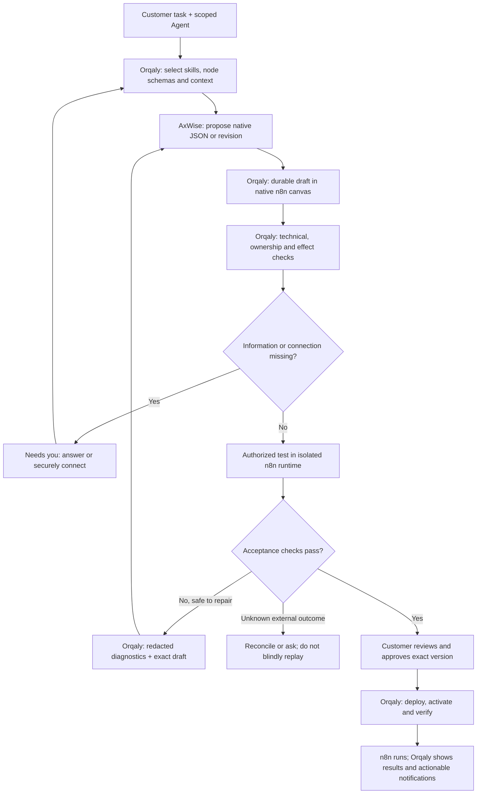

# General n8n workflow builder — Orqaly implementation plan

Recorded: 5 September 2026.
Status: native request-workflow core implemented and verified locally; the full plan remains open. See [implementation and evidence](native-workflow-builder-implementation-2026-09-05.md) for the successful branching case, blocked held-out repair, incomplete provider/runtime packages and GCP release gates. This plan is not itself a deployment claim.
Baseline: Orqaly commit 6f5c4529; currently verified self-hosted n8n 2.37.10 preview.

## 1. Outcome and scope

A customer gives their Orqaly Agent a task. The Agent designs an actual native n8n
workflow using relevant skills and real node definitions. The customer sees the
workflow, supplies missing information or connections, tests it, asks for changes
or edits it directly, and activates a reviewed version that performs the task.
Orqaly shows what happened and asks for help when necessary.

This extends the accepted native n8n integration design. It is not a new demo,
another hidden connector layer, or a collection of three-node templates.
The first acceptance examples do not define the limits of generation.

Orqaly owns this capability. AxWise is its replaceable reasoning service; n8n is
the first execution engine and native editor. We retain self-hosted GCP deployment,
existing Agent identity/task scope, native canvas, release history and application
access. No Supabase migration, reads, writes or fallback are involved.

The current webhook-transform slice works, but broader authoring, outgoing
connections, controlled general-workflow testing/repair and autonomous-trigger
lifecycle are not yet complete. Earlier completed webhook/application-access
milestones remain valid; this plan replaces their narrow authoring assumptions
for the next version, without rewriting historical acceptance evidence.

## 2. Ownership and execution loop

| Layer                            | Owns                                                                                                                                                                               | Must not do                                                                    |
| -------------------------------- | ---------------------------------------------------------------------------------------------------------------------------------------------------------------------------------- | ------------------------------------------------------------------------------ |
| Orqaly                           | Task/persona context, memory selection, skill registry, tools, durable build loop, customer UI, validation, permissions, connections, tests, approvals, provisioning and lifecycle | Treat a model's confidence as permission or proof                              |
| AxWise                           | Requirement interpretation, candidate JSON/patches, useful questions, proposed tests, semantic review and explanations                                                             | Choose another tenant/runtime, receive raw secrets, grant authority or publish |
| n8n                              | Actual native canvas/editor, stored executor artifact and real workflow execution                                                                                                  | Become the source of Orqaly ownership, approval or business-success truth      |
| Restricted tool/runtime boundary | Resolve server-owned targets; enforce capability, network, credential and execution limits; collect evidence                                                                       | Give the model an unrestricted owner-account MCP connection                    |

Customer edits enter the same draft/review loop. They never silently overwrite
the live release. A model patch carries its base revision/hash; an intervening
customer edit rejects the stale patch.

### Exactly what AxWise checks

- Does the proposed workflow cover the customer's requested outcome?
- Which necessary decisions remain ambiguous?
- Do routing, transformations and failure handling make business sense?
- Does a proposed repair preserve the intended outcome?
- How can the result and proposed change be explained plainly?

These checks are advisory. Orqaly independently checks schemas, graph structure,
scope and permissions. Actual execution plus agreed acceptance assertions establishes
runtime evidence. A second model review is useful but is not an independent
execution test.

Context is selected by authenticated customer, Agent, task and Solution. Unrelated
weather conversations must not influence a software workflow. Persona instructions,
retrieved documents and node outputs are data, not permission to override policy.

## 3. Skills and tools: use official guidance inside the product

Use the [official n8n skills](https://github.com/n8n-io/skills) as the reviewed
knowledge base. Relevant areas include workflow lifecycle, node configuration,
expressions, loops, sub-workflows, errors, credentials, data/binary handling, Code,
AI nodes and debugging. Orqaly selects the necessary guidance for each operation;
installing a plugin only in a developer's Codex session does not satisfy this work.

Implementation requirements:

1. Vendor a reviewed revision with license notices; record source commit, content
   digest and selected skills on each build attempt. Do not fetch mutable skill
   instructions into a production run without review.
2. Maintain a versioned node catalog from the actual pinned n8n distribution.
   Distinguish known node definitions from nodes enabled in this customer's runtime.
   Retrieve actual operation parameters, credential types, ports and type versions.
3. Adapt tool names and examples to the verified runtime. Use self-hosted setup;
   do not inherit Cloud-account recommendations, implicit credential selection,
   auto-publishing or unrestricted tool access from generic agent instructions.
4. Expose narrow Orqaly tools for node discovery, draft access, validation,
   authorized test submission and execution evidence. Orqaly derives environment,
   workflow and credential scope from authenticated records, not model arguments.
5. Treat templates as optional examples, not a whitelist of customer use cases.
   Missing information should produce a specific question; a missing runtime
   capability should produce an explicit dependency, not a substitute workflow.

Native n8n JSON remains the canonical executor artifact and uses the existing
REST adapter for persistence. Official MCP is useful for discovery and
per-node checks. Its `validate_node_config` accepts node parameters, whereas
`validate_workflow` and `create_workflow_from_code` use the SDK-code pathway;
they are not interchangeable whole-native-JSON validators. An SDK bridge is
optional, not a required product rewrite.
[Official MCP tool contracts](https://github.com/n8n-io/n8n-docs/blob/main/docs/connect/connect-to-n8n-mcp-server/mcp-server-tools-reference.md).

Do not introduce the community n8n-mcp service by default. Any later adoption
requires separately reviewed telemetry, egress, licensing and tenant scoping;
customer workflow data must not be sent to a telemetry/Supabase backend.

## 4. Versioned contracts, storage and durable state

Add a general-workflow V2 contract; retain V1 validation and behavior for existing
Solutions. Do not make the old fixed-mapping schema permissive.

A candidate envelope contains:

- Native workflow JSON, base revision/hash, intent summary and requirement IDs.
- Explicit input/output contracts, trigger type and proposed acceptance cases.
- Required nodes/versions, connections, external effects and runtime capabilities.
- Questions/dependencies, selected skill/catalog versions and model provenance.

Server-owned scope, policy decisions and validation results are stored separately
from the model's claims. Orqaly derives and checks actual graph capabilities;
the model's manifest cannot hide a node's behavior.

Persist build attempts, questions/answers, draft snapshots, validation reports,
sanitized test evidence, repair diffs, approvals and release records in Cloud SQL.
Store larger immutable artifacts in GCS under owner-checked references. Store
secrets only in the controlled secret/credential boundary, never ordinary JSON,
chat, prompts, browser storage or execution logs. n8n retains its own database
identity and encryption boundary; its internal state is not Orqaly's audit ledger.

The Agent remains a named durable entity with a pinned persona/profile reference;
it does not require a permanently running VM. Runtime allocation belongs to
customer/Solution scope, not whichever chat happens to be open.

Proposed build stages: Designing → Needs you / Validating → Testing → Repairing /
Ready for review → Approved. Deployment/activation and invocation status are
separate state machines, not overloaded as “done.”

Persist attempts, budgets, cancellation and operation IDs. Default repair budget:
at most three repair rounds, with explicit time/token/execution ceilings.
Stop earlier on repeated diagnostics, missing authority or uncertain side effects.
Browser closure does not cancel server work. Explicit cancellation blocks further
generation, repair and execution admission and requests best-effort cancellation
of current work. It cannot promise to stop an already dispatched provider action.
Reconcile that action without admitting another effect or reviving the cancelled
build. Crashes and duplicate job delivery must not duplicate an external action.

## 5. n8n best-practice gates

The official lifecycle separates planning, building, validation, testing,
publishing and handoff. Its important warning is that a valid design still needs
saved-graph verification and execution tests.
[Workflow lifecycle guidance](https://raw.githubusercontent.com/n8n-io/skills/main/skills/n8n-workflow-lifecycle-official/SKILL.md).

Implement enforceable checks, not just a longer system prompt:

| Gate                 | Required checks                                                                                                                                                                            |
| -------------------- | ------------------------------------------------------------------------------------------------------------------------------------------------------------------------------------------ |
| Native structure     | Bounded JSON; unique node identities/names; installed type versions; operation-specific parameters; valid references, connection types and ports                                           |
| Flow correctness     | Reachable required branches, item linking, multiple-item behavior, merge inputs, bounded loops/pagination, appropriate response/error paths; do not mistake fan-out for parallel execution |
| Maintainability      | Purposeful node names, readable layout, useful descriptions; supported grouping/sub-workflow reuse; prefer suitable native nodes/expressions and justify Code where needed                 |
| Security and effects | Owned connection/sub-workflow references; allowed trigger/settings; actual destination, method, data and permission bounds; no embedded secrets or unapproved dynamic targets              |
| Save/readback        | Read actual stored nodes, connections, settings and credential bindings after every save; compare against the candidate using a narrowly documented provider-normalization rule            |
| Execution            | Test agreed outcomes, negative cases and effect evidence on the exact candidate; do not use “HTTP 200,” “n8n success,” or model approval alone as business success                         |

n8n's own checklist highlights node configuration, item/branch behavior, errors,
credentials and output inspection. Some recommendations are contextual; their
prose is not itself a security sandbox.
[Validation checklist](https://raw.githubusercontent.com/n8n-io/skills/main/skills/n8n-workflow-lifecycle-official/references/VALIDATION_CHECKLIST.md).

For unfamiliar/community nodes, Orqaly can preserve the proposed design but cannot
certify execution until node code/package, capability and runtime installation
are reviewed. The canvas must show the real dependency and resolution path.

### Test and repair safely

Separate three kinds of evidence in the UI and data model:

- Static validation: no execution.
- Controlled runtime test: actual n8n execution with explicit synthetic inputs,
  approved mock coverage and restricted egress; identify which nodes were mocked.
- Live connection test: actual authorized provider action; show target, sample
  data and possible cost before asking for approval.

Ordinary n8n `test_workflow` invokes the runner. Missing pins do not establish
safety, and unmocked downstream nodes may act. It must not be labeled a universally
safe dry run.
[Pinned n8n test tool](https://github.com/n8n-io/n8n/blob/n8n%402.37.10/packages/cli/src/modules/mcp/tools/test-workflow.tool.ts).

Use an authoring/test boundary with no production credentials and restricted
network/filesystem access. Verify transitive sub-workflows too; mocking a parent
does not authorize an arbitrary child. Prefer runtime-enforced restrictions over
assuming every side-effecting node was detected perfectly.

Each test records the production-candidate fingerprint, actual executed test-artifact
hash, test connection versions, mock bindings and assertions. A derived test graph
must have an explicit relationship to its candidate. Mocked success cannot satisfy
a live-connection acceptance requirement or be described as execution with production
bindings.

Capture bounded, redacted failed-node diagnostics and execution correlation before
provider data is pruned. Do not enable indiscriminate raw execution retention to
make debugging easier. If evidence is unavailable, say so.

The model may propose tests, but expected behavior must be grounded in approved
requirements, independently maintained fixtures/assertions and provider evidence.
It must not change the acceptance criteria merely to make its repair pass.

A safe failed computation can be repaired and tested within its granted budget.
An ambiguous SMS, issue creation or POST is “Outcome unknown”: reconcile first.
Never automatically resend it just because a repair produced valid JSON.

Enforce this inside n8n as well: node-level retries, HTTP retries, error branches
and sub-workflows must not repeat a non-idempotent write implicitly. Use stable
per-action idempotency keys only where the downstream service actually supports
them; otherwise disable automatic write retries. Bound safe transient-error retries
and respect provider rate limits. Test a receiver that commits a write and then
times out: one Orqaly invocation must not hide duplicate provider effects.

## 6. Connections, isolation and runtime lifecycle

### Connections

Implement generic typed “Needs you” actions for information, connection setup,
account/setup prerequisites and effect approval. Each shows why it is needed,
the affected node, the service/account and the smallest next action.

Use native encrypted credentials by verified ID, with service-appropriate types.
Do not let n8n auto-select a matching credential or expose raw secrets to AxWise.
[Official credentials guidance](https://raw.githubusercontent.com/n8n-io/skills/main/skills/n8n-credentials-and-security-official/SKILL.md).

The Orqaly server creates/binds credentials through the scoped connection service;
the model does not call credential creation. Preserve the distinction between
“Saved,” “Verified for this operation” and “Action succeeded.”
Generic credential storage alone is not an authentication test.

Bind connection versions, destinations and effects into review. A rotated or
revoked connection invalidates affected grants/evidence; it does not silently
change an approved release. Incoming application access keys remain separate from
outgoing service credentials.

Enforce egress across the execution boundary, not just in the editor: block
private/metadata addresses and credential forwarding; restrict destinations and
methods; bound time, requests and decompressed response bytes. Native provider
nodes must not bypass these controls.

The existing pinned security review identifies an unbounded-response issue in the
stock HTTP transport. Before arbitrary customer endpoints, implement and test a
bounded egress transport or audited bounded node. Controlled test receivers alone
are not evidence that arbitrary endpoints are safe.

### Runtime profiles

Broad generation is not the same as unlimited runtime authority. Resolve capabilities
per workflow, while keeping the general authoring loop unchanged.

| Profile                   | Intended work                                                                       | Release prerequisite                                                                                                                                                |
| ------------------------- | ----------------------------------------------------------------------------------- | ------------------------------------------------------------------------------------------------------------------------------------------------------------------- |
| Request-driven automation | Branches, nested data, arrays, aggregation and approved native/HTTP service actions | Expanded reviewed node catalog, bounded execution/egress, real connector tests and correct input/output contracts                                                   |
| Durable/event automation  | Schedules, polling, waits, callbacks and asynchronous work                          | Proven trigger lifecycle, durable resume/evidence, workload-appropriate capacity and restart tests                                                                  |
| Code/data processing      | Justified n8n Code execution                                                        | Hardened isolated runner, no host/other-customer access, resource/egress limits and adversarial tests                                                               |
| Software-development work | Repository changes, dependency installation, builds/tests and PR preparation        | n8n orchestrates a separate isolated coding worker with scoped repository grants and artifact/effect evidence; this is not accomplished by enabling Execute Command |
| Additional node packages  | Reviewed integrations missing from the pinned distribution                          | Package provenance, install/upgrade policy, capability tests and customer-visible availability                                                                      |

Keep dedicated customer execution/database/credential boundaries. Code or untrusted
packages must not share the Orqaly control-plane process or production authority.
Draft-only API enforcement must remain effective even when customers send direct
native API requests; hidden buttons are not enforcement.

The current preview has operator-created isolated environments, not an automatic
multi-customer provisioner. A production provisioner needs idempotent allocation,
owner binding, quotas, health checks, secret rotation, upgrade/backup and recoverable
decommissioning. New environments or capacity are separately authorized resources.

### Critical lifecycle correction

Today `solution-runtime.js` publishes during deployment, while Orqaly activation
and pause gate its own invocation API. That arrangement is bounded by the private
webhook-only profile. A schedule or polling trigger could start at publish time
or continue after the Orqaly UI says “Paused.”

Before autonomous triggers become deployable:

1. Split save/stage, test, approve, publish/activate, pause and reconciliation.
2. Stage with production triggers disabled; controlled testing must not activate
   production event sources or install production subscriptions.
3. Activation must enable the exact approved provider version/trigger and confirm it.
4. Pause must disable provider triggers/subscriptions and block new admitted work.
   Show “Pausing” until confirmed; distinguish already in-flight work.
5. Reconcile provider state after timeouts/restarts. Never show Active/Paused based
   solely on a database update when n8n disagrees.

The current scale-to-zero webhook deployment does not establish scheduling or
long-wait support. Each new profile needs an explicit capacity design and tests.

## 7. Customer experience in the existing Orqaly workflow

Keep one addressable build linked from Assistant, Agent, Solution and notifications.
Do not ask the customer to repeat a task already provided; only clarify missing
decisions. Starting a build does not authorize external effects.

The Solution's native canvas stays central. Show a plain-language purpose, the
selected Draft/Active version, current progress and one primary next action.

| State                  | What the customer sees and can do                                                                         |
| ---------------------- | --------------------------------------------------------------------------------------------------------- |
| Designing / validating | Genuine persisted progress; the actual draft as it becomes available; cancel                              |
| Needs you              | A specific affected node and question, secure Connect action or setup prerequisite; resume the same build |
| Testing / repairing    | Whether execution is mocked or real, current attempt, failed node, useful diagnostic and proposed change  |
| Ready for review       | What it does, changed effects/connections, evidence, remaining limits; approve exact version              |
| Active                 | How to use it, last real result, execution history, pause and edit-as-new-draft                           |
| Failed / unknown       | What is known, what might already have happened and the safe next action; no fake success or unsafe retry |

Replace mapping-only summaries and sample editors with contract-driven input/output
forms and human-readable action summaries. Keep technical JSON and detailed traces
available as secondary views. Preserve native node inspection, branches and layout.

Editing must survive reload, show save errors, preserve active-version context and
invalidate stale review. Reworking through the Agent and editing in n8n converge
on the same versioned draft.

Use durable events for Needs you, ready-for-review, confirmed activation and
operational failure; deduplicate notifications and link back to the exact work.
Current in-app polling is not email/push. Add out-of-app channels only with explicit
delivery configuration and preference/authorization, and test their delivery before
claiming it. Do not notify every unchanged progress poll.

Verify keyboard interaction, accessible labels, mobile layouts, expired sessions,
refresh/reconnect and long-running work. No invented percentages or “working”
animation while the build is actually waiting for the customer.

## 8. Implementation work packages and exit criteria

The packages below describe the agreed scope; completion is tracked in the implementation/evidence document. P1–P5 form the general request-driven
builder milestone. P6 carries additional runtime profiles; P7 is the live release
gate for every capability claimed.

| Package                                        | Main existing touchpoints                                                              | Exit criterion                                                                                                                                    |
| ---------------------------------------------- | -------------------------------------------------------------------------------------- | ------------------------------------------------------------------------------------------------------------------------------------------------- |
| P0 — freeze baseline and contracts             | Shared preparation/build/Solution contracts; AxWise domain contracts                   | V1 regressions preserved; V2 native artifact, requirements, evidence and capability contracts agreed; no new resource created                     |
| P1 — skills, catalog and real generation       | Orqaly build service and operation dispatch; AxWise solution preparation               | A real model returns different native graphs using pinned knowledge; Orqaly persists them without recompiling to three nodes                      |
| P2 — general checks and safe authoring         | Workflow review, native gateway, revision service and runtime adapter                  | Native editor roundtrip preserves branching/configuration; structural/policy checks catch bad graphs and unauthorized actions                     |
| P3 — controlled tests and bounded repair       | Build jobs, runtime, Solution service, invocation/evidence contracts                   | Real isolated n8n test fails, returns useful diagnostics, is repaired against the exact draft and passes unchanged acceptance assertions          |
| P4 — generic connections and service actions   | New scoped connection service; build questions; gateway metadata; environment profiles | Secure setup/resume; explicit credential binding; controlled HTTPS plus GitHub/SMS adapter acceptance as authorized; no secrets in prompts/JSON   |
| P5 — integrated customer journey               | Existing Build/Solution/native workspace, app-access UI and notifications              | Task → visual draft → Needs you → test/repair → review → activation → app invocation/history works as one journey; no mapping-only UI assumptions |
| P6 — durable triggers and code-worker profiles | Provisioning operators, execution adapter, lifecycle/reconciliation                    | Profile-specific activation/pause/restart/resume/isolation tests pass before enabling schedules, Code or development jobs                         |
| P7 — GCP acceptance and guarded rollout        | Existing preview deployment/test tooling and regression suite                          | Real browser-to-model-to-n8n proof, provider evidence for claimed connectors, isolation/regression report, explicit limits and rollback evidence  |

P0 precedes contract consumers. P1 and P2 can proceed in parallel once contracts
stabilize; connection backend and UI work can proceed alongside P3 using those
contracts. P3/P4/P5 converge before live request-driven acceptance.
P6 cannot be bypassed by advertising schedules or software execution prematurely.

Concrete paths to update during implementation, relative to their repositories:

- Orqaly: `shared/workflow-v2/contracts.js`,
  `solution-build-contracts.js`, `solution-contracts.js`.
- Orqaly: `server/workflow-v2/solution-build-service.js`,
  `solution-workflow-review.js`, `solution-revision-service.js`,
  `solution-runtime.js`, `solution-service.js`,
  `solution-application-key-service.js`, `native-n8n-gateway.js`.
- Orqaly: `src/pages/GcpWorkspace/WorkflowBuildEntry.jsx`,
  `WorkflowBuildPage.jsx`, `SolutionDetailPage.jsx`,
  `SolutionNativeWorkspace.jsx`, `solution-presentation.js`,
  `workflow-build-presentation.js`, `useWorkflowBuilds.js`,
  `NotificationsPage.jsx`.
- Orqaly: `scripts/solution-preview-operator.mjs`,
  `scripts/solution-preview-002-operator.mjs` and corresponding tests.
- AxWise: `backend/services/workflow_v2/solution_preparation.py` and
  `backend/domain/workflow_v2/contracts.py`.

New modules should separate skill/catalog lookup, capability analysis, connection
lifecycle and test/repair orchestration; do not concentrate everything in a prompt
or a single route. Select additive migration identifiers from the actual repository
at implementation time.

## 9. End-to-end acceptance matrix

Deterministic CI uses controlled fixtures/providers. Separate integration acceptance
uses actual model generation and actual pinned n8n. Record which evidence is which.

| Case                          | Required proof                                                                                                                                                                                                    |
| ----------------------------- | ----------------------------------------------------------------------------------------------------------------------------------------------------------------------------------------------------------------- |
| General branching task        | Natural-language request generates native validation/routing branches with useful error responses; valid and invalid inputs take the correct paths                                                                |
| Different data model/topology | Array filtering/aggregation, nested data, fan-out/fan-in and bounded iteration cases work; include held-out prompts, not just renamed contact mappings                                                            |
| Missing information           | One necessary question; saved answer resumes the same build; refresh/restart does not lose context or duplicate work                                                                                              |
| Missing connection            | Actual action node is visible; secure connection setup and verified owner-bound binding resume the draft; no secret reaches chat/model/artifact/history                                                           |
| Controlled HTTP action        | Actual n8n calls a controlled authenticated receiver; response/failure, timeout, redirect, oversized/decompressed response and egress-denial cases behave truthfully                                              |
| GitHub example                | With a selected test repository and explicit write approval, create a correctly populated issue and show its real identifier/link; test duplicate handling without claiming GitHub provides universal idempotency |
| SMS example                   | With a selected provider and approved test number/cost, send the requested message through the visible node; distinguish provider acceptance from confirmed delivery                                              |
| Repair                        | Deliberately introduce an invalid parameter, broken connection and runtime data error in separate cases; diagnose and repair the draft; unchanged business assertions pass; active release is unaffected          |
| Customer edit                 | Native edit/reopen/readback; review meaningful changes; reject stale model patch and stale approval; publish only the selected reviewed snapshot                                                                  |
| App and lifecycle             | Server-side customer app invokes the active release, gets a durable receipt, replay does not duplicate effects, revoke/pause blocks new work; failed/unknown outcomes remain distinct                             |
| Isolation and resilience      | Cross-tenant/owner/environment/credential/sub-workflow attacks fail; native run/publish/admin bypass fails; cancellation, duplicate jobs, concurrent edits/revoke and restarts preserve authority                 |
| Trigger profile               | Before claiming schedules/polling/waits: no pre-activation action, verified provider pause, timezone behavior, durable resume, restart reconciliation and no unintended duplicate action                          |
| Coding profile                | Before claiming software implementation: isolated checkout, scoped branch change, actual tests/artifact and approved PR action; no control-plane or other-customer filesystem/secrets                             |
| UX and notifications          | Same task/build/Solution across desktop/mobile and keyboard; actual canvas, missing-input action, readable results, version status and deduplicated actionable notifications                                      |

For a full general-builder release, acceptance must cover multiple generated graphs,
connections, repair and the native editor—not just a static JSON fixture. Provider-
free tests can proceed immediately during implementation. Live GitHub/SMS cases
remain pending until the customer supplies the specific account/target and approves
the effects; a pending case must not be reported as passed.

Store an evidence chain:
task/Agent snapshot → skill/catalog pins → candidate fingerprint → validations →
authorized tests/assertions → customer approval → deployed provider version →
real execution/effect receipt → customer-visible result.

The candidate fingerprint binds the canonical workflow, runtime/capability policy,
runtime image/node versions, connection versions and effect/input/output contracts.
It also binds immutable transitive sub-workflow hashes/versions and coding-worker
image/artifact versions. Ownership alone is insufficient: an unchanged approved
parent must not execute a subsequently modified child. Use provider-enforced
version pins where verified, or release-specific immutable child copies; verify
dependency integrity before execution.

Tests reference that fingerprint and the actual test configuration; approvals bind
the fingerprint and the required evidence. Dependency, connection or runtime changes
require appropriate revalidation/retest. Include mutable-child and worker-image
substitution attacks in the isolation suite.

## 10. Rollout, preservation and definition of done

- Add a versioned feature gate; keep existing V1 Solutions and application-key
  behavior intact. Broader input/output support must replace the fixed mapping
  success oracle only on the V2 path.
- Preserve current preview environments 001/002, active releases, drafts and
  historical receipts. Acceptance must use explicitly assigned test artifacts,
  never silently replace the customer's existing Solution.
- Use additive migrations and staged builds. Do not push GitHub changes, create
  new billable capacity, send SMS or write customer repositories as an implicit
  consequence of this plan.
- Fail closed on profile/node-version drift; test upgrades before changing
  catalogs or runtime images. Rollback preserves history and reconciles provider
  state; it cannot undo messages or records already sent.
- Re-run selected existing security/unit/UI suites, real PostgreSQL checks, actual
  pinned n8n integration tests and authenticated GCP browser acceptance. Publish
  exact results and failures, not a blanket “all tests pass.”
- Keep provisioning, backup/restore, data-retention and profile-specific operating
  limits explicit. Do not claim an automatically scalable multi-tenant platform
  from two manually provisioned preview instances.

Done means the customer can start from a task, inspect its genuinely generated
native workflow, satisfy missing prerequisites, see a real test and repair, approve
the exact result, run it and understand its outcome—all through the existing Orqaly
experience. A capability without its live acceptance evidence remains clearly
limited or unavailable, not “completed” because documentation or JSON exists.

### Related repository documents

In Orqaly, retain and link this next phase alongside:

- `docs/workflow-v2/native-n8n-integration-design.md` — accepted product direction.
- `docs/workflow-v2/customer-solutions-plan.md` — historical webhook milestone.
- `docs/workflow-v2/customer-application-access-and-connections-plan.md` —
  completed incoming access and outstanding outgoing-connection work.
- `docs/workflow-v2/service-connection-security-review.md` — pinned transport findings.
- `docs/workflow-v2/application-access-preview-acceptance-2026-09-05.md` —
  preservation baseline and live evidence.

This plan is maintained as matching copies at
`docs/orqaly-general-n8n-workflow-builder-plan-2026-09-05.md` in the main AxWise
workspace and `docs/workflow-v2/general-n8n-workflow-builder-plan.md` in Orqaly.
