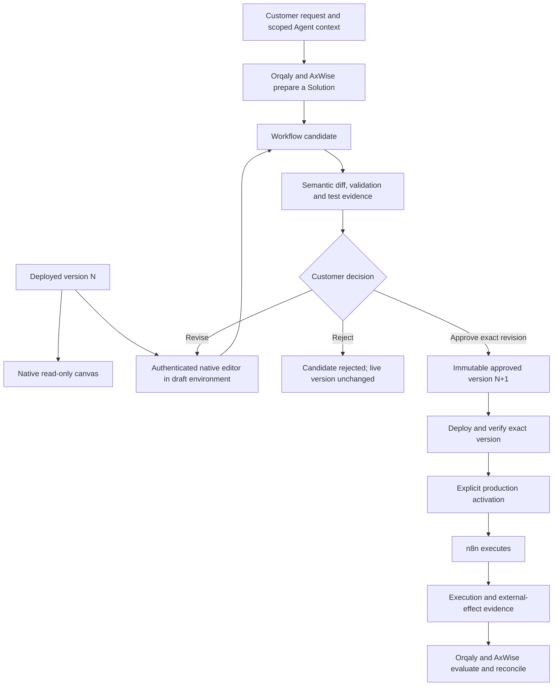
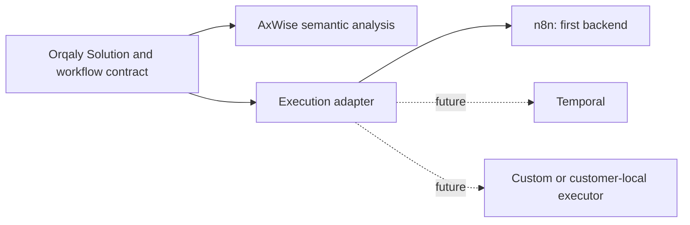

# Native n8n integration — agreed product design

**Recorded:** 5 September 2026

**Status:** accepted product direction; native viewing, editing and releases are
verified live for the supported webhook slice. The broader Agent-driven design
remains implementation work.

**Source:** [Native n8n Integration Design](chatgpt-conversation://6a9bf883-8ff8-83eb-85da-069d817105c7), explicitly adopted by the customer in the implementation task.

This document captures what we intend to build. It supersedes earlier requirements
that restrict n8n to hidden connector actions, exclude the native customer editor,
or require customer solutions to share an internal n8n instance. The existing
connector adapter remains useful, but does not define the limits of the product.

The canonical document is maintained in the AxWise repository at
`docs/orqaly-native-n8n-integration-design-2026-09-05.md`, with a synchronized copy in
Orqaly at `docs/workflow-v2/native-n8n-integration-design.md`. Keep both copies aligned.
Sections 1–7 retain the accepted broader product design; they are not a claim that
every described capability has shipped. Section 8 separates the verified webhook
checkpoint from the remaining work. Detailed live evidence and deployment
identifiers are recorded in the Orqaly repository at
`docs/workflow-v2/native-n8n-release-2026-09-05.md`.

## 1. Product model

**Orqaly owns the Agent experience and control. AxWise supplies cognition,
evidence and semantic analysis. Self-hosted n8n provides the native workflow
viewer/editor and executes the customer's automation.**

A customer asks an Agent for a useful outcome. Orqaly and AxWise understand the
request, select the relevant context and prepare an executable Solution. The
customer can inspect it visually, test it, edit it when needed, approve a version
and control its operation from the existing Orqaly workspace.

The scope covers many tasks: CRM operations, communications, data processing,
software-development workflows, monitoring and automations. SMS is one example.
Research and reasoning remain Agent work; n8n can coordinate a delivered software
workflow that calls an appropriately isolated build/test worker.

| Component                        | Responsibility                                                                                                                                                       |
| -------------------------------- | -------------------------------------------------------------------------------------------------------------------------------------------------------------------- |
| Orqaly                           | Agent identity/persona reference, ownership, permissions, task context policy, Solution lifecycle, versions, approvals, execution controls, evidence and customer UI |
| AxWise                           | Interpret intent, prepare plans/personas, reason over authorized evidence, explain workflow meaning and changes, and evaluate outcomes                               |
| n8n                              | Display the native canvas, provide an authenticated expert editing surface, and execute approved workflows through the execution adapter                             |
| Tool Gateway / provider adapters | Enforce authorized external actions and return evidence about those actions                                                                                          |
| Isolated workers                 | Perform supported code/build/test or other specialized work under the approved task scope                                                                            |

AxWise and the editor may propose changes. Orqaly enforces authority. An n8n
success status alone does not prove that every external effect succeeded.

## 2. Customer experience

The native canvas belongs in the existing Solution page, reachable from its Agent
and conversation. It displays the actual selected workflow version: nodes,
connections, branches, names and inspectable configuration with secrets redacted.
A topology-only preview may be an intermediate milestone, but does not satisfy
the complete viewing and editing requirement.

```text
B2B Operations Agent
Contact Intake Automation                         Active · v7

┌───────────────────────────────────────────────────────────┐
│ Native n8n canvas                                         │
│                                                           │
│ Webhook → Normalize → Find contact ── Existing → Update    │
│                                  └─ New      → Create     │
│                                                ↓          │
│                                             Notify        │
└───────────────────────────────────────────────────────────┘

Last run: 4 minutes ago       Result: verified
Environment: your isolated environment
Viewing: deployed v7         Draft: v8 awaiting review

[Test]       [Edit workflow]       [Review changes]       [Pause]
```

This example illustrates the target experience; CRM and notification nodes are
not claims about the current webhook preview.

Customers should first see what the automation does, its current state, the last
real result and the next useful action. Advanced details include connections
used, external data destinations, permissions, version history and execution
evidence. Less technical customers can work through the Agent; advanced customers
can use the native editor.

Viewing, editing, testing, deployment and production activation are distinct
operations. Labels always identify whether the canvas shows a draft, an approved
release or the deployed version. The UI does not imply that opening a canvas
creates an execution or that saving an edit changes production.

## 3. Editing creates a candidate

The central decision is that native editing produces a proposed revision.
It cannot silently overwrite or activate the live workflow.



When the customer edits active v7, Orqaly records a v8 candidate with its base
version and content hash. Saving in n8n updates that candidate. Orqaly captures a
specific snapshot, checks it and presents the proposed changes before approval.
Further edits invalidate the review/approval for the earlier snapshot.

Approval binds the exact revision, environment, required connections and effects.
Deployment verifies the approved bytes and provider version. Activation enables
the approved production behavior. A rejected or failed candidate leaves the live
version unchanged. Reverting a workflow restores approved configuration through
the same controlled process; it cannot undo an email already sent or other
irreversible effects.

Tests also carry a defined scope. A side-effect-free transformation can run on
sample input before activation. A test that sends a message, writes a record or
incurs cost still requires the relevant authorization and test credentials.

## 4. Semantic review: explain what changed

AxWise should explain operational consequences, backed by deterministic inspection
of the workflow and capability contracts. Node counts or JSON diffs alone are
insufficient; model-generated risk labels alone cannot grant permission.

Example: the customer adds an email step to a CRM workflow.

| Meaning            | Active v7                | Proposed v8                                         |
| ------------------ | ------------------------ | --------------------------------------------------- |
| Trigger            | New contact              | Unchanged                                           |
| Reads              | CRM contact              | Unchanged                                           |
| Writes             | CRM contact              | Unchanged                                           |
| Communications     | None                     | Send email                                          |
| Connections        | CRM connection           | Adds a named email connection                       |
| External data flow | Contact details to CRM   | Also sends recipient/message data to email provider |
| Reversibility      | Depends on CRM operation | Email delivery cannot be undone                     |
| Approval change    | Existing scope           | Adds external communication and associated data use |

The review should say, for example: “This revision adds email sending using your
Support email connection. Recipient and message data will go to the email provider.”

The customer can inspect recipients, destinations and effects, then reject or
approve the exact candidate. Unsupported nodes, unknown behavior and unresolved
credential requirements must be surfaced before deployment.

## 5. Authentication and customer isolation

Read-only viewing and native editing have different authority. The editor normally
needs its own authenticated n8n session; an Orqaly login alone does not establish
one. Implement a supported session integration and verify the pinned n8n version's
embedding, cookie and licensing requirements before rollout. No paid n8n Cloud
dependency is assumed.

Each session is resolved from server-verified customer ownership and the selected
Solution. Customer A cannot access Customer B's workflows, credentials, executions
or editor. A customer editor cannot expose Orqaly's internal n8n environment.

Draft authoring must be isolated from production authority. Enforce this at the
service/API and credential boundary, including n8n save, publish, activation and
manual-run endpoints. Hiding buttons is insufficient. If the selected native
editor cannot enforce draft-only permissions, use a separate authoring environment
with no production credentials or production deployment rights.

n8n receives only the workflow and task inputs needed for its assigned work.
The Agent's unrelated memories, persona internals and broader user context do not
automatically enter the editor or executor.

For the verified webhook slice, the actual pinned n8n frontend is embedded on the
existing Orqaly API origin through an authenticated, customer-scoped gateway.
The n8n service remains IAM-private. Native draft saves are mediated by Orqaly;
native run, publish, credential and administration APIs are denied server-side.
This does not establish support for every n8n node, provider connection or future
authoring environment. Broader capability and distribution/licensing requirements
still need validation. No customer workflow is sent to a public third-party viewer.

## 6. Durable entities and storage

The Agent is a durable scoped identity with a name, persona/profile, permissions
and history. It need not occupy a permanently running VM. A Solution is a durable
deliverable owned by that customer and associated with its Agent.

| Record              | Stored meaning                                                                                          |
| ------------------- | ------------------------------------------------------------------------------------------------------- |
| Agent reference     | Owner and task scope; pinned persona/profile reference                                                  |
| Solution            | Purpose, specification, workflow contract and assigned environment                                      |
| Draft revision      | Base release, author, workflow snapshot/hash and change history                                         |
| Review              | Semantic change report, validation results and exact tested snapshot                                    |
| Approval            | Approver, approved hash, environment and authorized effects/connections                                 |
| Release/deployment  | Immutable approved version and verified executor identifiers                                            |
| Invocation/evidence | Input/output under retention policy, version, actual execution ID, outcome and relevant effect receipts |

Orqaly's canonical records belong in Cloud SQL; artifacts belong in GCS and
secrets in Secret Manager or the controlled connection service. The customer's
n8n environment has its own database identity and encryption boundary.
n8n's implementation state does not replace Orqaly's approval and audit records.

An editor draft and a live release must remain distinguishable after a refresh,
restart, timeout or deployment. Scheduling and long-running work need durable
capacity appropriate to that workload; the webhook preview's scale-to-zero
configuration is not sufficient evidence for them. No Supabase data is migrated,
imported or used as an execution-context fallback.

## 7. Keep the execution engine replaceable

Orqaly owns the Solution contract and lifecycle independently of n8n. The adapter
maps that contract to a native workflow and maps execution results back to Orqaly.
The n8n definition is retained as a versioned executor artifact; engine-specific
details belong at this boundary.



Replaceability does not mean every backend can execute every workflow. Each adapter
declares supported capabilities and rejects unsupported ones. Replacing the engine
preserves ownership, meaning, approvals and evidence; an engine-specific expert
editor can change without rebuilding the Orqaly product model.

## 8. Implementation sequence and acceptance

### Verified live: supported three-node webhook

The 5 September preview now embeds the actual native n8n canvas/editor in the
existing Solution page. Simplified step cards remain an accessible summary, not
the only workflow view. The supported executable capability is
`webhook_transform_v1`: **Webhook → Transform fields → Respond**, using bounded
field mappings and safe copy/trim/lowercase/uppercase behavior. This checkpoint
does not cover arbitrary graphs, external providers or software execution.

- [x] **Native viewing for the webhook:** actual nodes/connections, pan/zoom and
      inspectable supported configuration; selected version is explicit. Viewing
      cannot mutate or execute it.
- [x] **Native editing for the webhook:** customer-scoped editing changes a
      durable candidate of an existing deployed Solution. Supported mappings,
      transforms and layout persist; native production/credential APIs are denied.
- [x] **Revision capture:** save and reopening retain the candidate and its
      version/hash. Stale saves cannot overwrite a newer version; approved snapshots
      and the original v1 remain immutable.
- [x] **Deterministic mapping review:** the exact candidate receives supported
      capability checks and meaningful input/output change analysis. Malformed or
      unsupported behavior cannot pass review or deploy. This is not the broader
      AxWise semantic review described in section 4.
- [x] **Controlled release:** exact approval, separate verified deployment, real
      test and explicit activation control the current release. Changed drafts need
      renewed review; rejected drafts do not change the deployed workflow.
- [x] **Signed-in native execution proof:** changed v2 was reviewed and rejected
      while active v1 retained trim behavior. New v3 was edited, saved, reviewed,
      approved, deployed, tested in n8n execution 4, activated and used in production
      execution 5. Reload preserved active v3 and history. An older unknown-outcome
      test remains unknown; not every history item is a success.

The release record at `docs/workflow-v2/native-n8n-release-2026-09-05.md` in Orqaly
contains exact workflow hashes, provider/version IDs, timestamps, image/build
provenance and test limitations. Local real PostgreSQL/n8n and authenticated API
tests cover tenant isolation and stale-state guards; the signed-in browser
acceptance covers the owner journey. Those are distinct pieces of evidence, not
a claim that a second real customer's browser session was exercised.

### Still planned: the broader customer task journey

- [ ] **Task → visual authoring:** an explicit build request selects only the
      task's authorized context and produces its own visible native draft. Today the
      first Solution is compiled from a manual mapping form, not generated by AxWise.
- [ ] **Predeployment native edits:** the customer can edit initial authoring
      before any deployment. Current native revision creation requires deployed v1;
      it must not be mistaken for completion of this initial-authoring requirement.
- [ ] **Durable Needs you:** specific information, registration, secure connection
      or approval requests persist; answers or verified secret references resume the
      same build request and produce a newly reviewed candidate. Existing research
      scope clarification does not provide this Solution-specific flow.
- [ ] **Typed AxWise design and semantic review:** source-bound
      `PrepareSolutionV1` results (`needs_input`, `candidate`, `unsupported`), contextual
      workflow generation, and the broader effect/data/connection analysis in
      section 4. Deterministic webhook review does not complete these capabilities.
- [ ] **Provider and software capabilities:** secure customer credentials,
      registration guidance, approved connector effects, software-build workers,
      schedules, per-node execution replay and general-purpose workflow support.
      Unsupported nodes and credentials remain rejected, not silently enabled.

The remaining handoff contract is recorded in Orqaly at
`docs/workflow-v2/task-to-solution-handoff.md`; it is explicitly planned, not
shipped. It specifies task → early native draft → specific Needs you action →
persisted answer/connection reference → reviewed draft → real runnable Solution.
No secrets belong in chat or model inputs. Registration, payment, provisioning
and external effects need explicit authority; connecting an account is not blanket
permission. The original SMS research scope remains immutable reference material,
not authority to build or operate an SMS gateway.

Extend the verified webhook lifecycle to additional approved capabilities without
marking the full product design complete merely because one native editor and
execution path now work.
