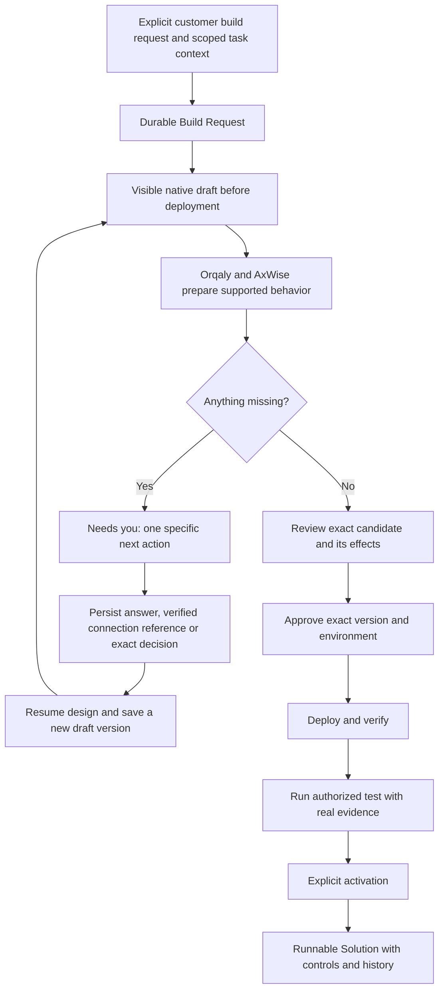

# Task to runnable Solution — product and implementation contract

Recorded 2026-09-05. **Status: P1–P4 are implemented and live-verified for the
webhook capability, including fresh isolated n8n execution, production, pause
and persistent history. P5 and general chat-intent routing remain open.** See the
[task-to-Solution release evidence](./task-to-solution-release-2026-09-05.md).

This document records the customer's clarified journey and the remaining work
between the existing Assistant/Agent experience and executable customer Solutions.
It extends the [native n8n integration design](./native-n8n-integration-design.md)
and [customer Solutions plan](./customer-solutions-plan.md). It does not certify a
live deployment, expand an existing approval, or claim that an Agent already
generates arbitrary working automations. Native rollout evidence is tracked
separately in [the native release record](./native-n8n-release-2026-09-05.md).

## 1. The experience we are building

A customer gives an Agent a task. Orqaly and AxWise prepare the workflow, and the
customer sees the actual native n8n draft early in that same task journey. If
something is missing, the Agent asks for the specific information, registration,
connection or approval it needs. The answer is saved, the work resumes from that
point, and the customer receives a real, testable, runnable Solution.

This is not another documentation artifact, a hidden connector action, or a form
that silently substitutes the same contact-data example for every customer task.
The native workflow is the proposed executable deliverable. Orqaly owns the
Agent, context, questions, permissions, review and lifecycle; AxWise supplies
task interpretation and design; self-hosted n8n edits and executes approved
supported workflows.



Questions and edits can occur more than once. A later answer or edit creates a
new candidate and invalidates review or approval for the changed content. A test
that has external effects needs appropriate authorization even before activation.

## 2. Customer controls and visible state

The entry point belongs in the existing Assistant task/Agent card: **Build
workflow from this task**. It creates a new explicit build request. The selected
task and evidence remain visible as sources; research does not become deployment
permission. An explicit build request made directly in chat should reach the same
backend contract, not a separate demo or hidden flow.

The task contains a compact, persistent Solution-building card. Opening it shows
the native canvas in the existing workspace, the selected draft/version, its
purpose, and the next useful action. The conversation and Agent profile link to
this same record. Refresh or opening another tab restores it.

| Customer sees            | What the system must mean                                                                                   |
| ------------------------ | ----------------------------------------------------------------------------------------------------------- |
| Preparing workflow       | A durable design operation was actually submitted and has observable status; no timed or simulated progress |
| Draft — not runnable     | A persisted native-renderable draft exists, but review, inputs or permissions are incomplete                |
| Needs you                | A persisted unresolved request names the missing item and why it blocks the next step                       |
| Ready for review         | A complete candidate passed deterministic capability checks; this does not mean it is deployed              |
| Ready to test            | The approved version was deployed and verified; permitted test scope is explicit                            |
| Active / Paused          | Production invocation is enabled / blocked by authoritative lifecycle state                                 |
| Failed / Outcome unknown | Real failure or uncertain dispatch evidence; uncertainty never becomes automatic success or blind retry     |

### Show the workflow before asking the customer to deploy

Early visibility and **native editing before the first deployment are required**.
For a recognized webhook task, show the real planned Webhook → Transform →
Respond topology while highlighting unresolved configuration beside the canvas.
The draft is explicitly incomplete; it has no execution authority.

Persist a native-renderable authoring blueprint separately from the complete,
validated executable candidate. Unresolved fields must not be invented merely
to satisfy the executable schema. Unsupported tasks must not receive an unrelated
webhook graph. A text outline or simplified step rail may explain progress, but
does not satisfy the native draft requirement.

The customer can inspect and edit the draft without publishing, activating or
running it through native n8n endpoints. Server-side controls enforce that
restriction; hiding buttons is insufficient. Saving an edit persists a new
candidate version and leaves any deployed version unchanged.

## 3. “Needs you” is a real pause, not a chat suggestion

Ask the smallest specific question that unlocks the next step, with a clear reason
and a control appropriate to the answer. Group closely related required field
mappings if answering them together avoids a needless sequence of questions.

| Need                   | Example customer prompt                                                                          | Persisted resolution                                                                                                                  |
| ---------------------- | ------------------------------------------------------------------------------------------------ | ------------------------------------------------------------------------------------------------------------------------------------- |
| Information            | “Which output field should receive the normalized email?”                                        | Typed answer bound to question ID and build-request input version                                                                     |
| Registration           | “This provider requires an account. Open its registration page, then connect your account here.” | Verified connection/account reference when an integration can verify it; a claim that registration is done is not connection evidence |
| Connection             | “Connect the test account that this workflow may use.”                                           | Server-verified, tenant-owned connection reference and permitted capability; never the raw credential                                 |
| Approval               | “Allow this version to send this test message using this connection?”                            | Decision bound to exact workflow hash, connection, recipient/effect and applicable limit                                              |
| Unsupported capability | “This runtime cannot yet deploy the requested SMS provider node.”                                | Explicit unsupported result with supported alternatives; no fabricated completion                                                     |

An unresolved required item blocks its dependent design/release/action step.
Independent safe work may continue only when represented by real state; the UI
must not pretend the entire Agent is running while it is waiting for the customer.

Answers survive refresh, process restart and browser closure. Answer submission
uses optimistic concurrency and an idempotency key. The system rejects stale
question versions, changed-body key reuse and another customer's request. A
duplicate answer resumes no more than one equivalent design attempt.

Orqaly owns the wait. Open questions project into the task and an in-app **Needs
you** inbox/notification; answering them resolves that same item. External push,
email or scheduled follow-up is not implied by this first slice. Later delivery
channels must reference the same durable question, not maintain separate state.

### Secrets, accounts and authority

- Do not request API keys, passwords, tokens or other secrets in chat, general
  answer fields, workflow JSON, model prompts or logs. Provide a dedicated secure
  connection flow. Store secret material in Secret Manager or the controlled
  connection service; ordinary records contain only opaque references.
- Connection ownership and authorization are verified server-side. A browser
  value such as “connected”, a pasted secret identifier or a URL is not evidence.
  Secret references remain internal; the customer sees a safe connection label.
- Connecting an account does not approve every action that account can perform.
  Workflow and action permissions remain specific and reviewable. Replacing or
  broadening a connection invalidates affected review/approval.
- Do not automatically register accounts, accept terms, purchase a plan, supply
  payment information or create billable resources. Those actions require
  explicit authority and a supported safe interaction; unsupported steps stay
  customer-operated. Opening a registration link is not permission to complete it.
- Draft preparation cannot send messages, modify repositories, create external
  records or otherwise perform the task's external effects. Testing is not a
  permission bypass. Externally visible actions require explicit authority.

## 4. Durable contract and storage

Introduce a source-bound `SolutionBuildRequest`; do not overload a completed
research Goal or the older operational-record receipt.

| Record                 | Required meaning                                                                                                                                                                         |
| ---------------------- | ---------------------------------------------------------------------------------------------------------------------------------------------------------------------------------------- |
| Build Request          | ID, server-resolved tenant/owner, Agent and pinned profile version, explicit build instruction, requested capability, status, input version, row version and idempotency identity        |
| Source snapshot        | Selected thread/turn/run and immutable artifact references/hashes, task hash and bounded context-envelope hash; distinguish the new build instruction from historical reference material |
| Design attempt         | Operation ID, request/input version and input hash, state, result reference/hash, failure or unsupported reason                                                                          |
| Authoring draft        | Native-renderable blueprint/snapshot, base and candidate versions, author and content hash; incomplete drafts cannot become approved releases                                            |
| Input request / answer | Stable question ID, kind, blocking dependency, schema, requested version, status, typed answer or verified connection/decision reference and audit timestamps                            |
| Review / handoff       | Exact validated spec/workflow hash, capability/effect report, connection bindings, decision, and resulting Solution ID                                                                   |
| Events / dispatch      | Append-only state-change history and durable operation-dispatch intent, with retry and reconciliation identity                                                                           |

Use Cloud SQL for canonical records, tenant/owner isolation and concurrency;
bounded artifacts may use the existing GCS artifact path. Use the existing
Secret Manager/connection boundary for secrets. Do not import or consult Supabase.
An Agent is a durable identity, not a requirement for a permanently running VM.

Only server-loaded task context is authoritative. Resolve source references under
the authenticated owner, select task-relevant evidence and preserve provenance.
Unrelated chats, such as a weather discussion, do not enter the build context.
Instructions embedded in research or tool output remain untrusted reference data.

Suggested additive service/API contract:

```text
POST /v2/solution-build-requests
  Explicit build instruction + selected source refs + Agent + supported capability
  Server resolves ownership/context and persists request and dispatch intent.

GET /v2/solution-build-requests/:id
  Authoritative status, selected draft, pending questions, review and Solution link.

POST /v2/solution-build-requests/:id/answers
  Question IDs + typed answers/verified connection handles + expected version
  + idempotency key. Persist resolution and next design intent atomically.

POST /v2/solution-build-requests/:id/confirm
  Exact candidate hash + expected version + idempotency key.
  Freeze/reuse the reviewed Solution draft; does not deploy or activate it.
```

Provide build-request-scoped native session and draft-save endpoints using the
existing gateway security model. Their authorization target includes request ID,
owner, draft version and mode; a session for one Solution or request cannot be
reused for another. No direct native publish, activation or manual-run authority
is granted during authoring.

Do not hold database locks across provider calls. Persist operation intent before
dispatch. A late AxWise result can update only the input version it was created
for; it cannot overwrite later answers or bless a changed workflow. A crash after
Solution creation but before handoff persistence reconciles using a stable build
request creation key, rather than creating a duplicate Solution.

## 5. Typed AxWise boundary

Add `PrepareSolutionV1` to the shared Orqaly/AxWise contract and implement it in
both services. Inputs contain the pinned Agent/context references, supported
capability manifest, current draft/input version and resolved non-secret answers.
The completed result is one of:

```text
needs_input  → structured questions + supported partial draft + explanation
candidate    → typed Solution specification + native draft + input/output contract
unsupported  → exact unsupported capability + truthful alternatives
```

The existing accepted/running/completed/failed operation lifecycle can be reused.
`needs_input` completes that design attempt; Orqaly persists the wait. Answers
produce a new versioned attempt. A new indefinitely waiting AxWise process is not
required for this slice.

AxWise proposes meaning and parameters. Orqaly's deterministic capability checks
and compiler decide whether a candidate is executable. Do not parse generic
Assistant markdown as trusted workflow output or permit arbitrary model-generated
JavaScript, expressions, URLs, Code nodes, HTTP nodes or credential bindings.

The first capability is `webhook_transform_v1`: selected scalar JSON fields mapped
using `copy`, `trim`, `lowercase` or `uppercase`. The typed candidate must pass the
existing specification/compiler boundary before release. A deterministic mapping
form remains a useful explicit fallback, but it is not evidence that autonomous
AxWise task interpretation has been implemented.

## 6. Existing foundations and exact gaps

The table below preserves the initial pre-implementation source checkpoint, not
the current release status. P1–P4 below and the linked release record describe
the subsequently implemented changes.

| Foundation                                                                  | Current boundary and required change                                                                                                                                                     |
| --------------------------------------------------------------------------- | ---------------------------------------------------------------------------------------------------------------------------------------------------------------------------------------- |
| `src/pages/GcpWorkspace/AgentSolutions.jsx`                                 | Creates a webhook from a manual form with contact defaults. Replace implicit defaults in the task handoff with source-bound design and explicit missing inputs.                          |
| `shared/workflow-v2/solution-contracts.js`                                  | `CreateSolutionSchema` accepts Agent/name/purpose/spec, without task provenance. Add separate build contracts and persist handoff provenance.                                            |
| `server/workflow-v2/solution-service.js`                                    | Compiles typed specs and supports real deployment/invocation. Reuse its idempotent creation; do not claim it already interprets task context.                                            |
| `server/workflow-v2/assistant-service.js`                                   | Delegates to a research/planning/artifact Agent with `externalActions:false`. Add a new explicit build handoff rather than widening that old contract.                                   |
| `shared/workflow-v2/assistant.js` and `AssistantConversationMessage.jsx`    | No durable build-request/needs-input/Solution-handoff part. Add typed parts and link to the same authoritative request.                                                                  |
| `AssistantGoalCard.jsx` and `command-service.js`                            | Existing Gate 1 material clarification and `ReviseScopeV2` are durable, but limited to pre-approval scope correction. Reuse the interaction pattern, not the old Goal's authority/state. |
| `shared/workflow-v2/contracts.js` and `server/workflow-v2/axwise-client.js` | Current typed operation union has no Solution design result. Add and test `PrepareSolutionV1` in both services.                                                                          |
| `server/workflow-v2/native-n8n-gateway.js`                                  | Complete Solution snapshots can be viewed before deployment. Extend owner-scoped authoring to incomplete build-request drafts.                                                           |
| `server/workflow-v2/solution-revision-service.js`                           | `createDraft` currently requires a deployed first version. Add predeployment authoring through the Build Request; preserve immutable existing Solution releases.                         |
| `server/workflow-v2/http-app.js` and `src/workflow-v2/api.js`               | Add request/read/answer/confirm and native authoring integration to existing authenticated boundaries.                                                                                   |

The clean initial-authoring boundary is: edit the Build Request's draft, review
it, then freeze the first canonical Solution snapshot. Subsequent release edits
use the existing revision lifecycle. Do not mutate immutable v1 records or require
first deployment merely to unlock initial editing.

## 7. Phased implementation and acceptance

P1–P4 have code, regression tests and a signed-in live webhook proof from explicit
build instruction through native authoring and isolated environment 002 execution.
Test execution 1 and production execution 2 returned distinct actual outputs;
pause rejected a fresh stale-tab request without creating a third invocation,
and history persisted after reload. P5 remains a separate, unimplemented expansion.
Arbitrary free-form chat does not yet automatically route into Build Requests.
Unsupported-capability and
crash/idempotency edge cases are covered by automated tests, not misreported as
every possible live customer task having been tested.

- [x] **P1 — Durable handoff and early native draft.** Add owner-scoped build
      records/events, explicit task entry, source projection, draft state and native
      authoring integration. Show a real persisted supported draft before deployment.
      Verify predeployment edits, reload persistence and cross-customer denial. If
      draft behavior is incomplete, show “Needs input / not runnable”, not success.
- [x] **P2 — Real AxWise design and missing-input loop.** Implement the typed
      operation end to end, question/answer persistence, durable dispatch and recovery.
      Wire a specific question into the existing task UI and in-app Needs you state.
      Verify that an answer resumes the same request, stale results cannot overwrite
      it, and unsupported tasks do not become generic contact webhooks.
- [x] **P3 — Reviewed executable handoff.** Validate complete candidates, expose
      meaningful input/output changes, freeze the reviewed initial snapshot and link
      it to a real Solution. Reuse exact deployment/test/activation controls. Verify
      duplicate confirmation, creation-crash reconciliation and edit invalidation.
- [x] **P4 — First live webhook acceptance.** In the existing GCP preview, execute
      the browser → authenticated API → durable request → AxWise → native draft →
      approved n8n deployment → actual result journey. Reuse the authorized preview
      scope; additional resources require separate authority. Publish evidence and
      limitations, not only unit-test success.
- [ ] **P5 — Additional capabilities and secure setup.** Add supported provider
      registration guidance, verified secure connections, external-effect approval,
      and corresponding execution/test evidence before offering SMS, CRM, code or
      other tasks. First-webhook completion does not complete this phase. Scheduling,
      always-on workers and additional infrastructure need their own capacity/cost
      decisions and authorization.

### First webhook proof

Use a new customer request, not the old research Goal: “Build a webhook that trims
the name and lowercases the email.” If output names are unspecified, ask exactly
which fields to return; do not invent business requirements. One accepted mapping
is `name → customer_name (trim)` and `email → email (lowercase)`.

The acceptance sequence must prove:

1. The selected task and Agent appear on the new Build Request, with immutable
   provenance and no unrelated conversation context.
2. A native draft is visible before deployment. The customer can edit it while
   the pending output-field question remains explicit and execution is blocked.
3. Reload retains the draft and open question. Answering with `customer_name`
   resumes the same request and produces a new version; duplicate submission
   does not create duplicate operations or Solutions.
4. Review shows the exact mapping changes. A native edit after review invalidates
   that review; rejected edits never alter an existing deployed version.
5. Explicit deployment, real test and activation produce a usable protected
   endpoint. Input `{"name":" Ada ","email":"ADA@EXAMPLE.COM"}` returns
   `{"customer_name":"Ada","email":"ada@example.com"}` with actual n8n
   execution/version evidence. A second distinct input produces its own result.
6. Refresh preserves history. Tests bind the exact candidate; late results cannot
   authorize a newer revision. Pause blocks new production invocations.
7. Another owner cannot read, answer, edit or invoke the request/Solution. No
   provider secret is present in chat, API responses, draft JSON, prompts or logs.
8. A request outside the first capability reports the exact limitation; it is not
   silently accepted, converted into the webhook example or marked completed.
9. The original SMS research checklist, Goal approval and artifact hashes remain
   unchanged. No SMS account, paid provider, message sending or repository write
   is performed or inferred from that original research approval.

The original SMS example explains a future customer outcome. It is not the domain
model, and its research-only scope is not authorization to build or operate an SMS
gateway. A later explicit SMS build request can cite that research as evidence,
but must acquire its own missing inputs, connections, approved effects and release.
