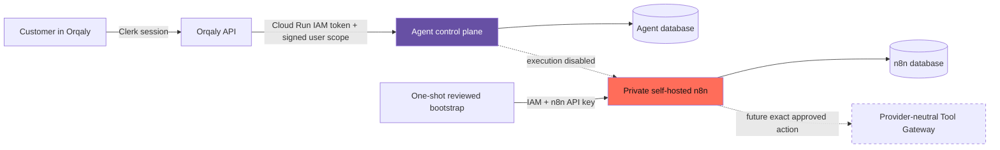

# Agentic Preview runtime on GCP

This directory deploys the first-class Orqaly Agent control plane and a private,
self-hosted n8n runtime into the existing Workflow v2 Preview boundary. It does
not read, copy or migrate Supabase data.



The browser never talks to n8n. Customers create, name, pause and inspect their
Agents in Orqaly. The Orqaly API is the only Cloud Run principal allowed to call
the control plane. Only the control plane and a narrow one-shot bootstrap
identity may invoke n8n. The n8n editor is disabled. Its `/api/v1` management
API remains enabled because the content-addressed bootstrap requires it, but
Cloud Run internal ingress, IAM and an n8n-issued API key protect it; this is not
a public network endpoint. Neither runtime has provider credentials. External execution is also disabled in the control
plane (`AGENTIC_EXECUTION_ENABLED=false` with an empty descriptor allowlist), so
deploying this stack cannot send an SMS or perform any other provider action.

## Reused and new resources

The scripts are hard-pinned to project `axwise-v2-preview-001`, project number
`161074549006`, region `europe-west4`, Cloud SQL instance
`orqaly-v2-preview-001-pg`, VPC `workflow-v2-preview`, subnet
`workflow-v2-preview-ew4`, and Artifact Registry repository
`workflow-v2-preview`. They fail if those identities do not match.

They add only:

- two scale-to-zero private Cloud Run services;
- two narrow runtime service accounts plus separate migration and bootstrap
  job identities;
- two empty logical PostgreSQL databases with different owners and passwords;
- separate Agent migration and runtime PostgreSQL roles: the web runtime cannot
  own schemas, create objects or bypass forced row-level security;
- distinct Secret Manager entries for migration/runtime database access,
  request signing, n8n database/encryption and the n8n-issued management key; and
- an idempotent Cloud Run migration job for the Agent schema.

The existing Cloud SQL instance remains the fixed-cost resource. n8n is limited
to zero or one instance and one concurrent request. Its durable application
state lives only in its own PostgreSQL database; container files are ephemeral.
Agent identity, profiles, scoped memory metadata, approvals, runs and audit
events live only in the separate Agent control-plane database.

This is a server workload, so GitHub Pages cannot host it: Pages has no private
runtime, service identity, database connection or secret boundary. A small GCE
VM would work but would add patching and always-on process ownership. Cloud Run
is used here because the Preview already has GCP IAM, VPC and Cloud SQL, while
both new services can scale to zero. The contracts remain provider-neutral, so
n8n or the hosting layer can be replaced later without changing Agent identity,
approval or memory records.

## Release order

Run from a clean committed Orqaly repository. Commands below intentionally use
explicit secret versions and image digests; never substitute `latest`.

1. Provision identities, databases and generated secrets. This is idempotent
   and never prints a secret value:

   ```bash
   ADMIN_DB_SECRET_VERSION=NUMBER \
     infra/gcp/agentic-preview/provision.sh
   ```

   Record the seven numeric versions it prints. The n8n management-key
   container is deliberately empty until n8n owner onboarding.

2. Build the control plane, mirror the pinned n8n Community runtime image with
   a digest-pinned registry-to-registry copy (without unpacking its layers), and
   build a distinct one-shot reviewed bootstrap image:

   ```bash
   infra/gcp/agentic-preview/build-images.sh
   ```

   Record the three `@sha256:` image references it prints. The raw n8n image is
   intentionally the long-running service. `n8n-bootstrap` is intentionally a
   separate Cloud Run Job image and is never exposed as a service.

3. Deploy. The script runs the checksum-verifying Agent migrations first, then
   creates or updates both private services. Re-running it converges safely:

   ```bash
   CONTROL_PLANE_IMAGE='...@sha256:...' \
   N8N_IMAGE='...@sha256:...' \
   CONTROL_PLANE_DATABASE_URL_SECRET_VERSION=NUMBER \
   CONTROL_PLANE_MIGRATION_URL_SECRET_VERSION=NUMBER \
   CONTROL_PLANE_MIGRATION_PASSWORD_SECRET_VERSION=NUMBER \
   PRINCIPAL_SIGNING_KEY_SECRET_VERSION=NUMBER \
   N8N_DATABASE_PASSWORD_SECRET_VERSION=NUMBER \
   N8N_ENCRYPTION_KEY_SECRET_VERSION=NUMBER \
     infra/gcp/agentic-preview/deploy.sh
   ```

   `apply-control-plane-schema.sh` may also be run independently with the
   control-plane image and its migration URL/password versions when diagnosing
   migrations. That job uses the migration identity; the service receives only
   the DML-only runtime URL.

4. Optional while external execution remains disabled: after one-time n8n owner
   onboarding, store the n8n-issued API key without printing it, then publish
   and verify the reviewed workflow:

   ```bash
   printf '%s' "$N8N_ISSUED_KEY" | gcloud secrets versions add \
     orqaly-n8n-preview-api-key --project=axwise-v2-preview-001 --data-file=-

   N8N_BOOTSTRAP_IMAGE='...@sha256:...' \
   N8N_API_KEY_SECRET_VERSION=NUMBER \
     infra/gcp/agentic-preview/bootstrap-n8n.sh
   ```

   The bootstrap job obtains a short-lived Cloud Run identity token from the
   metadata server and also supplies the n8n API key. It can only reconcile the
   content-addressed workflow in `infra/n8n/executor-bindings.json`. Initial
   owner creation is an explicit operator ceremony on a private/loopback path;
   these scripts do not fabricate an n8n API key or temporarily expose its UI.

5. After the normal Orqaly API release, connect that API revision to the private
   control plane:

   ```bash
   PRINCIPAL_SIGNING_KEY_SECRET_VERSION=NUMBER \
     infra/gcp/agentic-preview/connect-orqaly-api.sh
   ```

   The existing Workflow v2 deployment uses full `--set-env-vars` and
   `--set-secrets` replacement, so this small connection step must be repeated
   after every standard `orqaly-v2-api-preview` deployment. Keeping it separate
   avoids silently changing the established release script.

6. Verify exact images, secret versions, scaling, private ingress, invoker
   allowlists, database presence, disabled execution and disabled n8n UI:

   ```bash
   CONTROL_PLANE_IMAGE='...@sha256:...' \
   N8N_IMAGE='...@sha256:...' \
   CONTROL_PLANE_DATABASE_URL_SECRET_VERSION=NUMBER \
   CONTROL_PLANE_MIGRATION_URL_SECRET_VERSION=NUMBER \
   CONTROL_PLANE_MIGRATION_PASSWORD_SECRET_VERSION=NUMBER \
   PRINCIPAL_SIGNING_KEY_SECRET_VERSION=NUMBER \
   N8N_DATABASE_PASSWORD_SECRET_VERSION=NUMBER \
   N8N_ENCRYPTION_KEY_SECRET_VERSION=NUMBER \
     infra/gcp/agentic-preview/verify.sh
   ```

## What this release intentionally cannot do

n8n is present as a replaceable execution engine, not as the source of Agent
identity or authority. Its management API is platform-private and can be used
only by the reviewed bootstrap job after explicit owner onboarding. Enabling real connector work requires
a separately reviewed Tool Gateway, a one-action approval contract, n8n workload
identity, receipt/reconciliation handling, and a non-empty content-addressed
descriptor allowlist. Until all of those land together, the runtime remains a
safe visible architecture with real Agent storage and lifecycle management but
no external side effects.

There are no delete, teardown, database-drop or secret-destroy commands in this
directory. If a pre-existing resource has a conflicting owner, public invoker,
unexpected origin or mismatched identity, the scripts stop for operator review.
