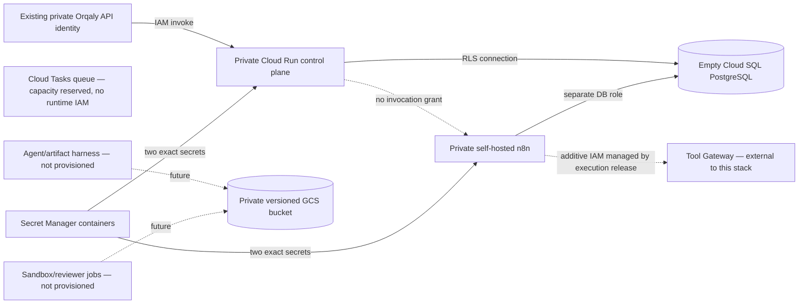

# Orqaly Agentic GCP foundation

This directory is a reviewable Terraform foundation for the new delegated-Agent system. It provisions empty, isolated platform resources and can optionally deploy the two runtime containers that exist today. It does **not** apply anything by itself, create credentials, load legacy data or enable live Agent execution.

The safe defaults are:

- `deploy_runtime_services = false`;
- `agentic_execution_enabled = false`;
- private Cloud Run ingress with no anonymous IAM binding;
- self-hosted n8n at `min=0`, `max=1`, concurrency `1`;
- one low-rate Cloud Tasks queue with no runtime enqueue or OIDC-minting authority;
- Cloud SQL and Cloud Run deletion protection enabled;
- a non-empty GCS bucket cannot be force-deleted;
- no secret versions or generated passwords in Terraform/state; and
- no runtime identity can access the artifact bucket yet.

## Provisioned shape



The module creates:

- required GCP API enablements;
- a dedicated VPC, Direct VPC egress subnet and private-services allocation, or references an existing VPC/subnet;
- a new empty PostgreSQL instance plus separate `orqaly_agentic` and `n8n_agentic` databases, or references an existing Cloud SQL instance;
- an Artifact Registry Docker repository for reviewed digest-pinned images;
- a private, versioned, public-access-blocked GCS artifact bucket with an unlocked minimum-retention policy;
- four protected Secret Manager containers, with no versions or payloads;
- separate control-plane, n8n and future Cloud Tasks invocation service accounts;
- secret-level read grants instead of broad project secret access; no runtime identity can enqueue Cloud Tasks yet;
- a rate/concurrency-limited Cloud Tasks queue; and
- optional project-scoped billing alerts at 50%, 90% and 100%.

When `deploy_runtime_services` is explicitly enabled, it also creates:

- the private Agent control plane at `min=0` and a configurable hard maximum; and
- private n8n at exactly `min=0`, `max=1`, concurrency `1`, 1 vCPU/2 GiB, instance CPU while active, no saved execution payloads, 30-second execution limits, disabled public API, an exact metadata/Gateway SSRF hostname allowlist and a blocked-node list.

n8n's Direct VPC egress firewall permits only PostgreSQL and Google private/restricted API VIPs, then denies other IPv4 egress. The Tool Gateway and the API → n8n and n8n → Gateway IAM members are owned by the reviewed Preview execution release, not this older foundation state. This module grants no runtime identity automatic n8n invocation, and a hard check forbids `agentic_execution_enabled=true`, preventing this partial stack from claiming the live execution boundary. n8n receives no artifact-bucket role and can read only its database-password and encryption-key secrets here.

## Deliberately not provisioned

This foundation is not a complete Agent runtime. The following components do not exist in this module and must be delivered in separately reviewed increments:

- Tool Gateway, one-use effect grants, provider egress and provider-event ingress;
- sealed-context Agent/research/artifact harness and model/evidence egress policy;
- disposable sandbox, independent reviewer and governed publisher jobs;
- Artifact Gateway and object/generation-scoped access;
- the generic execution-kernel Cloud Run handler and its dispatcher/reconciler; and
- schedule, memory-router and proactive-delivery workers.

The Cloud Tasks queue is only reserved capacity: the control plane has no enqueue role, no identity may mint the future task OIDC token, and no Cloud Run invocation grant exists. A task chooses its HTTP target when it is created, so merely leaving a target out of the queue configuration is not treated as a security gate. The future kernel module must enforce an exact private handler contract and grant only the minimum enqueue, token and invocation permissions in the same reviewed increment. The artifact bucket has no application IAM grant until the Artifact Gateway exists. These omissions are intentional fail-closed boundaries, not deployment steps to bypass.

## Cost warning

`terraform plan` is free, but `terraform apply` creates billable resources. Cloud SQL does not scale to zero and is expected to be the main fixed Preview cost. Automated backups and point-in-time logs add storage cost. Cloud Run can scale to zero but charges while requests/active instances run; n8n uses instance CPU while active. GCS, Artifact Registry, Secret Manager, Cloud Tasks, logging and network traffic can also incur usage charges.

The default `db-f1-micro`, `ZONAL` instance is a cost-oriented Preview choice, not a production availability recommendation. Reusing a suitably isolated existing instance can reduce fixed cost. A dedicated instance improves fault and administrative isolation but creates another always-on charge.

Setting `billing_account_id` creates an alert budget. A GCP budget **does not stop, throttle or cap spending**. Configure billing recipients and external cost controls before applying. Review current prices and the Terraform plan with the project owner.

## State and secret rule

Use a protected remote backend for shared environments. Backend configuration is intentionally not hard-coded because the state bucket/project is deployment-specific. Never commit local state or `terraform.tfvars`; this directory's `.gitignore` excludes them.

Terraform creates only these secret containers:

| Key | Runtime reader | Payload populated outside Terraform |
|---|---|---|
| `control_plane_database_url` | control-plane service account | PostgreSQL URL using the `/cloudsql/PROJECT:REGION:INSTANCE` socket |
| `principal_signing_key` | control-plane service account | at least 32 bytes of cryptographic key material |
| `n8n_database_password` | n8n service account | password for the dedicated `n8n_runtime` database role |
| `n8n_encryption_key` | n8n service account | stable high-entropy n8n encryption key |

There are no `google_secret_manager_secret_version` resources and no random-password resources. Do not pass any payload through a `.tfvars` value, Terraform environment variable, output or plan. Populate secret versions through the approved operator secret-ingestion process, and create distinct least-privilege database roles through a one-time database administration session.

## Safe bootstrap sequence

1. Select a protected remote Terraform backend and authenticate a narrowly privileged deployment identity.
2. Copy `terraform.tfvars.example` to the ignored `terraform.tfvars`, set the project, and leave both runtime and execution flags false.
3. Run `terraform init`, `terraform fmt -check -recursive`, `terraform validate` and `terraform plan`. Review API enablement, IAM, network ranges, Cloud SQL cost and deletion protections.
4. If approved, apply only the reviewed base configuration. This creates an empty database/storage foundation and incurs cost; this repository does not perform the apply.
5. In a controlled database administration session, create separate migration, control-plane and n8n roles. The runtime roles must not own schemas, bypass row-level security or use one another's database.
6. Apply the control-plane migrations to the new empty Agent database using the one-time migration role. Do not load, copy, replicate or read data from a legacy store.
7. Add the four required Secret Manager versions outside Terraform. Record rotation ownership and test that each service account can read only its two containers.
8. Build the reviewed control-plane image. Mirror the pinned `n8nio/n8n:2.37.10` image into Artifact Registry. Resolve and record both immutable `sha256` digests.
9. Set `deploy_runtime_services = true`, the two digest references and the exact existing Orqaly API/operator IAM members. Keep `agentic_execution_enabled = false`.
10. Plan, review and apply the private services. Verify ingress/IAM denial, database separation, n8n egress denial, scale bounds, payload-retention settings and that no runtime identity has Cloud Tasks enqueue, task-token minting or kernel-invocation authority.
11. Add the missing security-critical components and pass the documented release gates before any proposal to set `agentic_execution_enabled = true`.

Changing a protected resource to deletable is deliberately two-step: first set its deletion-protection variable false and apply that state change; only then may a separately reviewed removal plan proceed. An unlocked GCS retention policy still prevents deletion of objects until their retention time passes, and `force_destroy` remains false by default.

## New instance versus reuse

The default creates a dedicated empty instance:

```hcl
create_cloud_sql_instance = true
manage_databases          = true
```

To reuse an existing Cloud SQL instance, the services must join the VPC/subnet that can privately reach it. Supply both the instance resource name and connection name, and provide the exact database private-IP CIDR for n8n's egress rule:

```hcl
create_cloud_sql_instance          = false
existing_cloud_sql_instance_name   = "existing-instance"
existing_cloud_sql_connection_name = "project:europe-west1:existing-instance"

create_network        = false
existing_network_id   = "projects/project/global/networks/runtime"
existing_subnetwork_id = "projects/project/regions/europe-west1/subnetworks/runtime"
existing_sql_private_ip_cidrs = ["10.20.0.15/32"]
```

Keep `manage_databases = true` only when Terraform should create two new empty logical databases on that instance. Set it false when a database administrator has already created them. Reuse does not grant access to any other database or make an existing application dataset Agent context.

## Image and invocation rules

Both image variables are rejected unless they point to Artifact Registry/GCR and end in an immutable `@sha256:<64 hex>` digest. Tags such as `latest`, including a tag plus a digest omission, do not pass the module check.

Neither service has `allUsers` or `allAuthenticatedUsers`. Populate `control_plane_invoker_members` only with the existing private Orqaly API identity. The control-plane identity alone receives n8n invocation rights. `n8n_operator_invoker_members` is for a small operator group; it must never include customers.

Internal ingress and IAM are separate checks. A caller must arrive through an accepted internal path **and** hold `roles/run.invoker`.

## Validation

From this directory:

```sh
terraform fmt -check -recursive
terraform init -backend=false
terraform validate
terraform plan -var-file=terraform.tfvars
```

`terraform validate` checks provider schemas only after `terraform init` installs the pinned provider. A valid plan does not establish application safety; the runtime release gates, database RLS integration tests, secret-access negative tests, network probes and cross-domain execution tests remain mandatory.
