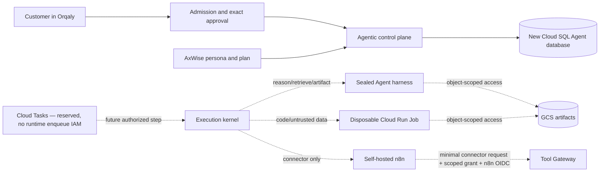

# Orqaly Agentic control plane

This package is the provider-neutral control plane for delegated Orqaly Agents. It is intentionally task-agnostic: research, document work, CRM operations, communications, repository work, monitoring and SMS setup all compile into the same Agent, plan, step, approval, memory, notification and receipt contracts.

Live execution is disabled by default. The current package safely materializes and displays authority; it does not yet contain the execution kernel, Tool Gateway, credential broker, Agent harness, sandbox or notification-delivery worker.

## What persists and what runs

An Agent is not a permanently running container. Its durable identity, exact AxWise persona version, team position, plan, delegation, memory policy and audit history live in the new Agent Cloud SQL database. A short-lived execution session will be created only for an authorized step.



- Cloud SQL is canonical for Agents, persona versions, teams, plans, immutable action intents, approvals, runs, steps, attempts, events, memory policy and notification state.
- GCS will hold immutable files and artifacts behind an Artifact Gateway; executors never receive bucket-wide credentials.
- Secret Manager will hold service secrets and provider/OAuth material; models, sandboxes and n8n receive only opaque, short-lived references.
- Self-hosted n8n runs one reviewed atomic connector workflow at a time. It receives only a minimal typed connector projection, never the principal, Agent persona, sealed context, artifact references, reasoning limits or callback. It has no provider credentials, no provider route, no write retries and no retained execution payload.
- Reasoning, retrieval and artifact work belongs in a sealed Agent harness. Code and untrusted transforms belong in a disposable sandbox job. Neither exists in this slice yet.

The new system starts empty. It has no data importer, backfill, replication, dual-write, fallback read or context bridge from Supabase.

There is intentionally no standalone `/agentic-control` product page. First-class and task-created Agents are shown inside Orqaly's existing Clerk-authenticated Agent, Assistant and Goal surfaces. The browser must reach this service only through Orqaly's server-side gateway, which resolves Clerk membership and signs a short-lived principal; browser-supplied tenant identity is never accepted. Legacy Supabase users, memberships and data are not imported.

### First-class Agent entity API

An Agent can now exist independently of a Goal or task. Its editable product profile is an immutable, hash-bound revision containing a name, role label, description, instructions and a bounded icon-or-emoji avatar. That profile is deliberately separate from immutable AxWise execution-persona versions: changing an Agent card does not silently change the identity pinned into an approved execution plan.

- `POST /v1/agents` creates a standalone Agent in `draft` state;
- `GET /v1/agents` and `GET /v1/agents/:agentId` return the current profile, lifecycle, latest-run summary and run count;
- `PATCH /v1/agents/:agentId/profile` appends a profile revision;
- `POST /v1/agents/:agentId/lifecycle` applies an exact `propose`, `activate`, `pause`, `resume`, `revoke`, `archive` or temporary-to-persistent `promote` transition; and
- `GET /v1/agents/:agentId/runs` returns that Agent's tenant-scoped execution history.

All writes are human-only, require the dedicated `agentic:agent:write` scope and an `Idempotency-Key` equal to the versioned body key. Profile and lifecycle writes additionally require the current Agent version in `If-Match`; create/detail/profile/lifecycle responses return it as an `ETag`. PostgreSQL row-level security owns organization/workspace/user isolation, profile and event rows are immutable, and every successful mutation produces a replayable mutation record plus a safe Agent event.

## Implemented boundary

- short-lived signed `RequestPrincipal` verification, sorted least-privilege action scopes, per-route scope enforcement and transaction-local tenant context. Approval decisions additionally require a signed `actorType: user`; a service principal is rejected before a database transaction, and the approval audit actor is derived from that verified actor kind. This is only the human-versus-service boundary: required Clerk organization membership and approver-role authorization remain release gates. The current principal proves a trusted upstream gateway's tenant/action assertion; the Clerk membership gateway itself is not implemented yet;
- forced PostgreSQL row-level security for the new Agent tables;
- standalone Agent creation, immutable user-facing profile revisions, explicit lifecycle control, rich Agent detail/list projections and per-Agent run history, with task-materialized Agents backfilled into the same profile model;
- proposal-only task/Agent admission separated from executable authority;
- lossless AxWise executor-persona materialization and exact persona version pinning;
- RFC 8785 hash-bound plan v2 plus byte-identical Python/JavaScript internal-plan, external-action-plan and execution-descriptor fixtures;
- a complete provider-neutral AxWise external-action bridge into immutable ActionIntent materialization;
- exact per-Agent plan delegations whose canonical target ceiling is the sorted union of that Agent's accepted external-action target triples; internal-only delegations keep an empty deny-all target ceiling, while each immutable policy snapshot pins the per-node provider operation, connection reference and scopes, targets, preconditions, idempotency, reconciliation and compensation identity;
- ActionIntent materialization fails unless its target is inside that ceiling and all of its node/external authority exactly matches the immutable delegation snapshot; the exact ActionIntent hash and delegation policy hash are then bound into the approval subject, secret-safe exact-consent presentation, backend-authoritative controls and versioned approval decision;
- durable event/outbox schema;
- server-resolved memory namespaces rooted in a trusted organization/workspace/user plus project/conversation/task/Agent scope and server-authorized domain/topic ceiling; an Agent-authored routing request cannot widen task semantics or provide namespace IDs, identities, purpose, clearance or time;
- exact project, same-user conversation, task and Agent namespace binding while reusable user/workspace namespaces remain inside the verified owner tuple; routing still requires one topic shared by request, namespace and item and enforces domain, purpose, classification, status and expiry, with valid zero-memory results;
- empty proactive-notification preference/grant/delivery tables and a pure intent policy/deduplication compiler. No repository/API/outbox consumer persists or sends the result yet, and a trusted event-to-urgency classifier plus complete recipient/consent/rate/cost grant binding remain release work;
- strict n8n adapter and content-addressed binding/workflow/runtime manifest; every connector read, external notification and write requires one exact provider-account connection, a scope-hashed grant with a maximum five-minute lifetime, and separate Gateway workload authorization; the workflow projects only connector-safe fields, and every unverified post-send write failure is ambiguous and requires reconciliation;
- execution-envelope contracts that require ActionIntent ID/hash references for every external effect and exact approval plus logical-effect idempotency references for writes; resolving those references against immutable database state remains an execution-kernel release gate; and
- honest task admission states: `ready`, `needs_customer_action`, `plan_only` and `unsupported`.

The deployed n8n descriptor allowlist is empty, no runtime identity can enqueue Cloud Tasks, there is no enqueue/dispatcher code or provider route, and `AGENTIC_EXECUTION_ENABLED` defaults to `false`. Missing Gateway workload authorization fails closed before n8n is called. A task chooses its HTTP target when it is created, so absence of a queue-level target is not presented as a security gate.

In this preview slice, `AGENTIC_EXECUTION_ENABLED=true` records operator intent only. Runtime responses expose it as `executionRequested`, while effective `executionEnabled`, `executionReady` and every `dispatchable` result remain false until real dependency readiness is implemented. The control-plane `/readyz` status therefore means that its database/API is ready; it never means an execution kernel is ready.

### Memory retrieval trust boundary

`MemoryRoutingRequestV1` contains only a domain, sorted query topics and a bounded result limit. The authenticated memory gateway, not the browser or Agent, must load the accepted task scope, run and Agent and construct `TrustedMemoryRetrievalScopeV1` with the verified organization/workspace/user, project, conversation, task, Agent, allowed domains/topics, purpose, clearance and server time. Requested domain/topics must be a subset of that trusted semantic ceiling. `resolveAccessibleMemoryNamespaces` then returns only active, unexpired namespaces allowed for that exact scope, domain, topic and purpose. Candidate/vector retrieval must query only those resolved namespace IDs; `routeMemory` repeats the ownership and policy checks as defence in depth before returning content references.

The hierarchy is additive but never fuzzy: workspace and user memory remain inside the exact owner tuple; project and conversation memory require their exact reference; task memory requires its exact project/conversation/task tuple; Agent memory requires the exact durable Agent ID. Missing or non-matching namespaces produce a valid zero-memory context. No legacy or Supabase-backed data participates in resolution.

## Local validation

Use Node.js 22 or newer.

```sh
npm install
npm test
```

Run migrations only against a new, empty PostgreSQL database with a dedicated migration role:

```sh
DATABASE_URL=postgresql://... \
ORQALY_PRINCIPAL_SIGNING_KEY=replace-with-at-least-32-random-bytes \
npm run migrate
```

The service currently applies nine ordered, additive Agent-database migrations.

The migrator performs a fail-closed preflight before creating its metadata schema. It accepts only a pristine database or one already marked by this migrator with known tables and migration names/checksums; public application tables, Supabase/foreign schemas, unknown Agent tables and unknown migration rows are rejected. Reusing a Cloud SQL instance means creating a separate empty database, never pointing at an existing application database.

The runtime database role must not own the schema or have `BYPASSRLS`. Set `TEST_DATABASE_URL` to that role to include the real PostgreSQL isolation and execution-lineage integration tests. Local self-hosted n8n instructions live in `../../infra/n8n/README.md`; the unapplied GCP foundation is in `../../infra/gcp/agentic/README.md`.

## Remaining release gates

Do not enable live dispatch until the server-side Clerk Organizations membership gateway, trusted descriptor registry integration, sealed Agent/artifact harness, Tool Gateway and credential broker, Cloud Tasks kernel with leases/fencing/reconciliation, sandbox/reviewer, memory-management APIs, notification delivery worker, observability and cross-domain end-to-end tests are complete. The auth gateway must verify Clerk issuer/audience/signature/expiry and active membership, resolve only fresh GCP membership rows, map roles to least-privilege action scopes and mint a principal valid for at most five minutes; Supabase tokens and browser-supplied tenant IDs are rejected. The current HMAC principal does not yet carry a trusted issuer or signing credential/key ID, so the gateway and verifier must add those fields with rotation/revocation semantics before connection. The memory gateway must construct `TrustedMemoryRetrievalScopeV1` from the verified principal and persisted accepted scope/run/Agent rows; browser, model and connector payloads must never supply that object or namespace IDs. Before dispatch, the execution kernel must resolve every envelope ActionIntent and approval reference against the immutable tenant-scoped database rows and reject any field drift. Exact approval must bind the immutable action, target, connection, policy, persona, plan, delegation, limits, expiry and nonce before any external effect. The production n8n-to-Gateway path must acquire short-lived OIDC as the dedicated n8n service account; the Gateway must verify signature, trusted issuer, expiry, the manifest-pinned audience and that exact workload subject. The current token-provider hook is contract scaffolding only, so the empty descriptor allowlist and inactive workflow remain release gates.
