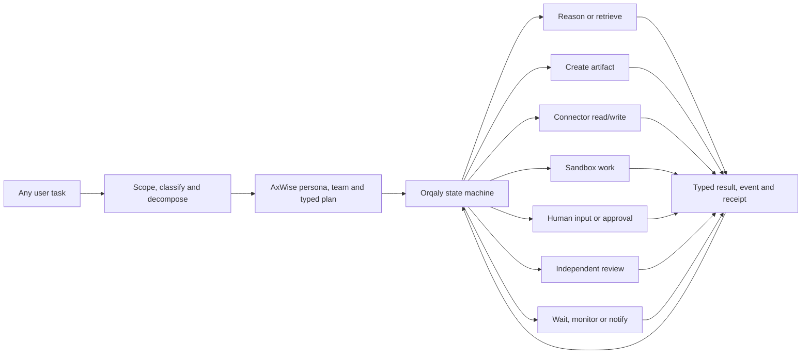
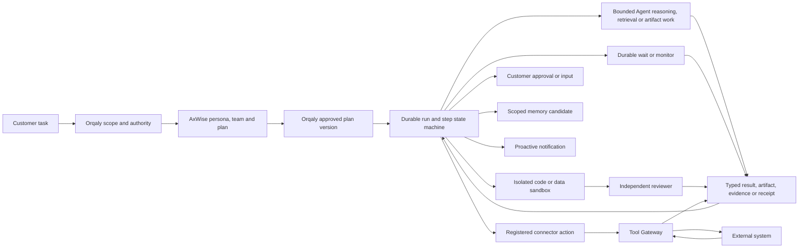
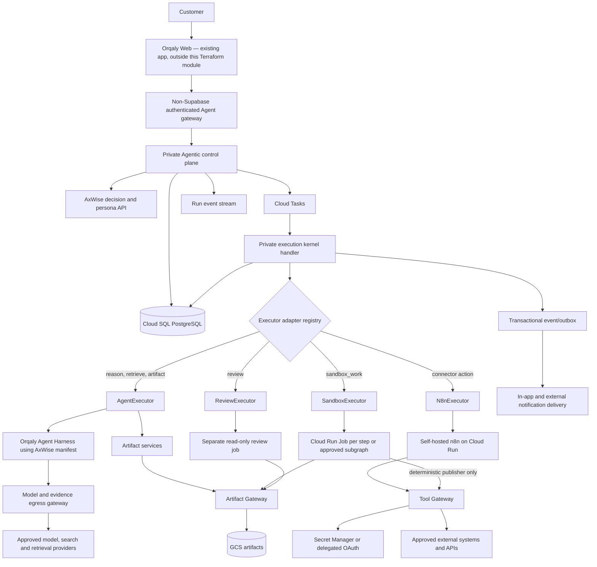
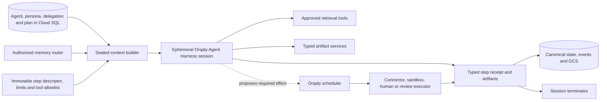
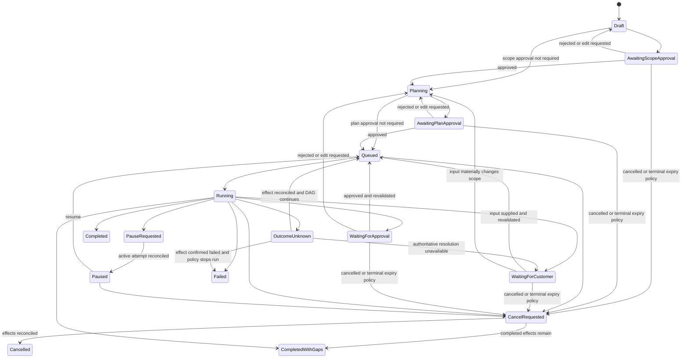
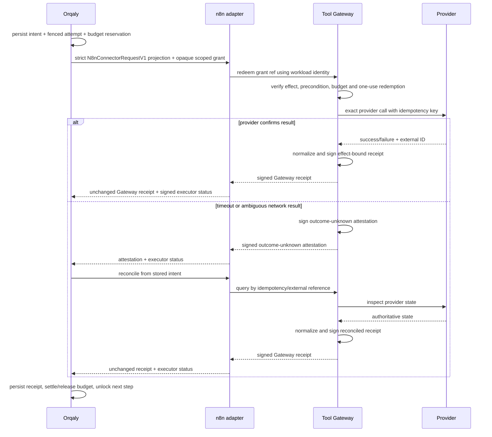
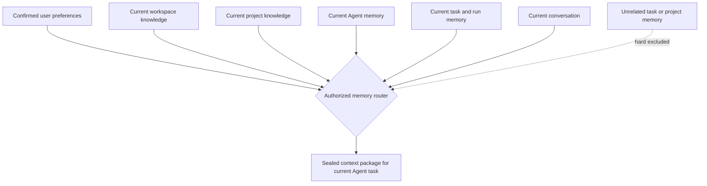
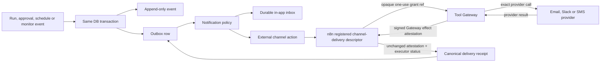

# Orqaly universal delegated-Agent execution implementation plan

**Date:** 4 September 2026

**Status:** historical 4 September implementation baseline; customer-solution and native n8n requirements updated on 5 September.

**Design precedence — 5 September 2026:** the accepted
[Native n8n integration design](./orqaly-native-n8n-integration-design-2026-09-05.md)
governs the customer Solution experience. Orqaly owns Agent control and approval,
AxWise supplies cognition/evidence/semantic analysis, and self-hosted n8n supplies
the native viewer, authenticated customer-scoped draft editor and workflow execution.
Earlier statements below requiring connector-only/shared n8n, hiding the native
canvas, or prohibiting customer editor access are superseded. The internal connector
adapter remains a useful capability. Existing isolation, scoped context, approval,
evidence and executor-replaceability requirements continue to apply. Dated
implementation snapshots below describe the earlier work, not the current preview.

**Preview runtime correction — 6 September 2026:** use the approved min-0/max-1
Cloud Run n8n environment003 and private Cloud Run Sandbox service, not a
dedicated coding-worker VM. Reuse the existing Cloud SQL instance with an
isolated n8n database/login; preserve environments001/002. Orqaly's existing
durable worker wakes approved webhook schedules, so n8n need not remain awake
for its own timer. Scale-to-zero does not promise zero total platform cost.
The [dated implementation and evidence ledger](./orqaly-low-cost-execution-preview-2026-09-06.md)
records the actual deployments, tested boundaries and remaining limitations. It does
not turn the historical platform-wide checklist into a completion claim.

**Product scope:** task-agnostic delegated Agents for research, operations, communications, data work, coding, documents, monitoring and mixed workflows

**Representative conformance fixtures:** cited research, CRM operations, approved communications, repository work, recurring monitoring and SMS configuration
**AxWise baseline reviewed:** `origin/main@2731dccf0df5` (27 August 2026). Implementation is now on the coordinated `codex/universal-agentic-foundation` branch based on that exact reference; the stale local `main@675610f474a2` remains untouched.

### Implementation snapshot — 4 September 2026

This snapshot records the task-agnostic foundations as of 4 September. Apply the
5 September design precedence above when continuing implementation. Work completed
on the coordinated implementation branches at that checkpoint included:

- a pure AxWise delegated-Agent contract layer for durable Agent/team/persona identity, structured effects and data egress, immutable plan references, lifecycle and scheduling invariants;
- an isolated Orqaly Agent control-plane service with short-lived tenant-and-action-scoped principals, per-route scope enforcement, tenant-scoped PostgreSQL RLS, proposal-only AxWise intake, RFC 8785 hash-bound executable plan v2, durable Agent/team/persona/run/step records, exact approval binding, append-only events and transactional outbox. Composite database keys now force every attempt, receipt and event reference to belong to one exact tenant/run/step chain;
- a lossless adapter for the real rich `axwise_executor_persona_v1` manifest, with the exact persona ID/version/content hash pinned into the plan, execution step, delegation and approval snapshot;
- byte-identical cross-runtime golden plans for an internal Agent step and a provider-neutral external write, proving that AxWise and Orqaly preserve the same RFC 8785 source-plan digest, nullable-field omission, effective execution limits and complete provider-neutral external-action intent semantics. This is a non-authorizing request until Orqaly policy, grant and exact approval succeed;
- one byte-identical cross-runtime execution-descriptor fixture plus matching AxWise/Orqaly manifest validators, proving the same descriptor identity, executor bindings, effect/egress authority, retry ceiling, runtime/cost limits and reconciliation/compensation policy;
- exact per-Agent delegation generated only from the materialized v2 plan—never from proposal capability labels—with each execution step database-bound to its Agent, run, plan version and delegation. External delegations persist a canonical target ceiling plus the full provider/connection/scope/target/precondition/idempotency/reconciliation/compensation snapshot; migration 007 and an insert trigger reject broader or drifting ActionIntents, while internal delegations remain explicit deny-all for targets;
- immutable external `ActionIntentV1` and `ApprovalSubjectV1` records that bind the tenant, approver, Agent, persona, plan, delegation, descriptor, executor, canonical input, target, precondition, connection reference, provider operation, idempotency key, policy, budget, expiry and nonce before a customer can approve; the approval API revalidates this identity and requires a user principal—not a service principal—before recording the decision and derived human audit actor;
- a pure, deliberately unwired AxWise outcome adapter that accepts only a known terminal dispatch receipt plus an already-verified Gateway attestation, preserves exact evidence for the existing evaluator, and cannot infer or upgrade run success or authorization;
- empty RLS-owned memory namespaces/items/access logs with exact workspace/user/project/conversation/task/Agent scope shapes, plus a separate trusted retrieval scope and topic, purpose, classification, status and expiry-aware resolver/router whose valid result may intentionally contain no memory. Browser/model input can propose only domain/topics/limit; those semantics must be a subset of server-authorized task domains/topics, while identity, namespace IDs, clearance, purpose and time never come from request JSON. Negative fixtures cover malicious semantic relabeling, unrelated weather and same-user cross-project/conversation/task/Agent isolation. Repository-prefilter and retrieval wiring remain;
- empty notification preference/grant/delivery tables with a unique delivery-dedupe constraint plus a pure quiet-hour/event/urgency policy compiler that always proposes an in-app intent and cannot authorize arbitrary Agent outreach without explicit user opt-in and a matching Agent-bound standing grant. Its event urgency is still supplied to the pure contract rather than derived by a trusted server classifier; no API, outbox consumer or delivery worker persists or sends those intents yet;
- a pinned self-hosted n8n connector profile and adapter behind a fixed private webhook, with no provider credentials, no write retry, no saved execution payload and mandatory matching Tool Gateway attestation for external completion. n8n receives a strict connector-only projection—not the Agent/persona/context/artifact envelope—and a deterministic recursive scanner rejects credential-shaped and reserved private-execution concepts hidden inside nested canonical input. All external reads/notifications/writes require exactly one opaque connection plus a scope-hashed ≤5-minute Gateway grant;
- a content-addressed n8n binding manifest that verifies the exact executor/descriptor/hash/step-kind combination, immutable n8n image digest and workflow bytes; its deployed descriptor allowlist is deliberately empty until a reviewed pack is registered;
- a protected Orqaly Agentic Control preview and provider-neutral client built only against implemented API shapes, with fixture-backed UI verification, a secret-safe exact-consent projection of the immutable plan/action and honest disabled controls. It cannot authenticate to a deployed Agent control plane until the non-Supabase gateway exists; and
- a validated, unapplied Terraform foundation for an empty GCP deployment: private Cloud Run control plane and self-hosted n8n, new or explicitly operator-supplied empty Cloud SQL databases, a capacity-reserved Cloud Tasks queue with no runtime enqueue/token authority, protected GCS/Artifact Registry, empty Secret Manager containers and narrow service identities. The migrator refuses foreign schemas/tables and accepts only a pristine database or one already marked as owned by this Agent migrator. Both runtime deployment and Agent execution default to off.

The implementation is intentionally feature-disabled for live dispatch. The remaining delivery work includes the browser-to-control-plane auth gateway, AxWise planning endpoint, trusted descriptor-pack registration and repository integration, sealed-context Agent/artifact executor, pgvector retrieval and memory-management APIs, Tool Gateway and credential broker, Cloud Tasks dispatcher/fencing/reconciliation, actual proactive-notification delivery worker/providers, sandbox/reviewer runner, full lifecycle/schedule/control APIs, Terraform apply/operator bootstrap, observability and cross-domain end-to-end conformance tests.

The data rule is final: this implementation creates new empty GCP stores. The Agent data and execution plane contains no Supabase importer, backfill, replication, dual-write, fallback read or Agent-context bridge. The current preview page still sits behind Orqaly's legacy Supabase-backed application-shell route guard; that guard is not an Agent principal, its token is not sent to or accepted by the Agent control plane, and it must be replaced by the authenticated non-Supabase gateway before the preview is connected or live execution is enabled.

## 1. Outcome in simple words

After this work, a customer can give Orqaly very different jobs, for example:

- research a market and write a cited brief;
- clean and update CRM records;
- prepare and send an approved customer communication;
- fix a bug and open a reviewed pull request;
- monitor a supplier or competitor and notify the user when something changes; or
- set up SMS for a B2B SaaS.

The same execution system will then:

1. create or select a clearly labelled delegated AI Agent for this task;
2. give it only the knowledge and permissions relevant to that user, workspace, project and task;
3. show the customer the exact plan, targets, risks and any applicable cost/recurrence;
4. apply policy and request exact approval before sensitive, consequential, irreversible or costly actions;
5. perform analysis, retrieval and artifact work in a bounded Agent harness, deliver customer automations through self-hosted n8n, and use isolated workers for code, builds, tests or untrusted data processing;
6. let the customer pause, resume, cancel remaining work, reject, retry or revoke the Agent;
7. use a separate reviewer wherever quality or separation of duties requires it;
8. keep durable receipts and proactively notify the customer; and
9. expire the temporary Agent or let the customer promote it into a reusable digital worker.

The Agent is not a permanent server, an SMS-specific bot or literally the customer. Its identity, memory scope, persona, permissions and history persist in Orqaly; task-appropriate compute starts only when work is authorized by policy or by a required human approval.

Even a one-step operational task receives the same tenant-scoped Agent, run, step, authority and audit boundary. It may use shared request-scaled infrastructure, but it never shares another customer's context or grant and does not require a permanently running per-user server.

## 2. Decisions fixed by this plan

Customer n8n rows below reflect the 5 September
[native integration decision](./orqaly-native-n8n-integration-design-2026-09-05.md).
Other foundation details retain their dated implementation context.

| Decision | Proposal |
|---|---|
| Product authority | Orqaly owns identity, plans, approvals, budgets, run state, memory policy, credentials, events, notifications and customer UI. |
| AxWise role | AxWise selects role/Agent candidates, compiles the executor persona, proposes context requirements/routing hints, plans over already authorized evidence, recommends guardrails and evaluates outcomes. Orqaly alone resolves memory namespaces and assembles sealed runtime context; AxWise never authorizes its own work. |
| n8n role | Self-hosted n8n supplies customer-scoped workflow viewing, draft editing and execution. Its native UI is integrated into Orqaly; an execution adapter preserves replaceability. |
| Sandbox execution | Generated code, repository checkout, builds, tests and untrusted data transforms run in a disposable sandbox per `sandbox_work` step or explicitly approved tightly coupled subgraph, never inside n8n. |
| Customer control | Orqaly contains the native n8n canvas and authenticated editor. Edits create a candidate; semantic review, exact approval, verified deployment and activation govern production changes. |
| Agent isolation | All Agent data and execution context are hard-scoped by organization/workspace/user/project/Agent. External actions receive short-lived tenant-bound grants; untrusted sandbox work receives a dedicated disposable process/job. Shared n8n never implies shared authority or memory. |
| Connected-preview identity | Use Clerk Organizations in membership-required mode for the first B2B Preview, reusing the verified GCP identity direction already present in AxWise. A server gateway verifies the Clerk session/JWT and active organization membership; the browser never supplies trusted tenant IDs or signs an Agent principal. The interface remains replaceable by another OIDC provider later. |
| Fresh membership mapping | A new Cloud SQL membership/mapping table binds Clerk user + organization IDs to internal Orqaly organization/workspace IDs and Agent roles. Rows are created only by an operator bootstrap or verified invitation/membership event; no Supabase users, workspaces or roles are imported. Existing users must be newly invited/enrolled into the Preview. |
| Credential location | Customer credentials remain behind an Orqaly Tool Gateway backed by Secret Manager/OAuth. The model and sandbox never receive raw long-lived secrets. |
| Persistence | Cloud SQL PostgreSQL is the canonical state and audit store; GCS stores immutable files/artifacts; Secret Manager stores secrets. n8n history is not the audit source of truth. |
| Supabase cutover | **No Supabase data is moved.** The GCP Agent data/execution plane starts with an empty Cloud SQL database and has no import, backfill, dual-write, fallback read or context dependency on Supabase. The existing Orqaly shell may keep its legacy auth temporarily only as a page-visibility guard; Supabase tokens must never become Agent principals or reach Agent routes, and the connected Agent preview requires a new non-Supabase auth gateway. |
| Background work | Cloud Tasks pushes durable step work to private Cloud Run handlers. Cloud Run Jobs execute bounded sandbox and isolated-review tasks. There is no always-running Agent loop. |
| First release safety | No automatic irreversible action, external send, purchase/spend, merge, deployment, deletion or publication without a matching exact approval. Proactive notifications and activated schedules run only under their narrow, revocable standing delegations. |
| Customer solution deployment | Use a customer-scoped n8n environment with isolated identity, database and credentials. The Agent is durable without requiring an always-running VM. Draft editing cannot carry production authority. |

### Universal task and step model

The platform must not contain one hard-coded “SMS workflow.” AxWise decomposes any supported task into a graph of universal step kinds. Orqaly schedules those steps and selects an executor through a registry.

| Step kind | Meaning | Typical executor | Examples |
|---|---|---|---|
| `reason` | analyse, plan, compare or decide | bounded AxWise/model harness | market analysis, solution design, prioritization |
| `retrieve` | obtain approved internal or external evidence | memory/evidence adapters | project facts, web research, document lookup |
| `produce_artifact` | generate a file or structured deliverable | bounded Agent or document service | report, proposal, spreadsheet, presentation |
| `connector_read` | inspect an external system without mutation | n8n/direct adapter through Tool Gateway | CRM lookup, account inspection, calendar availability |
| `connector_write` | make a typed external change | n8n/direct adapter through Tool Gateway | CRM update, ticket creation, email send, API configuration |
| `sandbox_work` | run code, shell, transforms, tests or repository work | disposable Cloud Run Job/local runner | bug fix, migration, data processing |
| `human_input` | request information, connection or a bound decision | Orqaly UI/inbox | choose option, connect account, approve cost |
| `review` | independently assess an artifact or proposed effect | distinct reviewer Agent/human | code review, factual review, policy review |
| `wait_or_monitor` | resume on time/event/condition | Orqaly scheduler/monitor adapter | weekly check, SLA wait, webhook event |
| `notify` | deliver an event according to user preferences | Orqaly inbox plus n8n channel adapter through Tool Gateway | approval request, completion, detected change |



Domain packs add descriptor schemas, policies, presentation metadata and executor bindings without changing this kernel. SMS, GitHub, CRM, email, documents and monitoring are packs over the same Agent/run/step/approval/event model.

## 3. What is already present and what must be added

### Reuse rather than rebuild

The current AxWise code already contains the cognitive half:

- strict task, Agent-candidate, tool, policy and budget contracts in [`backend/domain/orchestration/models.py`](../backend/domain/orchestration/models.py#L88);
- plan nodes with dependencies, tools, approvals, reviewer, budget and failure paths in [`backend/domain/orchestration/models.py`](../backend/domain/orchestration/models.py#L804);
- immutable, tenant-filtered orchestration decisions and audit events in [`backend/models.py`](../backend/models.py#L401) and [`backend/models.py`](../backend/models.py#L578);
- outcome and node-receipt ingestion in [`backend/models.py`](../backend/models.py#L600) and [`backend/models.py`](../backend/models.py#L653);
- idempotent decision composition and immutable replanning in [`backend/services/orchestration/decision_service.py`](../backend/services/orchestration/decision_service.py#L1036) and [`backend/services/orchestration/decision_service.py`](../backend/services/orchestration/decision_service.py#L1852);
- DAG, tool authorization, approval, budget and distinct-reviewer validation in [`backend/services/orchestration/plan_validator.py`](../backend/services/orchestration/plan_validator.py#L95);
- durable research-job status, claims, attempts, callbacks and recovery in [`backend/models.py`](../backend/models.py#L283) and [`backend/services/orqaly_hybrid_run_service.py`](../backend/services/orqaly_hybrid_run_service.py#L1400); and
- the intended rich synthetic executor persona, currently nested in a research bundle, in [`backend/services/orqaly_research_bundle_service.py`](../backend/services/orqaly_research_bundle_service.py#L1808).

That persona is explicitly `axwise_executor_persona_v1`. It already includes synthetic identity disclosure, role, mission, expertise, methods, work style, decision lens, output contract, risks, boundaries, task fit, provenance, persona ID and a content hash. This confirms the intended AxWise layer. The missing step is to materialize it as a versioned Orqaly Agent with lifecycle, memory and delegated authority.

Targeted existing orchestration/research suites passed in the audit: **109 passed, 3 deselected**. They do not cover the new execution plane or PostgreSQL RLS.

### AxWise topics that feed the implementation

| Existing AxWise topic | Delivery decision |
|---|---|
| Uncertainty routing, Agent eligibility/ranking and team planning in [`uncertainty_router.py`](../backend/services/orchestration/uncertainty_router.py), [`assignment_scorer.py`](../backend/services/orchestration/assignment_scorer.py) and [`team_planner.py`](../backend/services/orchestration/team_planner.py) | Keep as the single advisory compiler. Translate one accepted decision into durable Orqaly identities and a hash-bound executable plan; do not create a second planner. |
| Deterministic task classification, capability registry and authenticated feasibility projection in [`task_classifier.py`](../backend/services/orchestration/task_classifier.py), [`capability_registry.py`](../backend/services/orchestration/capability_registry.py) and [`plan_feasibility_adapter.py`](../backend/services/orchestration/adapters/plan_feasibility_adapter.py) | Reuse ambiguity/consequence/capability normalization for admission and planning. AxWise feasibility remains advisory; Orqaly must independently resolve the trusted signed descriptor, executor binding, live connection and policy before authority exists. |
| Sealed consequential-action projection in [`action_authority.py`](../backend/services/orchestration/action_authority.py) | Reuse its exact semantic-action normalization and catalogue intersection when compiling delegations and descriptor permissions. It is an admission ceiling, not permission to execute; the Orqaly ActionIntent, approval subject, connection grant and runtime policy must narrow it again. |
| Initial scope contract, proposal and decision projection in [`scope_contract_service.py`](../backend/services/orchestration/scope_contract_service.py), [`scope_proposal_service.py`](../backend/services/orchestration/scope_proposal_service.py) and [`scope_decision_projection.py`](../backend/services/orchestration/scope_decision_projection.py) | Reuse bounded, owner-confirmed objectives, stakeholders and requested-authority projection to drive `awaiting_scope_approval`. A material scope change creates a new immutable proposal/plan generation and never mutates an approved ActionIntent. |
| Deterministic, owner-reviewed scope correction in [`scope_correction_service.py`](../backend/services/orchestration/scope_correction_service.py) | Reuse the separation between model-assisted interpretation and a deterministic authority compiler. A correction creates a new immutable proposal/plan generation; it never mutates an approved ActionIntent or lets model prose grant tools, side effects or credentials. |
| Immutable failure-driven replanning in [`replanning_service.py`](../backend/services/orchestration/replanning_service.py) | Reuse its verified failure, unavailable-Agent/tool, rejected-output and human-override inputs. Replanning must produce a new hash/version and new approval whenever an approved action binding changes; it cannot edit an executing plan in place. |
| Outcome-based scorer evaluation and human-governed promotion/rollback in [`evaluation_service.py`](../backend/services/orchestration/evaluation_service.py) and [`scorer_registry.py`](../backend/services/orchestration/scorer_registry.py) | Reuse only for advisory Agent assignment after tenant-scoped, promotable outcomes meet sample, safety, drift, calibration and minority-slice gates. Learning may change a future ranking version after human review; it may never expand an Agent's authority, memory namespace or live plan. |
| `axwise_executor_persona_v1` | Promote this rich synthetic-worker profile into immutable Agent persona versions. Keep customer persona, research participant, delegated Agent identity and authority as four distinct objects. |
| Evidence-backed persona resolution in [`orqaly_persona_resolution_service.py`](../backend/services/orqaly_persona_resolution_service.py) | Reuse its separation of customer/research persona evidence from an executor candidate. A customer or research persona is never silently promoted into a delegated Agent identity or authority. |
| pgvector/SQLite document grounding in [`cognitive_grounding_service.py`](../backend/api/research/simulation_bridge/services/cognitive_grounding_service.py) | Reuse extraction, chunking, embedding and similarity mechanics only after replacing arbitrary `partition_id` access with owned namespaces and an audited topic/purpose router. Document grounding is not digital-twin memory. |
| Research topic/source contracts in [`research_topic_contract_service.py`](../backend/services/research_topic_contract_service.py) and [`research_source_authority_service.py`](../backend/services/research_source_authority_service.py) | Reuse bounded topic normalization and source proof as retrieval-ranking/provenance inputs only. Neither service may choose an Agent memory namespace or grant access to one. |
| Research pipelines and evidence/claim provenance | Keep as an optional evidence provider selected by uncertainty routing. Synthetic participant output never becomes user memory or execution authority automatically. |
| Durable research-job leases, heartbeats, retries and signed terminal callbacks | Reuse the fencing, idempotency, SSRF prevention and callback-signing patterns in the generic dispatcher, schedule reconciler and notification delivery worker; do not reuse the research-specific polling state machine. |
| Immutable outcomes and node receipts in [`outcome_service.py`](../backend/services/orchestration/outcome_service.py) | Translate generic runtime receipts into the existing evaluator so learning remains human-governed and cannot expand an Agent's authority. |
| Conditions/MCP connector | Retain only as bounded advisory classification/policy input. It is not the Agent harness, credential broker, scheduler or effect authority. |
| AxPersona execution trace and evidence UI | Reuse the visual language for the Orqaly operational timeline; keep research pages separate from Agent lifecycle, approvals, memory, schedules and notifications. |

The audit also found one pre-existing release blocker: [`_assert_ownership`](../backend/api/routes/perpetual_personas.py#L113) caught and suppressed its own wrong-owner `403`. The implementation branch now makes this check fail closed and includes a regression test; those routes still require the broader tenancy audit before any broad Agent access. Existing research-session operations that query by session ID without owner scope and browser `localStorage` history remain excluded from Agent memory.

### Do not promote these placeholders into production

- The legacy twin routes are feature-gated and return hard-coded results, including mock registration, a hard-coded CFO response and heuristic RBAC: [`backend/api/routes/orqaly_integration.py`](../backend/api/routes/orqaly_integration.py#L649).
- The Conditions gateway is decision support, not an authority service. Its cache is in-process, its persona is fixed, and request tenancy is not strong enough for consequential actions.
- The current Twin page is only a static form: [`frontend/app/dashboard/twin/page.tsx`](../frontend/app/dashboard/twin/page.tsx#L3).
- The current MCP page produces a dummy key rather than managing a real connection: [`frontend/app/dashboard/mcp/page.tsx`](../frontend/app/dashboard/mcp/page.tsx#L3).
- Adaptive tool recognition in [`adaptive_tool_recognition_service.py`](../backend/services/processing/adaptive_tool_recognition_service.py) uses in-memory caches, model suggestions and a hard-coded fallback. Keep it as optional discovery hints intersected with the trusted descriptor registry; never promote it into executor selection or authority.

These should be retired after the real Agent surface is available, not extended into the execution system.

### New capability required



## 4. Security and tenancy are Phase 0, not later hardening

Read-only research assumptions are insufficient once an Agent can communicate, mutate external data, spend money, publish, change code or operate on sensitive information. No real executor may be enabled until all of these are true:

1. Introduce a verified `RequestPrincipal` containing `org_id`, `workspace_id`, `user_id` or service actor, roles, credential ID, audience and scopes.
2. Replace the single global M2M key with short-lived signed service identity/JWTs whose organization scope, issuer, audience, key ID and expiry are validated. The current dependency begins in [`backend/api/dependencies.py`](../backend/api/dependencies.py#L38).
3. Hash user API keys; the current model stores a queryable value in [`backend/models.py`](../backend/models.py#L44).
4. Add organization/workspace ownership and PostgreSQL RLS to every new Agent, memory and execution table. Application filters remain defence in depth, not the sole boundary.
5. Replace arbitrary knowledge `partition_id` access with ownership-checked namespaces. The current knowledge model lacks tenant/Agent/ACL fields in [`backend/models.py`](../backend/models.py#L784).
6. Fail closed if production PostgreSQL is unavailable. Never fall back to a local SQLite file in a deployed service; the current fallback is in [`backend/database.py`](../backend/database.py#L140).
7. Never log constructed database URLs or raw executor payloads; redact credentials and classified parameter/payload fields. Phone numbers and message bodies are examples, not the only protected data.
8. Run one explicit migration job per release. Remove metadata auto-creation from API startup and reconcile the two migration-looking directory trees.
9. Rotate the production database credential previously found in `scripts/draft_migration_notification.py`, replace it with a Secret Manager reference, inspect access logs and purge it from Git history before enabling Agent execution.
10. All mutation endpoints fail closed on missing/invalid identity. Development-token and OSS-auth fallbacks are forbidden on deployed Agent routes.
11. Give callbacks their own strict body-size/schema, signature, audience, timestamp, nonce and replay validation; do not inherit any legacy Orqaly-route validation bypass.
12. Audit every status/result route for tenant ownership before returning whether an ID exists; do not reuse legacy routes whose ownership check is absent or disabled.
13. Fix or quarantine the perpetual-persona ownership bypass before enabling delegated-Agent access; a raised wrong-owner denial must never be swallowed by a broad exception handler.
14. Route remote model, search and retrieval requests through a model/evidence egress policy that checks destination, region, customer/data classification, retention/training terms and redaction/DLP before release.
15. Treat retrieved pages/documents/tool output as untrusted data. Delimit it from instructions, strip active content, prevent it from selecting tools/targets and scan outbound queries/context for sealed-data exfiltration.

**Phase-0 gate:** an integration test using real PostgreSQL must prove that principals from workspace A cannot list, retrieve, mutate or infer the existence of workspace B's Agents, memories, approvals, runs, events, credentials or receipts.

Tenant context enforcement is part of the database contract:

- API code verifies the principal, opens a transaction and applies `SET LOCAL` organization, workspace and actor context before any customer query; RLS denies all customer rows when context is absent;
- connection-pool release always rolls back/resets session state, with a regression test that alternates two tenants on one pooled connection;
- parent/child ownership is enforced with tenant-inclusive composite foreign keys, not application convention;
- Cloud Tasks and scheduler/reconciler workers authenticate the signed service request, claim work through narrow database functions, then set the stored row's tenant context before loading customer data;
- callbacks resolve organization/workspace from the persisted `step_attempt`, never from caller-supplied tenant fields, and verify that every referenced run, step and effect belongs to it; and
- only the migration role may bypass RLS. Runtime services do not receive a general `BYPASSRLS` role.

## 5. Target runtime

**5 September update:** customer Solutions follow the
[native n8n runtime and isolation design](./orqaly-native-n8n-integration-design-2026-09-05.md).
The shared internal connector topology below describes the earlier adapter. It
does not prohibit dedicated customer environments or authenticated draft editors.

### Hosting decision

| Option | Appropriate use | Decision for Agent execution |
|---|---|---|
| GitHub Pages | static public UI/docs | Not an execution backend: it is a static-site host and cannot run n8n, private orchestration services or isolated jobs. |
| Cloudflare Pages/Functions | frontend plus lightweight Worker-style request handlers | Technically useful for edge UI/API pieces, but the n8n container, PostgreSQL state and disposable sandbox still need another runtime. Do not split the first control plane across clouds. |
| One small GCE VM | internal demo running Docker Compose | Viable fallback for an inexpensive demo, but it is always-on, manually patched and one failure/isolation domain. Do not use it as the customer execution architecture. |
| GCP managed services | private containers, queues, database, secrets, object storage and run-to-completion jobs | **Selected:** Cloud Run services/Jobs + Cloud Tasks + Cloud SQL + GCS + Secret Manager, reusing the GCP move already under way. |
| Developer machine | local integration and fake-provider tests | Docker Compose only; never a customer runtime. |

“Self-hosted n8n” means the Community image runs inside our GCP project and is operated by us; it does not mean n8n Cloud, the customer's laptop or one n8n server per Agent. A static marketing frontend may live elsewhere without changing this execution design. There is no promise of zero cost: `min=0` reduces idle compute, while Cloud SQL remains the main fixed service cost and can initially reuse the existing instance.

### GCP Preview and production shape

The diagram below is the target architecture, not a claim that every box is deployed by the current Terraform slice. `infra/gcp/agentic` can currently create only the disabled private Agent control-plane and n8n services plus their empty database/storage/identity foundations. Moving the existing Orqaly web/API and AxWise API onto GCP, and adding the execution kernel, gateways, jobs and delivery workers, remain separate release work.



Deployment units:

| Unit | Initial deployment | Scaling/isolation |
|---|---|---|
| Orqaly web/API and auth gateway | Existing app plus a new non-Supabase Agent gateway; deployment/migration is outside the current Agent Terraform module | The gateway verifies the platform session and mints only a short-lived signed Agent principal; the browser never signs its own principal |
| Agentic control plane | Private Cloud Run service; optional disabled deployment exists in the current Terraform module | Request-scaled with `min=0`; execution flag off until all release gates pass |
| AxWise API | Existing service; any GCP migration is outside the current Agent Terraform module | Decision/cognition only; no external authority |
| Execution kernel | Private Cloud Run service invoked by Cloud Tasks | Stateless transition handler; optimistic lock and leases in PostgreSQL |
| Agent/artifact executor | Private Orqaly Agent Harness consuming the immutable AxWise persona/plan manifest, plus typed artifact services | Executes reasoning, retrieval, synthesis and document/artifact steps; receives sealed context, limits and no implicit external-write authority |
| Model/evidence egress gateway | Private policy boundary | Allows only approved providers/regions and data classes; applies redaction/DLP and provider retention/training rules before remote model/search calls |
| n8n | One private self-hosted Cloud Run service, PostgreSQL mode, 1 vCPU/2 GiB, instance CPU/no throttling, `min=0`, `max=1` initially | Shared connector executor; no customer login; one atomic action per workflow execution |
| n8n database | Separate database/schema and DB role on the existing Cloud SQL instance | n8n internal state only; never canonical Orqaly history |
| Sandbox | Cloud Run Job | One execution environment per `sandbox_work` step or explicitly approved tightly coupled subgraph; destroyed at completion/TTL |
| Reviewer | Separate Cloud Run Job/service identity | Read-only artifact/diff access; no executor write token |
| Artifact Gateway | Private API/service | Authorizes the canonical artifact row before issuing object-and-generation-specific upload/read URLs; executors receive no bucket credential |
| Files | EU GCS bucket | Content-addressed objects, generation preconditions, version/retention policy and short-lived signed access |
| Secrets | Secret Manager/delegated OAuth | Dedicated ingestion/OAuth callback handles a credential transiently; after storage, only Tool Gateway may retrieve it for a bound effect |
| Dispatch | Cloud Tasks plus a periodic reconciler | At-least-once delivery; use stable dedupe/idempotency keys and reconciliation. If an effect supports neither safe idempotency nor reliable reconciliation, it is not executable. |
| Schedules | Cloud Scheduler wakes Orqaly schedule endpoint | No continuously running Agent process |

Cloud Tasks is appropriate for durable asynchronous pushes to private Cloud Run handlers; longer repository work belongs in a Cloud Run Job. Do not add the new execution plane to the current research-specific PostgreSQL polling worker or extend its one-second polling deployment. Reuse its fencing/idempotency ideas while creating a separate generic run model. n8n's filesystem is treated as disposable: Orqaly/GCS owns artifacts, and v1 n8n workflows exchange small typed JSON and object references only.

GCS prefixes are organizational, not the authorization boundary. The Artifact Gateway first checks the tenant-scoped canonical artifact/input row, then issues a short-lived URL restricted to the exact object name, generation, operation, size/hash and expiry. Upload uses a no-existing-generation precondition; final immutable evidence uses content-addressed names and stores the resulting object generation/hash. Sandboxes and reviewers receive only these object-scoped URLs, never bucket-listing credentials. Retention/versioning follows the artifact classification and legal policy.

The `AgentExecutor` is where the delegated Agent performs ordinary knowledge work such as analysis, drafting, classification, synthesis and artifact production. n8n is invoked only when a plan step's descriptor selects a connector binding. Tasks with no connector or sandbox steps never start n8n or `SandboxExecutor`; an isolated reviewer may still run when its descriptor or policy requires one.

### Local development shape

The current partial local slice is Orqaly's `infra/n8n/compose.yaml`; it starts only self-hosted Community n8n and its own PostgreSQL database. It is not yet the whole Agent runtime. Orqaly owns the future canonical opt-in local composition (for example `infra/agentic/compose.yaml` or a root `agentic` profile):

```text
orqaly-web/gateway     existing UI plus non-Supabase principal exchange
agentic-control-plane  Orqaly API and state ownership
agentic-db             fresh Agent PostgreSQL database
execution-kernel       local durable worker/test dispatcher
n8n                    self-hosted n8n Community
n8n-db                 separate disposable n8n PostgreSQL state
tool-gateway           credential/policy fake with signed receipts
sandbox-runner         rootless one-shot Docker executor
axwise-api             external `AXWISE_API_URL` or cognition-only container
```

Use a fresh Agent database, a separate `n8n` database/user, a persistent n8n configuration volume for local development, and a fixed development-only encryption key from `.env`. Test customer secrets must be fake. AxWise is consumed as a planning/persona dependency and does not own local run persistence. The same executor contracts must run against local Docker and GCP.

### What “isolated for the user” means

| Layer | Isolation rule |
|---|---|
| Durable Agent | Every row carries organization, workspace, owner, project, Agent and persona-version identity as applicable; RLS fails closed. |
| Memory | Namespace access is computed before vector search. There is no global top-K search followed by filtering. |
| Reasoning | Each run receives a sealed context package containing only selected memory IDs, plan version and limits. |
| Authority | When a step needs external authority, a server-side one-use capability binds org, run, step, descriptor, target, input/effect hash and expiry. The executor receives only an opaque grant reference; persona text cannot add authority. |
| Connector action | A shared n8n process may execute it, but the workflow is stateless and receives only one tenant-bound connector-request projection plus its opaque connection and scope-hashed grant. |
| Sandbox/files | A fresh sandbox/job with ephemeral disk is created for each `sandbox_work` step or explicitly approved tightly coupled subgraph, even for a small operational task. |
| Review | Separate identity and no mutation credential. |
| Audit | Events/receipts carry tenant IDs plus immutable run and, where applicable, step/attempt references. The assigned/acting Agent is resolved through tenant-inclusive run→step→Agent foreign keys; future event types that can outlive or bypass a step must pin `acting_agent_id` directly. |

A dedicated n8n instance per customer is not required for the first release. If a future customer requires physical executor isolation, the same adapter can route that workspace to a dedicated n8n or customer-local runner without changing the Orqaly domain model or UI.

## 6. Agent identity and lifecycle

### Identity model

Never use “impersonation” to mean silent human identity adoption. The product objects are a **delegated AI Agent** with a task-derived synthetic persona and, when decomposition benefits from specialization, an explicit **Agent team** containing a coordinator and bounded worker/sub-Agents.

```text
human principal
  └─ workspace/project
      └─ task Agent team
          ├─ coordinator Agent + immutable persona version
          ├─ worker/sub-Agent + immutable persona version
          ├─ independent reviewer identity when required
          └─ run
              └─ step assigned to one Agent/reviewer
                  └─ step attempt + conditional exact tool grant
```

Persona controls professional behaviour: role, methods, communication style, task lens and expected output. Authority is a separate, sealed delegation created by Orqaly. An Agent must identify externally as something like:

> Orqaly Implementation Agent (AI), acting for Alice in Acme workspace under approved run `run_…`.

AxWise may recommend a team and later propose a specialist from the current task. Orqaly alone materializes that Agent, records its parent/team/assignment and grants a strict subset of the task delegation. Dynamic sub-Agent creation is an immutable plan revision, not an unbounded model operation. Preview defaults are at most five active Agents per team and two parent/child levels; exceeding either limit or requesting new authority requires policy rejection or explicit customer approval. Reviewer separation is checked independently: a worker's child, shared write identity or self-review does not satisfy it.

The lifecycle below applies to every Agent member. Team state is derived from its members/runs; pausing or revoking the team blocks new work for all members, while a per-Agent action affects only that member and causes its assigned work to be replanned.

### Default lifecycle

```mermaid
stateDiagram-v2
    [*] --> Draft
    Draft --> Proposed: AxWise persona compiled
    Proposed --> Active: customer approval or policy-authorized delegation
    Proposed --> Archived: proposal discarded
    Active --> Paused: customer pauses Agent
    Paused --> Active: customer resumes
    Active --> Revoked: customer revokes authority
    Paused --> Revoked: customer revokes authority
    Active --> Expired: temporary Agent TTL reached
    Paused --> Expired: temporary Agent TTL reached
    Revoked --> Archived
    Expired --> Archived
```



`agent_kind = temporary | persistent` is orthogonal to operational status. Promotion changes a temporary Agent to persistent and updates retention/reuse policy while leaving it `Active` or `Paused`; it grants no new tool or external authority. Runs reach `Completed`, not Agents. A reusable Agent can execute later runs until paused, revoked or archived.

### Runtime session: persistent Agent, ephemeral compute

The durable Agent is a database identity plus immutable versions and policies; the executing Agent is a bounded session created for a single step attempt. A promoted Agent reuses its identity and approved memory policy, not an old process, prompt buffer or credential.



The harness is a private request-scaled Cloud Run component (or the equivalent local process) and keeps no authoritative in-memory state between attempts. It loads only the referenced persona/context, enforces max turns/tokens/time/tool calls, and can use approved retrieval/artifact tools. Every remote model/search request passes through the model/evidence egress policy; retrieved content is untrusted data, never a source of authority. A requested external mutation becomes a typed Orqaly step; persona reasoning cannot bypass the scheduler, approval policy or Tool Gateway.

Recommended Preview defaults:

- task coordinator and sub-Agents: temporary unless individually promoted;
- temporary-Agent expiry is set once to 7 days after its originating run becomes terminal; later scheduled runs never extend that timestamp;
- tool delegation expiry: at run end or 60 minutes after issue, whichever comes first;
- approval expiry: 24 hours;
- sandbox deadline: required by every `sandbox_work` descriptor, bounded by workspace policy and hard-killed when reached; Preview conformance fixtures use a 60-minute maximum;
- promotion changes `agent_kind` to persistent and retention/reuse policy, but grants no permanent write credential;
- revocation prevents all new steps/tokens immediately but preserves audit history and completed effects.

## 7. Canonical storage model

Do not overload `PipelineRun`, `DigitalTwin`, research `Persona`, or terminal `orchestration_outcomes`. They demonstrate useful patterns but represent different concepts.

This is the target inventory. Current fresh migrations 001–008 implement Agent/team/persona/delegation, plan/run/step/attempt/receipt, approval/event/outbox, scoped memory, notification-policy/delivery placeholders, immutable action-intent/approval-subject tables, database-enforced delegation authority ceilings and exact run/step/attempt relational chains. Future migrations include platform identity memberships, connections/grants, schedules/occurrences, artifacts, effect/reconciliation/budget ledgers and delivery attempts. Every target-only table below that is not present in migrations 001–008 is also future work, including `agent_tool_bindings`, the platform registry tables, `plan_step_lineage`, separate `approval_decisions`, `memory_sources`, `action_receipts`, `data_egress_events` and `inbound_messages`.

### Agent and delegation tables

| Table | Essential fields/purpose |
|---|---|
| `platform_identity_memberships` | provider issuer, Clerk user/org IDs, internal org/workspace IDs, mapped Agent roles/scopes, active/revoked status, invite/operator-bootstrap provenance, verified/revoked timestamps and optimistic-lock version. Fresh rows only; no Supabase import. |
| `agent_teams` | task/source decision, coordinator Agent, status, maximum members/depth, creation policy, expiry and optimistic-lock version |
| `agent_team_memberships` | team, Agent, parent Agent, coordinator/worker/reviewer role, assigned step/capability families, join/leave reason and timestamps |
| `agents` | `agent_id`, org/workspace/owner/project, display name, temporary-or-persistent kind, status, source decision/task, current persona version, expiry, revoke/archive timestamps, optimistic-lock version |
| `agent_persona_versions` | immutable persona JSON, AxWise contract/compiler/model version, source evidence/decision, content hash, created time |
| `agent_delegations` | principal, Agent, run/task, allowed descriptor families/effect profiles, targets, data classifications, spend/time limits, policy hash, grant/revoke/expiry |
| `agent_tool_bindings` | tool/descriptor catalogue bindings; no secret value |
| `connection_bindings` | provider, owner/workspace, OAuth/Secret Manager reference, scopes, health, created/rotated/revoked times |

### Platform registry tables

| Table | Essential fields/purpose |
|---|---|
| `descriptor_manifest_versions` | immutable signed manifest, descriptor key/version/content hash, trusted publisher, security-review provenance, minimum platform version and activation/revocation state |
| `executor_binding_versions` | immutable binding digest, adapter, n8n workflow revision or image/tool version, Gateway operation key, requirements and activation state |
| `gateway_operation_catalogue` | platform-owned operation key, destination, minimum effect/data-egress classification, required scopes, idempotency/precondition/reconciliation support and non-weakenable approval floor |

These rows are global platform configuration, writable only by the reviewed deployment path. Customer/runtime identities can resolve active immutable versions but cannot author or weaken them.

### Run and execution tables

| Table | Essential fields/purpose |
|---|---|
| `execution_plans` | source task/decision, owning Agent/team, current version pointer, lifecycle and optimistic-lock version |
| `execution_plan_versions` | immutable versioned DAG JSON/hash, AxWise/compiler/descriptor-set hashes, superseded version, revision reason/diff, creator and timestamp |
| `plan_step_lineage` | old/new plan-version step mapping as retained/replaced/added/removed; completed steps/effects remain linked and cannot be rewritten away |
| `execution_runs` | Agent/team, source decision, immutable plan version/hash, state, state version, requester, budgets, pause/cancel state, timestamps |
| `execution_steps` | plan node, `step_kind`, immutable descriptor key/version/content hash, effect/data-egress profile snapshot, dependencies, assigned Agent/reviewer, executor requirements/selected binding digest, input/output hash, state and attempt count |
| `step_attempts` | every cognitive, artifact, connector, sandbox, review, wait or notification attempt; attempt number, executor binding/version/content digest (workflow revision, tool schema or image digest), opaque reference, lease/fence, timing, normalized state/error and resource usage |
| `step_receipts` | immutable normalized result/evidence for every step kind; output/artifact references, provenance, usage/cost, actor, timestamp and receipt hash |
| `action_intents` | only for proposed external effects: stable logical `effect_id`, exact typed parameters/targets, external version/ETag or before-state precondition, canonical hash, effect profile, approval binding, optional provider/connection, idempotency scope/key and reconciliation/compensation state |
| `action_receipts` | only for observed external effects: immutable sanitized provider result, object IDs/URLs, cost, before/after hashes, actor/timestamp, receipt hash and verified Tool Gateway signature/key ID |
| `approval_requests` | subject kind/scope, immutable descriptor/effect/constraint snapshot, exact binding digest, human-readable effects/risks/applicable limits, required approver, expiry and status |
| `approval_decisions` | immutable approve/reject/edit decision, actor, timestamp, bound digest and optional reason |
| `run_events` | append-only sequence, event type/version, actor, run/step/attempt, safe payload and correlation ID |
| `artifacts` | owner/scope, GCS URI, media type, hash, provenance, classification, retention and creator step |
| `data_egress_events` | step/attempt, destination/provider/region, released data classes and hashes, redactions, policy/retention decision, timestamp and receipt—never the removed secret content |
| `outbox_events` | event/destination, dedupe key, dispatch state, attempts, next attempt, terminal/dead-letter details |
| `budget_ledger` | atomic reservation, settlement, release and observed charge per run/step/effect, dimension/currency/period and resulting balance |
| `inbound_messages` | executor callback/response dedupe key, signature metadata, persisted-attempt resolution, payload hash, processing state and receipt link |

### Memory and notification tables

| Table | Essential fields/purpose |
|---|---|
| `memory_namespaces` | org/workspace/project/Agent/conversation/task scope, purpose, classification, retention and ACL |
| `memory_sources` | source type/ID/hash, origin, owner, consent and provenance |
| `memory_items` | distilled fact/preference/instruction/outcome, namespace, embedding, confidence, validity, sensitivity, expiry and promotion state |
| `memory_access_logs` | query hash, authorized namespaces, selected item IDs/scores, reject reasons, run/step and time |
| `notification_preferences` | channel, event/risk rules, quiet hours, digest/escalation, locale/timezone and active standing-delivery grant reference |
| `notification_channel_grants` | verified recipient/channel, permitted event classes/urgency, rate/cost limits, consent evidence, grant/revoke/expiry and policy hash |
| `notification_deliveries` | event, channel, recipient, dedupe key, state, attempts, provider receipt and read/dismiss/archive state |
| `agent_schedules` | Agent, schedule/condition, timezone, next due, required completion `end_at`/horizon, maximum run duration, budget, allowed effect level, misfire/catch-up and overlap policy, activation approval, bound Agent kind/expiry version and active state |
| `schedule_occurrences` | unique `(schedule_id, scheduled_for)`, trigger source, claim lease/fence, misfire decision, linked run, outcome and timestamps |

Every canonical Orqaly table that contains customer data includes `org_id` and `workspace_id`, even where a foreign-key path could derive them. Composite constraints ensure child ownership matches parent ownership. The n8n database is a separately secured implementation store, not part of this model; it is configured not to retain customer execution payloads.

Target database constraints will enforce one `(step_id, attempt_number)`, one stable `effect_id` per logical effect, one active fenced claim per attempt, deduplicated inbound messages and provider-specific idempotency uniqueness where supported. A completed Tool Gateway will redeem a grant atomically against `effect_id` before the provider call. Concurrent steps will reserve budget before dispatch, then settle or release it from the receipt; recurring commitments will bind a currency, amount, period and horizon.

## 8. Run state machine and control semantics

### Run states



Completion is a DAG-level decision: reconciliation resolves the affected step and returns the run to scheduling; `Completed` is allowed only after every required step is terminal. No terminal state is legal while any effect is `outcome_unknown`. A cancellation that discovers completed irreversible effects follows `CancelRequested → CompletedWithGaps` (or a similarly explicit terminal result), never a clean `Cancelled`.

Approvals are policy-driven, not a mandatory ceremony before harmless work. A low-risk `reason`, authorized `retrieve` or private draft/artifact step may move directly into execution under an existing delegation. The descriptor, canonical inputs, effect profile, workspace policy and live context determine whether scope, plan, step, schedule or publication approval is required.

Step states:

```text
proposed → awaiting_approval → queued → running
                                  ├→ succeeded
                                  ├→ failed
                                  ├→ cancel_requested → cancelled
                                  └→ outcome_unknown → reconciled outcome

proposed/queued steps may also become blocked, skipped or cancelled.
```

Target control contract (remaining kernel/lifecycle work unless noted):

- **Pause:** prevents dispatch of subsequent atomic steps. It does not claim to freeze or undo an already accepted external request.
- **Resume:** revalidates Agent/delegation, plan version, connections and budgets before queuing the next step.
- **Cancel:** moves to `cancel_requested`; invokes best-effort executor cancellation; then reconciles external state before reporting `cancelled`.
- **Retry:** creates a new step attempt. An external-effect step retains its stable effect idempotency key; a non-effect step follows its descriptor's retry policy. Retry is disabled while an external outcome is unknown.
- **Edit plan:** creates a new immutable plan version and invalidates any approval whose digest no longer matches.
- **Revoke Agent:** prevents new authority/tokens immediately. Completed side effects and receipts remain.
- **Approve:** binds the approver to the domain-separated digest of an immutable `ApprovalSubjectV1` described below. Any material change invalidates it.

The completed control plane must return resource-scoped controls explicitly rather than letting the browser infer legality. Every control response will include the authoritative state version and disabled reasons:

```json
{
  "stateVersion": 17,
  "controls": {
    "run": { "pause": true, "resume": false, "cancel": true, "revisePlan": true },
    "team": { "pause": true, "resume": false, "revoke": true },
    "agent": { "pause": true, "resume": false, "revoke": true, "promote": false },
    "step": { "cancel": true, "retry": false, "reconcile": true, "respond": false, "accept": false },
    "artifact": { "accept": false, "requestRevision": true },
    "schedule": { "activate": false, "pause": false, "resume": false, "runNow": false },
    "delivery": { "retry": false }
  },
  "disabledReasons": {
    "step.retry": "The external effect must be reconciled first.",
    "artifact.accept": "Independent review is still running.",
    "agent.promote": "The first run is not terminal."
  }
}
```

Responses omit unrelated resource groups. Run, Agent/team, step, artifact, approval, schedule and notification-delivery controls must each be evaluated server-side against current policy and version; the UI only renders them. In the current slice, only exact approval decisions are backend-authoritative. Other lifecycle/resource buttons in the preview are deliberately disabled with static "not implemented" reasons and are not evidence that those APIs exist.

### Approval binding

An approval is not a reusable “yes.” It signs one canonical subject:

```text
ApprovalSubjectV1
  subject_kind: scope | plan | step_effect | connection_grant | schedule | publication
  org_id, workspace_id, approver_principal_id
  agent_id, persona_version_hash, delegation_id/version/hash
  plan_id/version/hash, run_id, step_id, action_intent_id/effect_id when applicable
  descriptor_key/version/content_hash when applicable
  canonical_input_hash when applicable
  targets and external preconditions/before-state hashes
  expected effect/data-egress profile and human-readable effect snapshot
  applicable constraints and budgets
  connection/provider/credential-owner references and requested scopes when applicable
  recurrence period/horizon when applicable
  policy_id/version/hash
  issued_at, expires_at and nonce
```

Compute `SHA-256("orqaly.approval.v1\0" || RFC-8785-canonical-json(subject))`. Money uses integer minor units plus currency; quantities and timestamps have one canonical representation; absent optional fields are omitted deterministically. Including tenant, plan, run, step/effect, delegation, descriptor content and expiry prevents an identical-looking action in another run from replaying the approval.

Immediately before dispatch, Orqaly rechecks delegation, budget reservation and connection scopes. For mutable external state, the Tool Gateway must pass an approved ETag/version/precondition into a provider-side conditional mutation so the check and write are atomic. If the provider has no conditional-write primitive, the descriptor must either classify a specific bounded drift as tolerable and include that risk in the approval, or declare the action non-executable; a read-then-write check alone cannot guarantee the approved before-state. Detected drift blocks the step and creates a revised plan/approval subject.

For `connection_grant`, the Orqaly approval/audit record does not replace the provider's OAuth consent. The connection becomes usable only after the named user completes provider consent and Orqaly verifies the callback, owner, scopes and resulting secret reference.

## 9. Execution contracts and APIs

### Adapter boundary

Orqaly code depends only on this port:

```python
class ExecutionAdapter(Protocol):
    async def dispatch(self, execution: ExecutionEnvelopeV1) -> DispatchReceiptV1: ...
    async def observe(self, reference: ExecutorReferenceV1) -> ExecutorObservationV1: ...
    async def cancel(self, reference: ExecutorReferenceV1) -> CancelObservationV1: ...
    async def reconcile(self, request: ReconciliationRequestV1) -> ExecutionReceiptV1: ...
```

Retry remains an Orqaly control-plane decision that creates another `step_attempt`; it is not delegated to an executor's opaque retry semantics.

`ExecutionEnvelopeV1` contains:

```text
contract/version
org_id, workspace_id, principal_id
agent_id, persona_version_id
run_id, step_id, attempt_id
step_kind and descriptor_key/version/content_hash
validated canonical input and input hash
effect-profile and immutable executor-binding digest
sealed context/artifact references and hashes
budgets, deadline and callback reference
approval binding and policy digest when required
idempotency scope/key when required
effect_id, targets, external preconditions and connection references when required
scope-hashed, audience-bound, short-lived Gateway grant when required
```

Every external-effect envelope currently requires an ActionIntent/effect ID, one opaque provider-account connection, logical-effect idempotency and a scope-hashed Gateway grant with a maximum five-minute lifetime; writes additionally require an exact approval and target. Public-source evidence is a non-external `retrieve` step, not an ungranted connector read. Reasoning/local artifact steps must not invent external authority.

The n8n adapter derives strict `N8nConnectorRequestV1` from the private envelope: tenant/run/step/attempt/action-intent/effect IDs and hashes; pinned descriptor/binding; exact typed canonical connector input and hash; effect/egress metadata; deadline, policy, approval and idempotency; target/precondition; and one opaque connection/grant. Principal/Agent/persona, sealed context, artifact references, model limits, issue time and callback never enter n8n. Exact normalized reserved-key matching recursively rejects those private concepts and credential-shaped keys inside nested connector input without rejecting merely similar provider parameter names. The Tool Gateway resolves and atomically redeems the grant. A separate manifest-pinned workload `Authorization` token must prove the dedicated n8n service-account subject and exact Gateway audience; the current `gatewayWorkloadTokenProvider` is fail-closed contract scaffolding, not production token acquisition. Every executor returns the same lifecycle observations and a typed step receipt; only external effects additionally create action intent/receipt records.

`ReconciliationRequestV1` is built from canonical stored state, not merely an executor reference. It carries the action intent/effect ID, descriptor and lookup strategy, idempotency key, provider/account connection reference, target/preconditions and any known executor/external reference. This covers a timeout before n8n or the provider returned an ID. A descriptor without provider idempotency or authoritative lookup enters `waiting_for_customer` after ambiguity and is never retried automatically.

An executor `DispatchReceiptV1` proves only executor acceptance/status. For an external effect it must carry an unmodified `GatewayEffectAttestationV1` signed over tenant, effect/attempt, descriptor/input/precondition hashes, observed outcome, external IDs, applicable cost, timestamp and receipt hash. Orqaly records external success only after verifying that Gateway signature and matching it to canonical intent.

### Descriptor taxonomy and portable registry

Executor selection and risk must come from versioned metadata, not naming conventions or task-specific branches:

```text
StepKind
  reason | retrieve | produce_artifact | connector_read | connector_write |
  sandbox_work | human_input | review | wait_or_monitor | notify

EffectProfile
  externality: none | read | write
  mutation: none | create | update | delete
  flags: financial, recurring_commitment, communication, publication,
         production, destructive, sensitive_data, external_disclosure, irreversible

DataEgressProfile
  destination/provider/region classes
  permitted input/output data classifications
  redaction/DLP requirements
  provider retention/training policy requirement

ExecutionDescriptorV1
  descriptor_key, schema_version
  input_schema, output_schema
  step_kind, effect_profile, data_egress_profile
  supported_executor_bindings and requirements
  approval_policy
  idempotency_scope
  retry and reconciliation policy
  compensation policy
  credential and data classifications
  default budgets, deadlines and retention
```

Orqaly derives approval and controls from the descriptor, canonical parameters, live target/connection state and workspace policy. It must never infer safety from a key prefix such as `read_`, `sms_` or `github_`.

A descriptor manifest is security policy and therefore must be content-addressed, signed by a trusted platform release key and linked to immutable code/security-review provenance. The registry rejects unsigned, revoked or incompatible manifests. The Tool Gateway's separate operation catalogue supplies a non-weakenable minimum effect/data-egress classification, scopes and approval floor; effective policy is the stricter union of catalogue, signed descriptor, tenant policy and live parameters. A pack may make an operation safer or more restrictive, never relabel a destructive write as a read.

Orqaly stores versioned descriptors under stable semantic keys, never n8n workflow IDs. The core registry is a generic persistence/validation/resolution mechanism; it has no provider catalogue compiled into application branches. Built-in kernel descriptors cover only universal operations:

```text
agent_reason_v1
knowledge_retrieve_v1
artifact_produce_v1
human_input_request_v1
independent_review_v1
wait_condition_v1
notification_emit_v1
```

Research, documents, CRM, communication, repository, monitoring and SMS capabilities arrive as version-controlled pack manifests containing descriptors, schemas, policy defaults, presentation metadata and executor bindings. The underscore convention deliberately matches the current AxWise action-ID validation. Swapping n8n for direct code, Temporal, a customer-local runner or another workflow engine changes a binding—not the plan, database, API or core UI.

### Orqaly API surface

Current implementation exposes only these signed-principal `/v1` routes: task admission, materialize Agent/team from task, list Agents, list approvals, decide one exact approval and submit/get one run plan version. They are feature-disabled for dispatch. The authenticated browser gateway, event stream and all lifecycle, memory, connection, schedule, artifact and notification endpoints below are target work; the list is not a statement that `/v2` exists today.

```text
POST   /v2/task-admissions               # side-effect-free capability/scope preview
POST   /v2/agents/from-task              # consumes signed admission proposal
GET    /v2/agent-teams/{team_id}
POST   /v2/agent-teams/{team_id}/pause
POST   /v2/agent-teams/{team_id}/resume
POST   /v2/agent-teams/{team_id}/revoke
GET    /v2/agents
GET    /v2/agents/{agent_id}
POST   /v2/agents/{agent_id}/promote
POST   /v2/agents/{agent_id}/pause
POST   /v2/agents/{agent_id}/resume
POST   /v2/agents/{agent_id}/revoke
POST   /v2/agents/{agent_id}/archive

POST   /v2/runs                         # dry-run by default
GET    /v2/runs
GET    /v2/runs/{run_id}
GET    /v2/runs/{run_id}/events?after=cursor
POST   /v2/runs/{run_id}/approve-scope
POST   /v2/runs/{run_id}/approve-plan
POST   /v2/runs/{run_id}/pause
POST   /v2/runs/{run_id}/resume
POST   /v2/runs/{run_id}/cancel
POST   /v2/runs/{run_id}/revise

GET    /v2/approvals
GET    /v2/approvals/{approval_id}
POST   /v2/approvals/{approval_id}/approve
POST   /v2/approvals/{approval_id}/reject
POST   /v2/steps/{step_id}/cancel
POST   /v2/steps/{step_id}/retry
POST   /v2/steps/{step_id}/reconcile
POST   /v2/steps/{step_id}/respond
POST   /v2/steps/{step_id}/accept
GET    /v2/steps/{step_id}/receipts

GET    /v2/artifacts/{artifact_id}
POST   /v2/artifacts/{artifact_id}/accept
POST   /v2/artifacts/{artifact_id}/request-revision

GET    /v2/runs/{run_id}/memory
POST   /v2/runs/{run_id}/memory-exclusions
PATCH  /v2/memory/{memory_id}
DELETE /v2/memory/{memory_id}
POST   /v2/memory/{memory_id}/promote

GET    /v2/connections
POST   /v2/connections/{provider}/start
POST   /v2/connections/{provider}/credentials  # dedicated write-only secret ingestion
DELETE /v2/connections/{connection_id}
POST   /v2/provider-events/{binding_key}        # raw signed provider webhook ingress

GET    /v2/notifications
POST   /v2/notifications/{id}/read
POST   /v2/notifications/{id}/dismiss
POST   /v2/notifications/{id}/archive
POST   /v2/notification-deliveries/{id}/retry
GET    /v2/notification-preferences
PUT    /v2/notification-preferences

POST   /v2/schedules
GET    /v2/schedules
GET    /v2/schedules/{schedule_id}
PATCH  /v2/schedules/{schedule_id}
POST   /v2/schedules/{schedule_id}/activate
POST   /v2/schedules/{schedule_id}/pause
POST   /v2/schedules/{schedule_id}/resume
POST   /v2/schedules/{schedule_id}/run-now
GET    /v2/schedules/{schedule_id}/runs
```

In the target API, `POST /task-admissions` creates no Agent, delegation, connection or external effect. It returns the four-way capability result, proposed team/plan outline, missing requirements and a short-lived signed proposal token; `/agents/from-task` revalidates and materializes it. Mutations require `Idempotency-Key` and an optimistic `If-Match`/state version. Event delivery uses SSE with cursor replay; resumable polling remains the fallback.

A schedule for a temporary Agent can be drafted while the originating run is active, but it cannot be activated until that run is terminal and the Agent's immutable `expires_at` is known. Here `end_at` is a run-completion horizon, not merely the last time a trigger may fire. Activation requires `end_at <= agent.expires_at` and binds both timestamps. Every occurrence revalidates the active Agent, schedule and delegation, and may start only when `max(scheduled_for, claim_time) + maximum_run_duration <= min(schedule.end_at, agent.expires_at)`. The run deadline and every tool/grant expiry are clamped to that same bound; a late occurrence with insufficient time follows the approved misfire policy instead of starting. An indefinite or longer-lived schedule requires explicit Agent promotion followed by a new schedule-activation approval; promotion or activation never silently extends the other lifecycle.

For API-key connections, a controlled browser form transmits the credential once over TLS to the dedicated ingestion endpoint, which writes Secret Manager and returns only a reference/fingerprint. The value is never echoed, added to browser storage/service-worker caches/analytics, or sent through a normal application mutation. OAuth secrets are exchanged on the backend callback. The unavoidable moment in the customer's input control is not described as “the secret never reaches the browser”; the enforceable rule is that it is never returned or retained there.

### AxWise changes

Keep the current decision v1 contract stable. Add an additive, versioned persona-manifest contract generated from the existing bundle compiler:

```text
ExecutorPersonaManifestV1
  persona_id
  persona_version
  synthetic_identity_disclosure
  role, mission, methods and decision lens
  task and evidence provenance
  input/output contract
  memory-routing hints
  requested capabilities/tools
  risks and boundaries
  content_hash

AgentTeamProposalV1
  coordinator_candidate_key
  member persona manifests with coordinator/worker/reviewer role
  parent_candidate_key when a member is a sub-Agent
  plan-node assignments and required separation constraints
  requested descriptor/tool families per member
  maximum useful lifetime and rationale
  source decision/plan version and content_hash
```

Requested members and capabilities are recommendations. Orqaly validates team/depth limits, reviewer independence, live ownership, connections, policy, budget and any required human approval before creating the actual Agents and strict-subset delegations.

## 10. Self-hosted n8n design

**Historical connector profile:** this section documents the internal adapter.
The [accepted native integration design](./orqaly-native-n8n-integration-design-2026-09-05.md)
supersedes its product-wide connector-only restriction, shared-instance mandate
and prohibition on customer accounts/canvas access. Native editing operates on
drafts; Orqaly retains release approval and production authority.

### What n8n does

n8n executes connector-shaped choreography whose inputs and outputs are fully typed. A workflow may:

1. validate the strict connector-projection schema and expiry;
2. present an opaque one-use grant reference to the Tool Gateway using n8n's workload identity;
3. request exactly one registered external effect or read operation from the Gateway;
4. forward the Gateway's signed, effect-bound receipt without transforming it;
5. return its separately signed executor status on the same bounded request; and
6. discard transient data.

One n8n execution may not hide several external mutations. If a provider exposes a truly transactional operation, that operation may be one descriptor/effect; otherwise Orqaly creates separate intents, approvals, receipts and reconciliation steps, or an explicit saga with visible child effects and compensation.

### What n8n never does

- decide the Agent persona or plan;
- choose which customer memory to retrieve;
- decide whether approval is required;
- store canonical approval/run/notification state;
- receive a user's full memory or long-lived raw credential;
- hold provider credentials or reach a provider/public API directly;
- create, rewrite or claim authority for a provider-effect receipt;
- run arbitrary generated code or shell commands;
- retry an external effect independently of Orqaly;
- merge or deploy code; or
- expose workflow IDs and n8n states to customers.

### Deployment proposal

- Pin `n8nio/n8n:2.37.10` for the first pilot (the verified stable version on 4 September 2026); update only after the executor conformance and migration tests pass. Never deploy `latest`.
- Use PostgreSQL with a separate database/user and a stable `N8N_ENCRYPTION_KEY` from Secret Manager.
- Store workflow JSON plus a deployment manifest under a version-controlled `infra/n8n/` directory; import/update through our script/CI because the domain must not depend on paid source-control features.
- Start in regular single-service mode. Do not add Redis/queue mode until concurrency measurements justify another fixed service.
- Use 1 vCPU/2 GiB, instance-based CPU (`--no-cpu-throttling`), `min=0` and `max=1` in Preview; accept cold start. The v1 adapter keeps its request open until the short atomic workflow returns a terminal result or its deadline is reached, so n8n has no permitted background/waiting execution after the HTTP response. If waiting/asynchronous workflows are later introduced, first move to `min>=1` or durable queue/worker recovery and re-run failure tests.
- Limit dispatch rate in Cloud Tasks and cap Cloud Run plus n8n production concurrency. A single instance is not itself a concurrency policy.
- Do not depend on n8n external binary storage. Pass GCS references and hashes, not file bodies.
- Disable/block Code, Execute Command, arbitrary file-system, provider connector and unapproved community nodes. Allow only audited validation/control nodes and a locked HTTP call to the private Tool Gateway.
- Route all n8n egress through a private VPC path with no general internet/NAT route. Firewall/service-to-service policy permits only the Tool Gateway, required private Orqaly endpoints, Cloud SQL and approved telemetry. The Tool Gateway alone owns public provider egress.
- Give the n8n service account only access to its own database/encryption secret and permission to invoke the Tool Gateway; it cannot read customer secrets, list GCS artifacts or administer Cloud Run. Enable n8n SSRF protections and reject any workflow whose resolved HTTP target is not the fixed Gateway origin.
- Disable n8n's own workflow retries. Orqaly alone creates a new fenced `step_attempt` after policy/reconciliation permits it.
- Disable saved execution payloads for successful, failed and manual executions, disable progress-data persistence, and prune residual metadata. Record only sanitized Orqaly events/receipts. Verify these settings against the pinned image in CI because n8n configuration names can change.
- Set a short execution timeout, payload limit and log redaction. Logs contain IDs/hashes, never canonical input, grant material or provider response bodies.
- Keep the editor/operator endpoint private. Customers never receive n8n accounts in v1.
- Authenticate Orqaly-to-n8n at the platform edge and sign every connector request and n8n status response. Separately obtain short-lived OIDC for the dedicated n8n service account, forward it as Tool Gateway `Authorization`, and make the Gateway verify trusted issuer, expiry, exact manifest-pinned audience and subject. This production acquisition/verifier/Terraform IAM path is not implemented, so missing workload auth fails closed and the workflow stays inactive. Reject duplicate attempts, expired grants and parameter/effect-hash drift. Orqaly separately verifies the Tool Gateway receipt signature/key ID; n8n status is never proof that an external effect occurred.

The shared n8n service provides logical tenant isolation, not a separate process per customer. Its database stores operator-owned workflow definitions/configuration, not Orqaly's customer execution history. The no-payload-persistence settings, minimal envelope, private operator surface and Tool Gateway boundary reduce the shared blast radius; a regulated workspace may later bind the same descriptor to a dedicated or customer-local executor.

### Cooperative pause, cancel and recovery



Pause only prevents the next workflow dispatch. Cancel requests best-effort stop for the active execution and then reconciliation. An irreversible provider action is never reported cancelled merely because the n8n process stopped.

### Asynchronous provider events

Later delivery/status changes do not create a waiting n8n workflow. A binding-specific Provider Event Gateway endpoint verifies the provider's raw-body signature, timestamp and replay/event ID, then resolves tenant/run/effect from the stored connection plus external-object mapping—never from tenant fields in the webhook. It persists a deduplicated `inbound_messages` row and the updated action receipt/event/outbox in one transaction. If a provider has no trustworthy webhook/subscription, a fenced scheduled reconciliation occurrence polls its authoritative status. Subscription creation itself is a visible external effect. This keeps the v1 n8n request synchronous and compatible with `min=0`.

## 11. Smart memory routing

### Namespace hierarchy



Retrieval v1:

1. derive allowed namespace IDs from the verified principal, project, task, Agent delegation, purpose and data clearance;
2. hard-filter by namespace, ownership, classification, validity, expiry and source status **before** similarity search;
3. score the remaining items using semantic relevance, exact project/topic/purpose match, source trust and recency;
4. require a calibrated minimum score; returning no memory is valid and preferable to contamination;
5. cap item count and token budget;
6. log selected and rejected item IDs/scores/reasons; and
7. show the customer “memory used” on the run.

Suggested initial score for offline calibration:

```text
0.45 semantic relevance
+ 0.20 exact project/topic match
+ 0.15 purpose match
+ 0.10 source/confirmation quality
+ 0.10 recency
minimum acceptance score: 0.72
maximum items: 12
```

The hard namespace filter is the security boundary; the score is only relevance ranking.

Write policy:

- raw chat remains conversation history, not automatically global memory;
- the Agent produces candidate facts/preferences/outcomes with source and confidence;
- task facts stay in the task/project namespace;
- only explicit user preferences or customer-approved promotion may enter reusable user/Agent memory;
- every memory is editable, forgettable and time-bound; and
- an unrelated message in another thread can never be a candidate for the current task because its namespace is unauthorized.

Required negative-test matrix:

- weather conversation → CRM task;
- project A operating preference → project B research task;
- Agent A private outcome → Agent B code task; and
- workspace A marker → workspace B task.

Each unique marker must be absent from retrieval candidates, sealed context, prompt, output, plan and customer-visible trace. A security test may assert that an unauthorized namespace was denied, but production logs must not reveal the excluded content.

## 12. Proactive notification system

Notifications are driven by durable events and policies, not by a model polling forever.



Initial event catalogue:

```text
approval.requested
approval.expiring
run.waiting_for_input
run.paused
step.failed
step.outcome_unknown
run.completed
run.completed_with_gaps
run.failed
agent.expiring
connection.expiring
schedule.due
monitor.condition_met
```

Enabling an external channel creates a revocable standing notification delegation bound to the verified recipient/channel, allowed event classes and urgency, rate/cost limits, quiet-hour policy and expiry. This is why an approved proactive alert does not require a new click for every delivery. Arbitrary Agent-authored outreach is denied unless the customer separately opts in and grants that exact Agent the corresponding outreach kind; a consequential provider write still remains bound to its ActionIntent, policy and any required exact approval.

Required behaviour:

- in-app notification is durable and available even if external delivery fails;
- every delivery has a dedupe key and provider receipt;
- unread, read, dismiss and archive are separate states;
- approval alerts deep-link to the exact bound action;
- customer preferences control channels, quiet hours, digest and escalation;
- the in-app record is immediate and durable; normal/high external delivery obeys quiet hours, while only a server-owned event-and-risk rule may classify an event as `critical` and bypass quiet hours when the user explicitly enabled that behavior. Agent-authored text can never self-label an event critical;
- external delivery retries with backoff and dead-letter state;
- schedules specify timezone, next due time, explicit completion horizon, maximum run duration, maximum budget and whether actions are read-only or require approval;
- a temporary Agent's schedule cannot activate until its fixed expiry is known and no occurrence, run or grant can outlive that expiry; scheduled runs never extend it, while a longer or indefinite recurrence requires explicit promotion and a new schedule-activation approval;
- every scheduled firing claims one unique occurrence with explicit overlap and missed-run behavior before it may create a run; and
- an Agent wakes for a due event and shuts down after the bounded run.

## 13. Customer UI/UX

The customer Solution UI additionally follows the
[native viewer and editor design](./orqaly-native-n8n-integration-design-2026-09-05.md).
Business summaries remain the default experience, with native workflow inspection
and expert draft editing available inside the same Solution context.

The current Orqaly branch contains a deliberately limited preview at `/agentic-control`, implemented in `src/pages/AgenticControl`, `src/components/AgenticControl` and `src/services/agenticControlPlaneService.js`. It is built against the implemented `/v1` Agent/run/approval resource shapes, but the default browser client has no principal-minting path and therefore cannot authenticate to a deployed control plane yet. Exact approval is the only implemented mutation shown as potentially actionable when an injected/test client returns an authoritative control; lifecycle, memory, connection, schedule, artifact and delivery controls are honestly disabled. The page currently inherits the existing `ProtectedRoute`/`AuthContext` application shell, which ultimately uses legacy Supabase Auth. That is only a temporary page-visibility guard: the Agent client does not inject that session, the control plane accepts only its short-lived signed principal envelope, and no connected deployment may expose the page until a trusted non-Supabase Orqaly gateway exchanges the user's platform identity for that envelope.

The target product surface belongs in Orqaly's existing Goal, Agents and Notifications areas, with a new Connections surface and the execution workspace. Extend the existing Orqaly Vite/MUI routes rather than introducing AxWise Next.js `/unified-dashboard` ownership. Exact child-route names remain a UI decision, but the integration points are:

```text
/my-agents                         existing Agent list; add delegated-Agent state
/my-agents/:agentId                target identity, delegation, memory and schedule detail
/goals/:id                         existing task/goal context; add admission and run link
/agentic-control                   current preview; evolve into run/approval workspace
/agentic-control/runs/:runId       target durable execution detail
/connections                       target scoped provider connections/grants
/notification-center               existing inbox; add Agent events and preferences
```

Canonical Orqaly frontend module boundary:

```text
src/services/agenticControlPlaneService.js
src/features/agentic/             # target contracts, hooks, query keys and status mapping
src/pages/AgenticControl/         # current preview, target execution/run workspace
src/components/AgenticControl/    # current admission/team/plan/approval/control components
src/pages/MyAgents/               # extend existing ownership/lifecycle surface
src/pages/NotificationCenter/     # extend existing durable inbox/preferences surface
```

AxWise execution-trace/evidence UI may inform visual language only. Orqaly owns the components, API client and customer controls; create new Agent/run types and do not stretch AxWise research stages into side-effect attempts.

Before Agent creation, show the task-admission result: **ready**, **needs customer action**, **plan only** or **unsupported**. If it is not ready, name the missing input, connection, approval, policy or executor instead of displaying a false running state.

When AxWise proposes more than one Agent, `AgentTeamPanel` shows the coordinator/parent-child structure, each synthetic role/persona version, assigned steps, memory namespace, tool/effect scope, status and expiry. Pause, resume and revoke are available at team and member scope with the affected work stated before confirmation. Promotion is deliberately per member so a customer never persists an entire temporary team accidentally.

### Required run view

```text
┌ Customer Operations Agent (AI) ─ Running ─ Acme ─ Temporary ────────┐
│ Memory: Acme + current task only   Connections: CRM, Email          │
│ Persona v1 · Plan v3 · Budget €5                                    │
│ Agent expiry: not set · becomes 7d after this originating run ends  │
│ Schedule: none                                                      │
│ Run: [Pause] [Cancel remaining work]                                │
│ Agent: [Pause Agent] [Revoke Agent] [Promote later]                 │
├ Plan ───────────────────────────┬ Live activity ────────────────────┤
│ ✓ Inspect customer record      │ 10:20 Agent started                │
│ ✓ Prepare account update       │ 10:22 Draft completed              │
│ ✓ Independent review           │ 10:24 Reviewer approved            │
│ ! Send customer update         │ 10:25 Approval requested           │
│ ○ Update CRM                   │                                    │
│ ○ Notify owner                 │                                    │
├ Selected step ─────────────────┴────────────────────────────────────┤
│ Action: Send customer update                                        │
│ Target: named customer contact · approved message hash              │
│ Effect: sends the exact approved message; delivery has own receipt  │
│ Technical/audit details ▸                                           │
│ [Edit plan] [Reject] [Approve exact action]                         │
└─────────────────────────────────────────────────────────────────────┘
```

The run page is descriptor-driven. Core UI must not contain conditionals for SMS, Twilio, GitHub, CRM or any other provider. `StepRenderer` selects a generic presentation by `step_kind` and `effect_profile`; a domain pack contributes labels, field schemas and safe receipt renderers.

Pack presentation metadata cannot hide or reinterpret authority. Trusted core components always render the AI/human identity, externality/mutation/effect flags, external-disclosure destination/data class, canonical target and preconditions, before/after state, applicable constraints/budget/recurrence, reversibility, approval expiry and binding status. Packs may supply audited business labels and field formatting only.

| Step family | Customer must see | Relevant controls |
|---|---|---|
| Reason/retrieve | task question, sealed sources/memory used, citations, output and usage | revise, accept, inspect evidence |
| Artifact | preview/download, version, provenance, review comments and classification | revise, accept, approve publication if separate effect |
| Connector read/write | provider-neutral business action, exact target, before/after values, effect flags and receipts | connect, approve/reject exact effect, reconcile, retry when safe |
| Sandbox | source revision, granted limits/network scope, logs, diff, tests, artifacts and reviewer result | terminate; approve a separate publish step |
| Human input/review | required decision, binding digest or review rubric, actor and expiry | answer, edit plan, approve/reject |
| Monitor/wait | condition/baseline, schedule/timezone, last/next run, schedule end, Agent expiry compatibility, budget and dedupe/quiet policy | activate, run now, pause/resume schedule |
| Notification | triggering event, channel policy, deep link and delivery state | read, dismiss, retry channel delivery |

Plan approval, connection authorization, exact external effect, recurring-schedule activation and publication/deployment are separate approval presentations because they bind different authority. Each shows expected before/after state, reversibility, recurrence, constraints and why a prior approval became stale.

UX rules:

- use business action names; never display raw n8n workflow IDs;
- always show AI identity, human principal, workspace, persona version, memory scope, applicable tool grant and expiry;
- show exact target, effect, risk, applicable constraints/budgets and parameter changes at approval time; show cost only when relevant;
- show `pause_requested`, `cancel_requested` and `outcome_unknown` honestly;
- put every attempt and receipt in a stable, cursor-ordered timeline;
- toast is only transient confirmation—the inbox is the durable record;
- display which memory items were used and why, and let the customer exclude an item from subsequent attempts/steps in the current run, edit/forget it or approve promotion into reusable memory; prior attempts/artifacts remain in immutable history and show where the item was already used;
- display a separate reviewer and whether separation of duty passed;
- visually separate run controls, Agent-lifecycle controls and schedule controls;
- show Agent expiry and schedule end separately; never label an active originating run as already having “7 days left,” and explain when promotion plus a new activation approval is required;
- for `outcome_unknown`, show reconciliation activity, state that the effect may already have occurred and disable unsafe retry;
- keep controls keyboard accessible, preserve browser zoom and test narrow mobile layouts.

Before enabling the first live acceptance fixture, complete Orqaly's non-Supabase server-side auth gateway, protect every Agent route with its verified principal, remove every auth fallback from mutations, keep principal/signing material out of browser storage and JavaScript cookies, and include the Agent components plus browser→gateway→RLS control-plane flows in CI. AxWise frontend hardening remains a separate concern because its pages are not the Agent control surface.

## 14. Cross-domain conformance scenarios

The execution kernel is not complete if it only passes the SMS example. It must run the same state, authority, memory, adapter, receipt and UI contracts across unrelated task families. SMS is the first deep fixture because one request happens to exercise most boundaries at once.

### 14.1 Mixed infrastructure fixture: SMS-service setup

Everything specific to Twilio/SMS, GitHub, repository publication and the required review is fixture-pack manifest data—not a core state, API route, database shape or UI branch. Loading these packs registers descriptors such as:

```text
# SMS/Twilio fixture pack
sms_account_inspect_v1
sms_messaging_service_create_v1
sms_number_search_v1
sms_number_purchase_v1
sms_number_attach_v1
sms_webhook_configure_v1
sms_test_send_v1

# repository/GitHub fixture pack
repository_inspect_v1
repository_patch_test_v1
github_branch_publish_v1
github_pull_request_open_v1
```

Their schemas, connection requirements, effect profiles, approval/reconciliation rules, renderer metadata and executor bindings are versioned in the pack. Installing the pack may add registry rows/configuration, but it must require no new core schema migration, API conditional, state-machine branch or provider-specific UI code.

#### Customer-visible flow

```mermaid
sequenceDiagram
    actor U as Customer
    participant O as Orqaly
    participant A as AxWise
    participant S as Isolated sandbox
    participant R as Reviewer Agent
    participant N as Self-hosted n8n
    participant T as Tool Gateway
    participant X as Twilio/GitHub

    U->>O: “Set up SMS for my B2B SaaS”
    O->>A: accepted scope + allowed catalogue
    A-->>O: SMS Agent persona + plan + guardrails
    O-->>U: Gate 1 scope and Gate 2 persona/plan
    U->>O: approve plan; connect Twilio and GitHub
    O->>S: inspect repo, implement behind config, run tests
    S-->>O: signed patch + tests + artifacts
    O->>R: review immutable diff and evidence
    R-->>O: approve or request correction
    O->>N: inspect Twilio account and search numbers
    N->>T: redeem opaque read-grant reference
    T->>X: read-only API calls
    X-->>T: provider results
    T-->>N: sanitized results + signed Gateway attestation
    N-->>O: unchanged Gateway attestation + executor status
    O-->>U: exact number, price and recurring-cost approval
    U->>O: approve bound purchase
    O->>N: dispatch four separate approved effects in order
    N->>T: redeem one-use write-grant references
    T->>X: exact guarded provider actions
    X-->>T: external IDs/results
    T-->>N: signed Gateway effect attestations
    N-->>O: unchanged Gateway attestations + executor status
    O->>S: publish reviewed patch to a scoped branch in a clean publisher job
    S->>T: redeem publication grant + reviewed commit hash
    T->>X: obtain scoped app token and publish exact commit
    X-->>T: branch + commit result
    T-->>S: signed Gateway publication attestation
    S-->>O: unchanged Gateway attestation + publisher status
    O->>N: open PR from reviewed published branch
    N->>T: redeem GitHub PR-only grant reference
    T->>X: open pull request; no merge/deploy
    X-->>T: PR result
    T-->>N: signed Gateway PR attestation
    N-->>O: unchanged Gateway attestation + executor status
    O-->>U: completion notification + plan/receipts/results
    U->>O: expire or promote Agent
```

#### Plan steps and gates

| # | Business step | Executor | Approval | Completion evidence |
|---:|---|---|---|---|
| 1 | Compile scope and SMS Integration Agent | AxWise recommendation; Orqaly materializes | Gate 1 scope | accepted scope hash, persona hash |
| 2 | Inspect repository and current infrastructure | isolated sandbox, read-only grant | covered by accepted scope | checkout commit, findings artifact |
| 3 | Propose provider, architecture, cost and exact changes | AxWise Agent | Gate 2 plan/persona | immutable plan version, cost/risk summary |
| 4 | Connect Twilio and GitHub | Orqaly connection flow | customer OAuth/credential action | connection refs/scopes, no secret in run |
| 5 | Implement integration with test/fake provider | isolated sandbox without write credentials | covered by approved repository scope | signed patch, build/tests, artifact hashes |
| 6 | Independently review implementation | separate reviewer | no additional approval | review receipt; executor/reviewer distinct |
| 7 | Inspect account and search available numbers | n8n through Tool Gateway | read-only policy | normalized candidate/price receipts |
| 8 | Create messaging service | n8n through Tool Gateway | plan approval if exact account/region unchanged | service ID and idempotency receipt |
| 9 | Purchase exact number | n8n through Tool Gateway | **step approval: exact number, currency, initial and recurring maximum** | provider number ID, price, idempotency receipt |
| 10 | Attach number and configure webhook | two atomic n8n actions through Tool Gateway | plan approval if exact targets/hashes are unchanged; otherwise new approval | binding receipt, webhook hash and provider receipts |
| 11 | Send test SMS | n8n through Tool Gateway | explicit recipient/message preview approval in pilot | message ID/status/cost; redacted body |
| 12 | Publish reviewed patch to scoped branch | clean deterministic publisher Cloud Run Job | approved repo and branch-prefix scope | branch, commit, patch and test hashes |
| 13 | Open pull request | n8n through the Tool Gateway's GitHub App operation | approved repo/branch/PR-only scope | PR number/URL, commit and diff hash |
| 14 | Notify and close | Orqaly event/outbox; n8n external channel optional | preferences | inbox record and delivery receipt |

The SMS fixture exit gate ends at an open pull request and configured provider resource. Merge, deployment, production traffic and ongoing message campaigns are separate later actions and approvals.

#### Failure examples the fixture must handle

- Browser closes after approval: the run continues from durable state.
- n8n restarts: Orqaly observes/reconciles and does not dispatch a duplicate purchase.
- Twilio times out after accepting a purchase: step becomes `outcome_unknown`; retry is blocked until lookup confirms the result.
- Customer presses cancel during the API call: UI shows `cancel_requested`; completed purchase is recorded, then unused-resource compensation is proposed rather than falsely labelled cancelled.
- Reviewer rejects code: AxWise replans/corrects in a new sandbox attempt; purchase remains blocked.
- GitHub token expires: the gateway issues a new step-bound token; the Agent never sees it.
- An unrelated weather chat exists: memory router returns zero weather items for the SMS context.

### 14.2 Minimum cross-domain conformance pack

| Scenario | Universal steps exercised | Required proof |
|---|---|---|
| Cited market brief | `retrieve`, `reason`, `produce_artifact`, `review`, `notify` | Agent returns a cited artifact, records exactly which evidence/memory was used, and has no external-write authority |
| CRM data cleanup | `connector_read`, `reason`, `human_input`, `connector_write`, `review` | Dry-run diff precedes a bound batch approval; per-record receipts and partial-failure recovery are visible |
| Approved customer outreach | `retrieve`, `produce_artifact`, `human_input`, `connector_write`, `notify` | Named recipients and message hash are approved; platform retry/replay cannot create an unintended duplicate; sent/delivered status reconciles |
| Repository bug fix | `retrieve`, `sandbox_work`, `review`, `connector_write`, `notify` | Disposable sandbox produces a patch/tests; distinct reviewer passes; scoped branch and PR open without merge/deploy authority |
| Recurring competitor monitor | `wait_or_monitor`, `retrieve`, `reason`, `notify` | Schedule survives restart, unchanged results remain quiet, meaningful change deduplicates and notifies with evidence |
| SMS-service setup | all major step kinds plus paid resource creation | Exact spend approval, provider reconciliation, code review, PR and notification pass the detailed fixture above |

All six scenarios use the same `Agent`, `persona version`, `delegation`, `run`, `step`, `approval`, `attempt`, `event`, `artifact` and `receipt` records. A scenario may register new descriptors or executor bindings, but it may not introduce its own workflow state machine, core schema/API branch or provider-specific core UI conditional.

### 14.3 Task admission and capability fallback

For any new request, the system must choose one of four honest results:

1. **Supported now:** all required step kinds, descriptors, executor bindings, connections and policies exist; produce a plan.
2. **Supported after customer action:** the plan is valid but needs a connection, information or approval.
3. **Plan-only:** AxWise can research/design the work but no safe executor exists; return an exportable plan without pretending to execute.
4. **Unsupported:** required capability or safe isolation is unavailable; explain the missing capability and do nothing externally.

This keeps the Agent general without giving it an unrestricted shell or treating every unknown task as executable.

## 15. Implementation sequence

The work should be delivered as independently testable, feature-flagged increments. Estimates assume three engineers (backend/control plane, execution/infra, frontend) with design/security review; they are planning ranges, not release commitments.

| Milestone | Duration | Current implementation status | Main deliverable and remaining exit gate |
|---|---:|---|---|
| M0 — baseline and security | 1–2 weeks | **Partial:** signed ≤5-minute tenant principal with explicit action scopes, per-route scope enforcement, fail-closed feature flag, tenant transaction context, forced RLS migrations, fresh/marker-owned database preflight, real PostgreSQL isolation tests and safe GCP foundation exist. Approval mutation rejects service principals before a transaction and derives the human audit actor from a verified user principal. The HMAC principal currently proves gateway-supplied tenant/action identity only; no gateway or membership authority exists yet, and the principal does not yet carry an issuer or signing credential/key ID. The preview is still nested under the legacy Supabase-backed shell guard, but no Supabase token is accepted as Agent authority. | Enable Clerk Organizations with membership required for Preview. Add a server gateway that verifies Clerk issuer/audience/signature/expiry and active membership, resolves a newly bootstrapped Clerk-org/user→Orqaly-workspace/role row from fresh Cloud SQL, maps least-privilege membership roles to principal scopes, and mints the Agent principal. The internal principal must include a trusted issuer and signing credential/key ID; the control plane must validate both and enforce rotation/revocation overlap before accepting it. Reject Supabase tokens and all browser-supplied tenant IDs. Enforce required approver role as well as action scope for consequential decisions; test owner/operator/approver/viewer and stale/removed membership. Legacy users must be freshly invited/enrolled, never imported. Also add secret rotation/inspection, callback/egress security and the cross-resource tenant matrix; execution remains impossible while the flag is off. |
| M1 — Agent identity and teams | 1 week | **Partial:** durable identities, rich AxWise persona preservation/pinning, five-member/two-level bounds, exact plan delegations, approval activation and lifecycle contracts exist. | Add the AxWise planning endpoint and full Agent/team lifecycle APIs; enforce child capability subsets and wire terminal-run expiry/revocation. |
| M2 — generic kernel and Agent work | 2 weeks | **Partial contract/persistence slice:** immutable plan-version bindings, durable run/step/attempt records, append-only receipts, external ActionIntent and exact approval-subject records exist; AxWise/Orqaly share byte-identical internal/external plan and descriptor fixtures. External plans carry the complete provider-neutral requested action. Per-Agent canonical target ceilings and full external-action policy snapshots are immutable, with repository and PostgreSQL-trigger containment checks. Migration 008 composite keys prevent attempts, receipts and events from mixing runs or steps inside the same tenant. Runtime envelopes bind ActionIntent/approval identity, a domain validator can compare them to stored tenant snapshots, and a pure verified-receipt outcome adapter exists. | Add trusted descriptor publication/repository resolution and input-schema validation proof, normalize/narrow AxWise source IDs to Orqaly UUID identities, add state-machine workers and Cloud Tasks dispatch/fencing/reconciliation, and wire the snapshot authority validator before any adapter call. Add the Gateway verification boundary, sealed-context Agent/artifact executor and fake-adapter restart/replay tests. |
| M2b — durable schedules and monitors | 1–2 weeks, parallel after M1/M2 contracts | **Not started beyond AxWise lifetime/admission contracts and the target design.** No Orqaly schedule tables, occurrence claimer, API or Cloud Scheduler handler exist yet. | Add schedule persistence, separately approved activation, fenced/deduplicated occurrences, Cloud Scheduler wakeup, overlap/misfire/deadline rules, event/provider-monitor reconciliation and run creation that cannot outlive Agent/delegation/budget horizons. |
| M3 — scoped memory | 1–2 weeks, parallel after M0/M1 | **Partial:** empty RLS-owned namespaces/items/access logs now have exact workspace/user/project/conversation/task/Agent bindings and a tenant-composite Agent foreign key. A separate trusted scope resolver prevents browser/model control of identity, namespaces, purpose, clearance or time and limits requested domain/topics to a server-authorized semantic ceiling; malicious relabeling, unrelated-weather and same-user cross-scope negatives plus valid zero-memory tests pass. The resolver is still a pure boundary, not wired to repository retrieval. | Build the trusted scope only from principal + persisted accepted scope/plan/Agent/run/task rows, prefilter allowed namespaces/items in SQL before pgvector ranking, add richer source/provenance storage, promotion/edit/forget/exclusion APIs and real multi-task/tenant integration tests. |
| M4 — self-hosted n8n | 1–2 weeks | **Partial:** local Community Compose, private bounded GCP service, immutable image/workflow/binding manifest, strict connector-only projection with recursive private-context/credential rejection, external-effect grant/connection/idempotency rules, ambiguity-safe adapter and signed-receipt contracts exist; deployed descriptor allowlist is empty. Missing Gateway workload auth fails closed. | Add Tool/Provider-Event Gateways, connection/grant issuance/redemption, production n8n-service-account OIDC acquisition, Gateway issuer/audience/subject verification and matching Terraform IAM. Then add reviewed descriptor packs with trusted input-schema validation, live receipt verification/reconciliation and fake/direct/n8n parity tests before activating the workflow. |
| M5 — UI and durable notifications | 2 weeks, parallel after M2 | **Partial:** protected preview and client use the implemented Agent/run/admission/approval shapes; fixture-backed UI tests cover immutable exact-consent details, backend-authoritative version-bound decisions and honest disabled controls. Notification preference/grant/delivery tables with a unique delivery-dedupe constraint and a pure intent compiler exist, but nothing persists or sends its result and urgency is not yet server-derived. The browser cannot authenticate to a deployed control plane yet. | Add the non-Supabase authenticated gateway, safe authoritative actor/workspace display context on every approval/run view, event stream/polling and authoritative lifecycle controls. Add memory/schedule/artifact views and inbox/preferences APIs. Build a server-owned event+risk→urgency classifier so Agent text cannot bypass quiet hours. Expand standing grants to verified recipient/connection, consent evidence, allowed event classes, rate/cost ceilings and policy hash with atomic counters and server-generated dedupe identity. A transactional outbox consumer must load RLS-scoped preferences/grants, atomically create durable in-app and external delivery/attempt rows, then provider workers reconcile receipts and expose read/dismiss/archive/retry state. |
| M6 — sandbox, reviewer and governed publisher | 1–2 weeks | **Not started beyond contracts/plan.** | Deliver Cloud Run Job executor, signed artifacts/diffs, generic deterministic publication boundary and separate reviewer; prove a governed artifact can be independently reviewed and published to a fake scoped target without long-lived credentials. |
| M7 — cross-domain conformance | 1–2 weeks | **Not started beyond generic fixtures and admission states.** | Add research, CRM/communication, code, monitoring and SMS packs; pass exact approval, compensation/reconciliation and evidence gates without task-specific state machines. |
| M8 — pilot, extensibility and cleanup | 1 week | **Not started; live execution remains disabled.** | Run shadow/allowlisted pilot, quotas/alerts/runbooks and failure drills; then retire named placeholders only after replacement parity and telemetry. |

**Expected elapsed time:** approximately 8–10 weeks with the three parallel workstreams; approximately 14–18 weeks for one engineer. Production hardening beyond the first allowlisted pilot should be scheduled separately based on observed failure and usage data.

### Proposed PR order

```text
AX-1  Extract/version ExecutorPersonaManifestV1 and contract tests
O-0   Non-Supabase browser gateway, principal, RLS, secret/auth/database fail-closed changes
O-1   Task admission plus Agent/team/persona/delegation schema and lifecycle APIs
GEN-1 Step/effect/egress taxonomy, signed content-addressed descriptor registry and ExecutionEnvelopeV1
O-2   Run/step/step-attempt/receipt/approval state machine + optional external intent/effect ledger
O-3   Transactional outbox, Cloud Tasks dispatcher and reconciler
O-4   Empty memory namespaces/router/access log; no legacy-data import
O-5   Schedule service, activation approvals, fenced occurrences, Cloud Scheduler wakeup and overlap/misfire reconciliation
EX-0  Sealed-context AgentExecutor, ArtifactExecutor, model/evidence egress policy and typed receipts
EX-1  n8n Compose/GCP deployment, workflow manifest and N8nExecutor
EX-2  Tool/Provider-Event Gateways, connection refs, opaque grants, signed receipts, budget/effect guards and reconciliation
UI-1  Protected Agent/run/approval/connection UI against fixtures
UI-2  Event stream, honest controls, receipts and durable inbox
EX-3  Cloud Run Job sandbox, independent ReviewExecutor and generic governed publisher
PACK-1 Research/artifact, CRM/communication, GitHub and monitoring conformance fixtures
PACK-2 Typed Twilio action pack with test-account contract tests
E2E-1  Cross-domain Preview E2E, failure drills and pilot flags
CLN-1 Remove/redirect mock twin and dummy-key surfaces after parity
```

M2 can use a deterministic fake adapter before n8n exists. M3, UI-1 and n8n deployment can then proceed in parallel. Do not block the domain model on the n8n implementation.

### Current and remaining code ownership map

AxWise implementation branch today:

```text
backend/domain/agentic/         # identity, lifecycle, plan, action, descriptor and runtime contracts
backend/services/orchestration/
  agentic_outcome_adapter.py    # verified terminal receipt -> existing evaluator
backend/tests/agentic/          # contract, ownership, lifecycle and golden-wire tests
```

The additive AxWise planning endpoint and extraction/versioning of the existing
`axwise_executor_persona_v1` compiler remain to be built. No n8n, credential
broker or authority-bearing general run state should be added to AxWise's
decision package. An earlier draft added a second Agent/run persistence stack to
AxWise; it was removed from this branch so Orqaly Cloud SQL remains the only
canonical Agent state and no duplicate migration can be applied accidentally.
AxWise's current `ExecutionEnvelopeV1` is a non-dispatching domain prototype and
still carries a plain grant reference rather than Orqaly's enriched scope-hashed
Gateway grant. It must be aligned or removed before any shared wire use; only
the Orqaly runtime contract may reach an executor today.

Orqaly implementation branch today:

```text
services/agentic-control-plane/
  src/domain/                  # strict identity, plan, approval, memory, notification and runtime contracts
  src/integrations/            # lossless AxWise persona and plan wire adapters
  src/repositories/            # tenant-scoped materialization, plans, approvals, runs and Agent queries
  src/services/                # admission, memory routing and notification policy
  src/executors/               # n8n adapter plus content-addressed binding-manifest enforcement
  migrations/                  # fresh PostgreSQL/RLS schema through 008; no legacy data path
infra/n8n/                     # local Community Compose, immutable workflow and binding manifest
infra/gcp/agentic/             # safe-default Terraform foundation; unapplied
src/pages/AgenticControl/      # protected customer control surface
src/components/AgenticControl/ # admission, team, plan, approval, memory and controls presentation
```

The connected Preview also requires a small public/server-side gateway boundary
that is not present today. It may proxy to the private control plane, but it may
not let the browser mint headers or select a tenant:

```text
services/agentic-auth-gateway/       # planned Clerk JWT/org verification and principal exchange
services/agentic-control-plane/
  migrations/
    NNN_platform_identity_memberships.sql  # planned next migration: fresh identity/workspace mapping; no legacy import
  src/repositories/
    platform-identity-memberships.js       # planned gateway-only lookup/update boundary
```

Remaining runtime boundaries should continue under this service/package rather than creating a parallel framework. The following paths are intended additions, not claims that those modules already exist:

```text
services/agentic-control-plane/src/domain/
  ports.js                       # ExecutionAdapter, CredentialBroker, EventPublisher
  transitions.js                 # worker-enforced state transition tables
services/agentic-control-plane/src/services/
  execution-kernel.js
  step-scheduler.js
  trusted-descriptor-store.js
  sealed-context-service.js
  reconciliation-service.js
  artifact-service.js
  schedule-service.js
  notification-delivery.js
services/agentic-control-plane/src/executors/
  agent-executor.js
  artifact-executor.js
  review-executor.js
  sandbox-executor.js
  governed-publisher.js
  artifact-gateway.js
  model-evidence-gateway.js
  fake-executor.js
  tool-gateway.js
  provider-event-gateway.js
  cloud-tasks-dispatcher.js
services/agentic-control-plane/src/http/
  lifecycle-routes.js
  artifact-routes.js
  memory-routes.js
  connection-routes.js
  schedule-routes.js
  notification-routes.js
  internal-executor-callbacks.js
  provider-events.js
infra/n8n/
  compose.yaml
  workflows/
  executor-bindings.json
  deploy/
packs/
  research/
  crm-communication/
  repository-github/
  monitoring/
  sms-twilio/
```

If Orqaly uses a different language/layout, preserve these boundaries and contracts rather than these literal filenames.

## 16. Verification and release gates

### Implementation-branch verification snapshot — 4 September 2026

These checks prove the disabled-by-default foundation implemented in the two working branches; they do not claim that the remaining release gates below or live Agent execution are complete.

| Surface | Reproducible result |
|---|---|
| AxWise Agent contracts, wire fixtures, outcome adapter and affected orchestration | `420 passed, 2 deselected`; one pre-existing `google.generativeai` deprecation warning |
| Orqaly control-plane unit/contract suites | `112 passed, 7 skipped, 0 failed`; the seven skips are explicitly environment-gated HTTP/PostgreSQL cases exercised separately below |
| Orqaly HTTP boundary | `4 passed, 0 failed` against a real loopback listener, including service-principal denial before database access |
| Fresh PostgreSQL and RLS | migrations 001–008 succeeded on a new PostgreSQL 16 database and succeeded again checksum-idempotently; all three non-owner real-PostgreSQL integration suites passed (`3/3`), including cross-run/cross-step lineage denial. A separate database containing an `auth` schema was rejected before migration with `agentic_database_unknown_schemas:auth` |
| Orqaly Agentic UI/client | `18 passed, 0 failed`; the Vite production build succeeded. Existing repository-wide chunk-size and legacy Supabase import warnings remain outside this new Agent surface. |
| Contract parity | AxWise and Orqaly external-action golden bytes are identical (`SHA-256 ef85ca7a09a6edb04db75a161d7656204a8bb4339c2cab7bcd3359485d67b508`); their canonical plan digest is `1894dc3355a689b42567e777afcb3b558aaea005390c40b9352ae8f0e3e9e53e` |
| n8n pins and adapter | manifest/adapter suites and `docker compose config` pass with workflow SHA-256 `9fd48b17fd3299f126d7967c7d74ab39a471ade933ec21145f0cdf49e812d34a`; the deployed descriptor allowlist is empty and workload-auth absence fails closed |
| GCP foundation | Terraform format check and validation passed; `terraform test` passed `2/2`; no Terraform apply, deployment or cloud-resource creation was performed |
| Focused static checks | relevant new/modified Orqaly paths pass Prettier and ESLint; the new AxWise Agentic paths pass Ruff `E`/`F` checks; both repositories pass `git diff --check` |

### Required automated tests

1. **Tenant, identity and fresh storage:** non-disclosing `404` across org/workspace boundaries; forged headers/audience rejected; forged/expired/wrong-audience Clerk tokens, inactive/switched organizations, removed membership, spoofed browser tenant IDs and stale role mappings rejected before a ≤5-minute Agent principal is minted. Default-deny RLS, `SET LOCAL`, pooled-connection reset and callback-to-stored-attempt tenant resolution are checked with real PostgreSQL. Bootstrap must refuse every unmarked database containing application/Supabase/legacy schemas or tables and allow only a pristine database or a checksum-verified Agent database previously marked by this migrator.
2. **Agent/team lifecycle:** temporary/persistent, bounded parent-child creation, strict delegation subsets, expiry, promotion, member/team pause/resume, revoke, replan and archive preserve correct authority/history; temporary expiry is fixed once from the originating terminal run and later scheduled runs never extend it; self/child review cannot satisfy separation.
3. **Persona integrity:** persona hash/version/provenance fixed per approved plan; persona prompt cannot grant tools or claim human identity.
4. **Memory isolation/control:** hard namespace filters, classification/expiry, the cross-domain negative-test matrix, valid zero-memory results and no excluded content in logs; exclude/edit/forget/promote operations update subsequent sealed contexts and audit history correctly.
5. **Plan/descriptor trust:** plan versions and DAG hashes are immutable; lineage maps retained/replaced steps without losing completed effects; every step pins descriptor/binding hashes; unsigned/revoked manifests fail; release provenance verifies; mutable aliases/deployments cannot alter a running plan.
6. **Approval binding:** changes to tenant/run/step/effect, descriptor/version, target/precondition, canonical input, expected effects, applicable constraints/budgets, recurrence, connection, delegation, policy, plan or expiry invalidate approval; identical parameters in another run cannot replay it. A service principal is denied before database access, only a verified user principal can decide, and the audit actor is derived from that verified kind.
7. **Policy derivation:** approval/risk is derived from the non-weakenable Gateway catalogue floor, signed effect/egress metadata, canonical inputs and workspace policy—never descriptor names; a malicious pack cannot downgrade a destructive operation, while low-risk private artifact work can bypass unnecessary human gates.
8. **Executor selection:** reasoning/artifact-only, connector-only, sandbox-only and mixed plans invoke exactly the required executors; artifact-only never starts n8n or a sandbox, connector-only avoids a sandbox, and sandbox-only avoids n8n.
9. **Idempotency, lineage and fencing:** duplicate Cloud Task, signed response/callback or provider response creates one logical external effect and canonical receipt; composite database keys reject any attempt, receipt or event whose run/step/attempt references do not form one exact tenant chain; stale leases lose their fence; n8n cannot retry effects itself.
10. **Connector trust boundary:** n8n cannot reach public/provider endpoints or hold provider credentials; every external connector read/notification/write has exactly one connection and a scope-hashed ≤5-minute grant; public evidence remains `retrieve`. The connector request contains no principal/Agent/persona/sealed-context/artifact/limits/callback fields, including when those reserved concepts or credential-shaped fields are nested inside canonical input. Missing, forged, expired, future, wrong-audience or wrong-subject workload OIDC fails before grant redemption. n8n cannot alter a Gateway-signed effect receipt; Orqaly rejects a valid n8n status paired with a missing, invalid or mismatched Gateway attestation.
11. **Ambiguity and drift:** timeout before an executor reference still reconciles from stored intent; retry stays disabled until authoritative resolution; strict writes use provider-side conditional mutation and drift blocks/replans, while any bounded drift tolerance is explicit in approval; a strict effect with no atomic precondition is non-executable; cancel/completion races converge to observed truth.
12. **Control semantics:** pause stops the next step; resume revalidates; revoke blocks grants; cancellation never erases completed effects; run completion requires a terminal DAG and zero unknown effects.
13. **Budget concurrency:** parallel attempts cannot overspend a run/delegation limit; reservation, settlement and release survive crashes; recurring commitments enforce period and horizon.
14. **Credentials and n8n retention:** a credential submitted through the controlled ingestion form is never echoed or retained in browser storage/analytics; no raw secret/capability persists in prompts, queues, application tables, GCS, events, logs or receipts; n8n retains no customer execution payload; only Tool Gateway can redeem an opaque grant.
15. **Data egress and prompt injection:** confidential markers cannot reach an unapproved model/search destination; destination/region/retention rules and DLP apply; poisoned evidence cannot exfiltrate sealed context, select a tool/target or turn data into authority.
16. **Sandbox and artifacts:** fresh filesystem, descriptor/policy time and network/resource limits, cleanup, malicious repository/data fixtures and no production-secret access; object-scoped URLs cannot list/cross tenants, generation preconditions prevent overwrite, and stored hashes match bytes.
17. **Reviewer separation:** an executor cannot approve its own output and a reviewer cannot mutate external systems.
18. **Notifications, provider events and schedules:** event/outbox atomicity, standing-channel delegation, webhook signature/tenant resolution/dedupe or polling fallback, backoff, dead letter, preference/quiet-hour behavior, meaningful-change suppression and exact deep link; duplicate scheduler delivery creates one fenced occurrence/run and overlap/misfire policies are deterministic; activation fails while a temporary Agent's expiry is unknown or when `end_at` exceeds it; occurrence admission proves the maximum run fits before both completion horizons, run/grant deadlines are clamped, and neither a scheduled run nor promotion silently extends/reactivates the schedule.
19. **Connector portability:** fake, direct and n8n connector bindings pass the same connector contract suite and render the same customer states; Agent, artifact, sandbox and review executors retain their own contracts.
20. **UI and authoritative controls:** artifact-only, connector-only, sandbox-only and mixed acceptance fixtures plus team/member, memory, artifact, schedule and delivery controls; Agent expiry and schedule end are distinct and blockers explain the promotion/reactivation path; stale-version conflicts, reconnect/out-of-order events, outcome reconciliation, keyboard/focus, zoom, screen reader, reduced motion and mobile behavior. Malicious pack metadata cannot hide core target/effect/constraint fields.
21. **Pack extensibility:** installing a new non-SMS pack requires registry/config data only—no migration or core API/UI/state branch. Static architecture tests keep SMS, Twilio and GitHub policy logic out of the core domain.
22. **Capability fallback:** unsupported executor, isolation, reconciliation or credential requirements fail closed into `plan_only`/`unsupported`; no external action is dispatched.
23. **Cross-domain E2E:** cited research, CRM cleanup, approved communication, repository change and scheduled monitor all use the same kernel; the detailed SMS fixture additionally proves spend and ambiguous-provider reconciliation.

### Preview rollout

```text
feature flag off
  → fixture-only UI
  → fake executor
  → bounded Agent/artifact execution with no external authority
  → n8n through Tool Gateway with fake CRM/email/SMS providers
  → internal read-only real connections
  → internal bounded write action
  → internal exact consequential external effect
  → detailed SMS paid-resource fixture
  → one allowlisted customer/workspace
  → measured expansion
```

Stop/rollback conditions include any cross-tenant access, secret exposure, unintended duplicate external mutation/communication, incorrect approval binding, false cancellation/completion, lost receipt or unreviewed governed publication.

## 17. Cost controls before subscriptions exist

- allowlist workspaces for agentic execution;
- one active run and at most three queued runs per workspace in Preview;
- shared n8n instance, `max=1`, no Redis/queue-mode workers initially;
- scale-to-zero request handlers where cold starts are acceptable;
- Cloud Run Jobs only while `sandbox_work` or isolated review work is active;
- per-run model/token/time/provider-spend budgets enforced server-side;
- customer supplies paid third-party accounts such as messaging, CRM or email providers;
- production spend effects disabled by default and enabled per workspace/descriptor family;
- no recurring schedule without explicit activation, next-run preview and budget;
- retention/lifecycle rules for sandbox artifacts and execution payloads; and
- usage events stored now even though billing/subscription logic is not yet present.

Cloud SQL remains the main fixed platform cost. Preview may place the new empty Agent database on an existing GCP Cloud SQL instance with separate databases/schemas/roles, or use a small dedicated instance when isolation requires it. Neither option imports or reads Supabase data.

## 18. Legacy retirement and GCP cutover plan

There is no application-data migration from Supabase. The Agent control plane, memory, audit, schedules and execution history begin empty in Cloud SQL. Do not build an importer, backfill, dual-write, CDC stream or Supabase fallback reader. Existing Supabase-backed features can continue independently during rollout, but their rows never become Agent context or authority. Any later request to preserve a specific legacy record is a separate, explicitly approved project—not part of this implementation.

Remove only after the replacement route and contract pass parity tests:

1. delete the feature-gated mock `/twins/*` handlers and hard-coded CFO/HSM claims;
2. redirect/remove the static `/dashboard/twin` page;
3. remove the dummy MCP-key generator or replace it with real connection management;
4. remove any development-token fallback from deployed Agent mutation routes;
5. reconcile/remove the unused migration directory so one Alembic lineage is authoritative; and
6. retire stage-name-keyed execution traces for Agent runs in favour of event/attempt IDs.

Retain:

- AxWise decision, evidence, planning, approval-gate, reviewer and replanning contracts;
- research/persona generation;
- immutable orchestration decisions/outcomes;
- existing research worker until its workload is separately replaced; and
- old legacy read paths only for their existing product surfaces until consumer telemetry shows they can be retired; they never feed the new Agent system.

No existing feature should be deleted merely because it is not part of the new UI. Deletion requires a named replacement, consumer inventory, migration, telemetry window and rollback path.

## 19. Definition of done

The [native integration acceptance criteria](./orqaly-native-n8n-integration-design-2026-09-05.md)
extend this historical checklist. Customer delivery requires native viewing and
authenticated editing through the draft → review → approval → release lifecycle.
The connector-only criterion below applies to the internal connector adapter,
not to the full set of workflows the customer product can deliver.

### Platform definition of done

The Agentic part is implemented—not merely demonstrated—when allowlisted customers can complete the cross-domain conformance pack through one shared kernel, with these guarantees:

- task admission honestly returns ready, needs-customer-action, plan-only or unsupported;
- the task creates or selects a versioned AxWise-derived delegated Agent; temporary is the default and promotion is explicit;
- the Agent is durably owned and scoped to the correct user/workspace/project;
- unrelated memory cannot enter its context;
- confidential context cannot leave through an unapproved model/search destination and retrieved content cannot grant authority;
- the plan and every material revision are immutable and visible;
- the bounded Agent/artifact executor can perform research, reasoning, drafting and artifact work without starting n8n or a sandbox;
- descriptor metadata routes each step only to the required executor and derives effect/risk/approval behavior without task-name branches;
- the customer controls approvals, pause, resume, cancellation, retry and revocation;
- a temporary Agent has one fixed post-originating-run expiry, any schedule is visibly bounded by it, no occurrence/run/grant can outlive it, and longer recurrence requires explicit promotion plus a newly approved activation;
- only trusted signed packs load, and their risk/approval metadata cannot weaken the Tool Gateway catalogue floor;
- self-hosted n8n performs only registered connector choreography behind the adapter, cannot reach providers directly and can only forward Gateway-signed effect receipts;
- `sandbox_work` runs in a disposable environment and a distinct reviewer is used when the descriptor or policy requires it;
- a credential may pass once from the customer's controlled input to the dedicated TLS ingestion endpoint, but is never returned or retained in browser storage/analytics and never reaches the model, n8n history or artifact store;
- timeout, restart, retry or duplicate delivery cannot create an unintended duplicate external effect;
- all external effects have authenticated, reconciled and human-readable receipts;
- proactive notifications and provider-status events are durable, preference/standing-delegation-aware and deduplicated;
- replacing an n8n connector binding with the fake/direct binding does not change product contracts or core UI;
- a new non-SMS domain pack installs through descriptor/renderer/binding configuration without a core schema migration, API/state branch or provider conditional; and
- each run ends with its task-appropriate artifact or reconciled external result, while no send, write, purchase, deletion, publication, merge or deployment occurs without a matching exact approval or explicitly applicable active standing delegation.

### SMS fixture exit gate

The SMS fixture passes only when its manifest can be loaded without core changes; Twilio and GitHub access occurs solely through scoped grants/Tool Gateway; the exact number, one-time and recurring cost and test message are correctly bound to approval; implementation runs in a disposable sandbox, passes distinct review, publishes only to an approved branch and opens a pull request without merge/deploy authority; and a timed-out purchase is reconciled without duplication before the run continues.

## 20. Reference documentation

- [Official n8n durable Cloud Run deployment](https://docs.n8n.io/deploy/host-n8n/install-options/use-a-cloud-provider/deploy-to-google-cloud-run)
- [n8n self-hosting documentation](https://docs.n8n.io/hosting/)
- [n8n execution history and retry behaviour](https://docs.n8n.io/workflows/executions/all-executions/)
- [n8n security audit](https://docs.n8n.io/hosting/securing/security-audit/)
- [Cloud Tasks with private Cloud Run services](https://docs.cloud.google.com/run/docs/triggering/using-tasks)
- [Cloud Run services, jobs and worker models](https://docs.cloud.google.com/run/docs/overview/what-is-cloud-run)
- [Cloud Run Jobs](https://cloud.google.com/run/docs/create-jobs)
- [GitHub Pages is static-site hosting](https://docs.github.com/en/pages/getting-started-with-github-pages/what-is-github-pages)
- [Cloudflare Pages Functions use the Workers runtime](https://developers.cloudflare.com/pages/functions/)
- [Superseded background delegated-Agent runtime research](./orqaly-delegated-agent-runtime-harness-2026-09-04.md) — useful option analysis only; this implementation plan is authoritative.
- [Existing Orqaly × AxWise transition audit](./orqaly-axwise-transition-2026-09-04.md)
