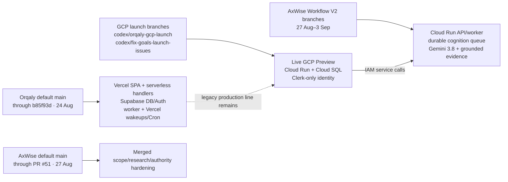
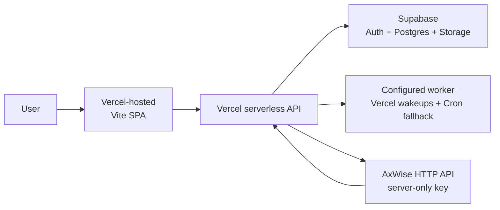
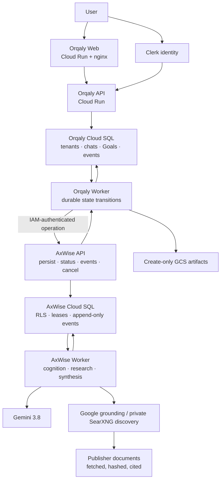
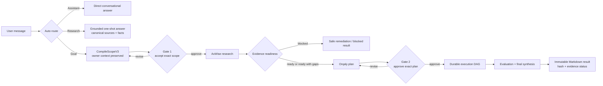
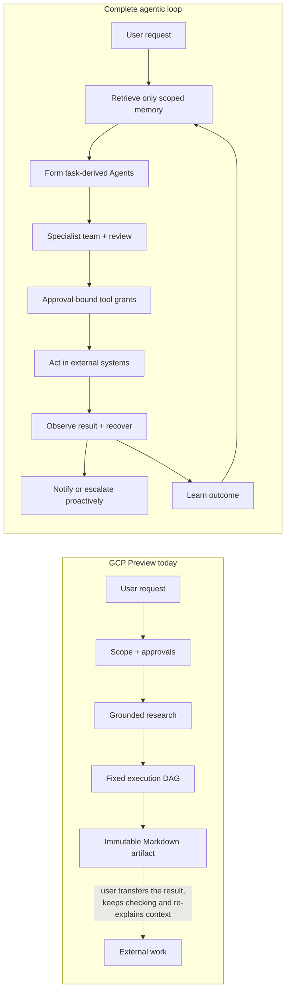
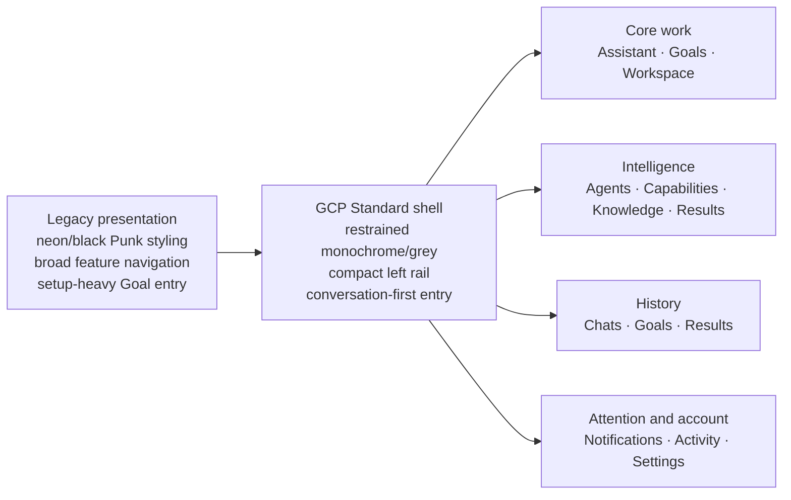

# Orqaly × AxWise transition status

**Review window:** 21 August–4 September 2026, inclusive

**Snapshot:** 4 September 2026, Europe/Berlin
**Repositories:** [Orqaly pull requests](https://github.com/mistersbuilder/orchestratori/pulls) (private) and [AxWise Flow OSS](https://github.com/vitalyvishnevsky/axwise-flow-oss)

> **Status note (4 September 2026):** the historical implementation findings in this audit remain useful, but its open-ended legacy-data migration recommendations are superseded by the [active Agentic implementation plan](./orqaly-agentic-execution-implementation-plan-2026-09-04.md). The approved boundary is a fresh, empty GCP Agent data/execution plane with no Supabase import, backfill, replication, dual-write, fallback read or Agent-context dependency.

## Executive conclusion

The core transition is real, but it is a **GCP Preview transition—not yet a production cutover or full product migration**.

The successful part is the new personal-workspace loop: Clerk sign-in, conversational Assistant, scope compilation, two approval gates, AxWise research/cognition, durable Goal execution, evidence-aware completion, immutable Markdown artifacts, history, notifications, and activity. That loop is present in a live Cloud Run Preview and backed by a Cloud SQL-ready API.

The incomplete part is equally important: Orqaly's default branch still describes and builds the Vercel/Supabase application; the GCP implementation lives on separate launch/snapshot branches; production promotion is explicitly closed; retained data and product capabilities have not all moved; and several retained screens are read-only or visibly marked **In progress**. Features intentionally removed from the lean product are excluded from the migration backlog below.

| Question | Finding |
|---|---|
| Has the core Orqaly experience moved to GCP? | **Yes, in Preview.** The web and API are live on Cloud Run; `/readyz` reports the Preview database ready. |
| Is AxWise embedded into Orqaly? | **Yes, as a server-side cognitive subsystem.** It is not an iframe, client SDK, or replacement backend. Orqaly remains the workflow and authorization authority. |
| Is Orqaly production off Vercel/Supabase? | **No evidence of that.** Default `main` remains the legacy line, and GCP production promotion is not allowed yet. |
| Are all retained feature and data contracts moved? | **No.** Task-derived executor agents, routed long-term memory, proactive notifications and several management surfaces remain partial or absent. Intentionally removed modules are not counted as gaps. |
| Is the central UX usable? | **Yes, with Preview caveats.** Persisted chats, Goals, approvals, outcomes, blocked states and evidence gaps are visible. Recovery, onboarding, mobile, rich artifact and management surfaces remain incomplete or unverified. |

## 1. The actual state: two product lines coexist

This distinction prevents most status confusion.

Authenticated review found 16 Orqaly PRs updated in the window: eight merged and eight open/draft. The last merge into Orqaly `main` was [#54](https://github.com/mistersbuilder/orchestratori/pull/54) on 24 August. That branch still documents Vercel and Supabase. The later GCP work appears on `codex/orqaly-gcp-launch` and `codex/fix-goals-launch-issues`, not in a merged PR found during the review.

AxWise has a similar split. Nine PRs were merged into `main` through [#51](https://github.com/vitalyvishnevsky/axwise-flow-oss/pull/51) on 27 August, establishing the core contracts. The combined Workflow V2/GCP implementation then continued on committed branches; the local aggregate branch is 99 commits beyond `origin/main` and changes 148 files (+51,156/-495).

## 2. Architecture: what changed

### Before: Vercel/Supabase Orqaly with external AxWise calls

AxWise integration itself predates this two-week window. The period reviewed here was primarily a **hardening, scope-first redesign and GCP re-platforming**, not the first connection between the products.

### Now in GCP Preview: a split control plane and cognitive plane

The separation is deliberate:

- Orqaly owns identity, tenancy, approvals, state transitions, credentials, budgets, execution, final status and user-facing records.
- AxWise owns bounded cognition: Assistant turns, scope compilation, evidence acquisition, research, plan/evaluation/synthesis inputs and typed failure facts.
- AxWise events may report facts, but they do not choose the next Orqaly state. The [Workflow V2 transition table](https://github.com/mistersbuilder/orchestratori/blob/codex/orqaly-gcp-launch/docs/workflow-v2/TRANSITION_TABLE.md) keeps successor, retry, approval and terminal-state authority in Orqaly.
- The AxWise API does not receive Gemini or authority-seal secrets; those belong only to the worker. The older responsibility rule remains concise: “AxWise recommends; Orqaly revalidates, authorizes and executes” in the [integration guide](../ORQALY_DEV_INTEGRATION_GUIDE.md).

## 3. What successfully transitioned

### 3.1 Core runtime and identity — transitioned to Preview

- A separate Cloud Run web application is live at the [Orqaly GCP Preview](https://orqaly-v2-web-preview-161074549006.europe-west4.run.app/).
- The deployed web bundle targets a separate Cloud Run API. Its [readiness endpoint](https://orqaly-v2-api-preview-161074549006.europe-west4.run.app/readyz) returned HTTP 200 with `status=ok`, `database=ok`, and `environment=preview` during this review.
- Clerk is the only sign-in identity in the lean GCP shell. A session creates or resolves an app-owned personal Orqaly tenant; the Settings page explicitly says there is no second Supabase account.
- The live workspace shows persisted tenant data rather than static mock cards: chats, seven Goal runs, six outcomes/artifacts and a 50-event activity projection were visible.

**Verdict:** technically transitioned for Preview. Clean-account sign-up and first-run provisioning were not independently exercised, and the Preview still uses Clerk Development mode.

### 3.2 Durable Assistant → Goal workflow — transitioned to Preview

The central journey is now both coded and visible:

- Home offers Auto, Assistant, Research and Goal routing.
- Assistant conversations persist and can be resumed from Recents.
- `CompileScopeV3` uses up to six prior exchanges but preserves authority order: current owner instruction, earlier owner instruction, then Assistant reference.
- Simple and Advanced views project the same state machine instead of maintaining separate execution semantics.
- Scope and plan approvals bind exact artifacts and input hashes.
- Durable state handles polling, leases, redispatch, retries, cancellation and append-only events.
- Research ends as `ready`, `ready_with_gaps`, or `blocked`; it does not silently turn incomplete evidence into success.
- Final Goal outcomes remain linked to their originating run with an immutable hash.

**Verdict:** transitioned in Preview. A fresh release-gate run of the exact current image pair in both Simple and Advanced modes is still required before production.

### 3.3 AxWise cognition and safety contracts — successfully implemented

The AxWise merged PR sequence provides the contract foundation:

- [#42](https://github.com/vitalyvishnevsky/axwise-flow-oss/pull/42): cold-start recovery, cancellation-race protection, tenant-scoped caches and safer logs.
- [#43](https://github.com/vitalyvishnevsky/axwise-flow-oss/pull/43): a universal scope/persona cognition contract.
- [#44](https://github.com/vitalyvishnevsky/axwise-flow-oss/pull/44): typed immutable research acceptance and retirement of direct paid simulation starts.
- [#46](https://github.com/vitalyvishnevsky/axwise-flow-oss/pull/46): durable scope corrections, proposals, acceptance, retries and leases.
- [#47](https://github.com/vitalyvishnevsky/axwise-flow-oss/pull/47): consumer authority and atomic research dispatch.
- [#48](https://github.com/vitalyvishnevsky/axwise-flow-oss/pull/48): sealed per-node tool/action grants and fail-closed drift detection.
- [#49](https://github.com/vitalyvishnevsky/axwise-flow-oss/pull/49): stale-snapshot recovery and reuse of completed research without paying twice.
- [#50](https://github.com/vitalyvishnevsky/axwise-flow-oss/pull/50) and [#51](https://github.com/vitalyvishnevsky/axwise-flow-oss/pull/51): safe PRD admission and scope-hash-bound commercial evidence policy.

Workflow V2 adds `AssistantTurnV1`, `CompileScopeV3`, grounded-source contracts, Gemini 3.8 provenance, token/search/cost metrics, publisher-document hashing, tenant RLS, worker leases and cooperative cancellation.

**Verdict:** strong implementation evidence. Nine foundational AxWise PRs are merged. The aggregate Workflow V2 tip is branch state, so release provenance still depends on the Orqaly coordinated deployment manifest.

### 3.4 Evidence integrity and honest outcomes — transitioned to Preview

- Search snippets are discovery hints only. Selected publisher content must be fetched and hashed before typed claims can be emitted.
- Completed one-shot research requires source-linked evidence; otherwise it fails closed.
- The live UI distinguishes `Completed`, `Completed with evidence gaps`, and `Blocked`.
- At review time, six completed results were visible: one evidence-ready and five with evidence gaps, plus one blocked Goal elsewhere in history.
- Result rows expose SHA-256 fragments and link back to the exact Goal.

This is a meaningful UX and safety improvement: “completed execution” is no longer presented as synonymous with “fully evidenced result.” It is also a warning that current Preview quality is not yet consistently evidence-ready.

### 3.5 Lean workspace shell — transitioned, often as a reduced first version

The live navigation contains:

- New chat, Recents and Pinned;
- Home, Assistant, Goals and Workspace;
- Intelligence: Agents, Capabilities, Knowledge and Results;
- History: Chats, Goals and Results;
- Notifications, Activity & Usage and Settings.

These routes are not placeholders: each returns tenant-scoped data. Several are intentionally read-only and label themselves **In progress**.

### 3.6 The three defining product requirements — only partially transitioned

| Requirement | Confirmed intended model | What exists in GCP Preview | Status |
|---|---|---|---|
| Task-derived Agent / digital twin | AxWise derives an executor persona for each required role, grounded in the accepted task and research; Orqaly should materialize it as a temporary executor or promote it into a durable Agent | Existing catalogue agent plus a task `requiredRole` and `lens`; no task-derived Agent creation or executor-persona object in Workflow V2 | **Not transitioned end to end** |
| Smart long-term memory | Recall user, Goal and Agent knowledge only from an allowed project/domain/topic/purpose scope, with a relevance threshold and a valid `none` result | Durable tenant/thread chat history and safe Assistant→Goal context; no cross-thread semantic retrieval or Agent-memory namespace | **Thread memory moved; smart memory not moved** |
| Proactive notification system | Durable events become deduplicated, preference-aware notifications delivered in real time and through configured channels | Pull-based in-app attention projection for approvals, blocked/failed work and evidence gaps | **Attention page moved; proactive system not moved** |

#### Executor persona: the digital-twin contract exists, but the Agent lifecycle does not

Confirmed: `axwise_executor_persona_v1` is the intended task-derived professional twin. For every required execution role, AxWise can produce a stable, hashed synthetic profile containing its mission, task fit, expertise, methods, work style, decision lens, output contract, evidence references, customer adaptation, risks and boundaries. It is explicitly non-human, cannot claim real credentials or legal authority, and always requires Orqaly authorization. See the [AxWise research-bundle implementation](https://github.com/vitalyvishnevsky/axwise-flow-oss/blob/2731dccf0df5a0419be5e9da2a59b2fa77fb794e/backend/services/orqaly_research_bundle_service.py).

The legacy Orqaly flow persists these profiles as Goal/run-scoped artifacts, binds one to each task and injects only the Gate-2-approved typed persona into the executor prompt. It can also create generic persistent catalogue-agent rows for missing roles, but it does **not** promote the rich AxWise executor persona into that permanent Agent profile.

The GCP Workflow V2 path is narrower still: it selects an existing `tenant_agent`, binds an immutable snapshot, and applies only a task `requiredRole` plus execution `lens`. Personal-tenant setup inserts one generic Research and Product Agent. The API and worker are not allowed to create/update Agents, and the live [Agents page](https://github.com/mistersbuilder/orchestratori/blob/codex/fix-goals-launch-issues/src/pages/GcpWorkspace/AgentsPage.jsx) is read-only.

Therefore the current implementation supports a **temporary persona overlay**, not a temporary sub-agent or durable digital twin. Completing the intended flow requires a first-class task-Agent instance, persona snapshot/version, expiry or promotion policy, memory namespace, tool grants, execution identity, results/learning link and user-facing create/promote/archive controls.

#### Knowledge and memory: safe thread context moved; routed memory did not

The original Supabase product already contained three relevant layers:

- general Assistant facts/preferences in `assistant_memory`;
- completed-Goal semantic memory in `goal_memory`;
- agent-scoped semantic memory in `knowledge_documents`, filtered by user plus `owner_type` and `owner_id`.

The [legacy Goal-memory schema](https://github.com/mistersbuilder/orchestratori/blob/b85f93df161754e322d41fa9d5d1136a06dfbaeb/supabase/migrations/136_semantic_memory.sql) supports an optional `business_type` filter, and the [agent-memory schema](https://github.com/mistersbuilder/orchestratori/blob/b85f93df161754e322d41fa9d5d1136a06dfbaeb/supabase/migrations/106_agent_memory.sql) supports owner-scoped similarity search. However, the actual [Goal-planning caller](https://github.com/mistersbuilder/orchestratori/blob/b85f93df161754e322d41fa9d5d1136a06dfbaeb/lib/goal-handlers/stages/pm-planning.js#L1659) supplied neither `businessType` nor a relevance threshold. Even the old path therefore could return unrelated top-K completed Goals.

The GCP implementation safely isolates messages by tenant, owner and thread. Assistant requests use only the current thread, while `CompileScopeV3` carries at most six recent completed pairs into a Goal with exact provenance, hashes and current-owner-over-prior-owner-over-assistant authority. A weather conversation in thread A will not enter an SMS-service Goal created from thread B. If both topics occur in the same thread, recency—not topic relevance—controls selection.

There is no migrated vector index, cross-thread memory router, project/domain/topic/purpose partition, minimum relevance threshold, capture/forget/edit policy, sensitivity/expiry policy or “memory used” explanation. The current Knowledge page is an immutable Goal-artifact library, not yet a memory system.

#### Notifications: workflow attention moved; proactive delivery did not

The live flow is `current Goal status → notificationFor() → /v2/overview → NotificationsPage → exact Goal link`. It covers Gate-1/Gate-2 approval requests, blocked/failed Goals and `completed_with_evidence_gaps`. A normal successful completion creates no notification.

There is no notification/outbox table in the GCP server, no list/read/dismiss/preferences/subscription API, and no polling, SSE, WebSocket, service worker or push subscription in the client. The page fetches a current projection on load or manual refresh; resolved attention can disappear without a durable delivery record. The current [Notifications page](https://github.com/mistersbuilder/orchestratori/blob/codex/fix-goals-launch-issues/src/pages/GcpWorkspace/NotificationsPage.jsx) is therefore an honest but limited attention queue.

A complete system still needs durable event-to-notification rules, an outbox and delivery ledger, deduplication/idempotency, success and wider system events, live fan-out, unread/dismiss/archive state, preferences, quiet hours/digests/escalation, retry/dead-letter handling, receipts, email/web/mobile push and cross-device state.

### 3.7 What real functionality and agentic capability was lost or narrowed

The net change is larger than a UI reduction. Workflow V2 successfully replaces the durable **research-to-artifact control plane**, but it does not yet replace the former **action, automation and learning planes**.

Here, **real legacy capability** means there is evidence of a callable implementation plus supporting schema, consumer/UI or tests. It does not mean every path was heavily used or reliable in the old production deployment. Representative legacy tests for specialist provisioning, sub-agent execution, tool authorization, human-task resumption, scheduling, memory and outcome delivery passed 120 tests across eight files during this audit.

#### Core retained capabilities that are currently absent or materially reduced

| Capability | What genuinely existed before | Problem it solved for the user | GCP Preview now | Assessment |
|---|---|---|---|---|
| External tools and real actions | Credential-aware provisioning plus a ReAct-style runner for GitHub, HTTP/API, Composio, Cloudflare deployment, files, landing pages, PDFs and images; execution authority was rechecked before side effects | The Agent could finish work in another system instead of returning instructions for the user to copy and execute | `toolIds` are bound as task metadata, but no retained business-tool runner is wired; the concrete side effect is final Markdown export to GCS | **Critical agentic regression. Restore through approval-bound, idempotent GCP action executors** |
| Task-derived Agents / digital twins | AxWise generated a rich, evidence-linked executor persona; Orqaly versioned it, bound it to the approved task and injected it at execution. Missing generic role agents and a Team Lead could also be added to Agent Hub | A Goal received the right professional mission, methods, audience adaptation and limits without the user manually configuring an Agent | One generic Research and Product Agent can service every role with only `requiredRole` and `lens`; no persona instance, memory namespace, expiry or promotion | **Critical product-promise gap. Materialize the persona as a temporary Agent and allow explicit promotion** |
| Delegated sub-agents and independent specialists | Owned blueprints could launch quota-checked child `agent_jobs` with parent execution, node and Goal provenance; team formation created distinct role assignments | Complex work could be decomposed, delegated and independently reviewed instead of simulated by one generic voice | The durable DAG has specialist-labelled tasks, but the same catalogue Agent may execute all of them; there is no child-Agent/job contract | **High. Restore distinct execution identities and reviewer separation; do not copy the incomplete legacy join mechanism** |
| Smart cross-run and Agent memory | Completed-Goal semantic memory, agent-scoped vector memory and agent chat history had tenant/owner filters; completed outputs and decisions could inform later work | The user did not have to repeat stable context, and each specialist could develop continuity without borrowing another Agent's history | Safe same-thread context only; no cross-thread retrieval, Agent namespace or topic/purpose router | **Critical. Restore with stricter project/topic/purpose routing, relevance threshold, provenance and explicit `none`** |
| Knowledge ingestion and retrieval | Knowledge CRUD, versions, embeddings, search filters, uploads/links and agent-linked outputs; connections for Notion, Obsidian and cloud drives, with varying levels of completeness | Agents could work from private company/project evidence instead of only the current prompt and public web | Knowledge is an immutable Goal-artifact library; upload, connections, indexing and retrieval are absent | **High retained gap. Start with GCS upload and one end-to-end connector, then expand** |
| General human-task checkpoint and safe resume | Missing credentials or manual integration steps became owner-scoped tasks; completion could store BYOK securely and resume the exact `awaiting_tools` Goal using compare-and-set controls | An Agent blocked by a human-only step could request exactly that step and continue rather than fail or lose state | Two fixed approval gates survive, but there is no general claim/complete/deadline/escalate/resume task model | **High once external tools return. Rebuild as a durable Workflow V2 checkpoint/outbox** |
| Proactive notifications | An in-app store, mark-read APIs, notification preferences, email dispatch and Web Push subscription/delivery code existed; long-running events and human tasks could trigger delivery | The user could leave Orqaly and still learn that approval, intervention, failure or completion needed attention | A pull-based page projects current Goal states; no success notification, durable delivery record, badge/live fan-out or external channel | **Critical unattended-work gap. Restore the whole event → outbox → delivery → receipt loop** |
| Agent, skill and tool lifecycle | Agent Hub, profiles, skill packs/forge, libraries, tool assignment/whitelisting, provider connection testing and reports exposed management operations | Users could define who works, what the Agent knows, what it may use and whether it is healthy | Agents and Capabilities are read-only catalogue views, with zero assigned tools in the reviewed tenant | **High. Restore task-Agent lifecycle first, then CRUD, assignments, credential health and test runs** |
| Outcome learning | Orqaly emitted idempotent per-node quality/cost/latency/rework receipts; AxWise stored observations and could update later Agent scoring after sufficient safe evidence | Agent selection could improve from real outcomes rather than remain a static model catalogue | Workflow events and within-run evaluation remain, but there is no cross-run outcome-submission/scoring loop | **High. Restore only with auditability, minimum sample sizes and rollback** |
| Assistant as a safe operator | The legacy Assistant accepted attachments and structured context, emitted typed proposed actions and could perform confirmed core entity/tool operations | Conversation could become work without making the user navigate every management page or manually transfer files | Durable chat, direct answer, research and Goal promotion are stronger; attachments and general confirmation-gated action intents are absent | **High. Add GCS/Knowledge attachments and narrowly scoped, approval-bound actions—not the old unrestricted breadth** |
| Organization collaboration and RBAC | Organization hierarchy, memberships, roles, permissions, team/Agent assignment and audit-oriented administration had product surfaces and schemas | B2B teams could share ownership, delegate approvals and enforce least privilege | Personal Clerk subject mapped to one app tenant; Workspace is mainly a readiness/catalogue view | **Conditional:** P0 before team GA, but a valid deliberate deferral for an explicitly personal-only launch |
| Usable deliverables and observability | Result refinement/version selection, richer viewers/exports, tracked model/provider/token/cost data, Goal traces and audit-oriented views existed in varying completeness | Outputs could be inspected, iterated, exported and trusted; owners could diagnose spend and failures | Results expose status, evidence state, hashes and Goal links; dedicated viewer/download and complete model/tool/token/cost traces remain | **High for viewer/download and operational telemetry; builders/dashboards can remain deferred** |

#### Deliberate simplifications that still removed useful behavior

These are not accidental migration defects because the lean manifest explicitly replaces or defers them. They nevertheless explain why the new product feels less autonomous.

| Deliberately reduced area | User problem the old mechanism addressed | Recommended treatment |
|---|---|---|
| User schedules, recurring Goals and Pulse actions | “Run this every Monday,” monitor a KPI, refresh credentials, synchronize Knowledge or repeat a proven Goal without manual relaunch | Do **not** port Pulse as an experimental product. Rebuild the valuable subset as Cloud Scheduler/Run Jobs plus durable Workflow V2 recurrence and owner pause controls |
| Arbitrary visual workflow DAGs | Compose reusable trigger → transform/condition → LLM/tool/sub-agent/report automations | Keep the fixed Goal workflow for first release; reintroduce user-authored workflows only if automation composition is a target use case |
| Broad dashboards, layout customization and separate management cockpits | Power-user monitoring and personalization | Keep the lean information architecture; restore only controls backed by live Agents, Knowledge, Notifications, Results and Activity contracts |

Several old paths should **not** be counted as lost working capability: the generic workflow `humanapproval` node did not truly suspend and rejoin; child sub-agents could be fired but `wait_for_result` joining was incomplete; paid human escalation was disabled; browser/CAPTCHA tasks often produced a handoff rather than completing inline; and the Vercel runner was sequential and timeout-constrained. The migration should recover the user outcome under GCP-native durable contracts, not preserve those flaws.

## 4. UI/UX changes

### 4.1 Interaction model

The product moved from setup-heavy screens toward a conversation-first model:

- A user starts with a message, not a questionnaire.
- AxWise compiles a concise scope with safe defaults and at most one material clarification.
- The user can continue conversationally or promote the request into a durable Goal.
- Scope and plan approval are separate, understandable checkpoints.
- Long-running work remains visible as a thread/history record instead of disappearing behind a spinner.
- Failures are translated into actionable human language; BYOK problems in the legacy line link to API-key recovery.

This evolution was built first in the Vercel-era merges [#45](https://github.com/mistersbuilder/orchestratori/pull/45), [#46](https://github.com/mistersbuilder/orchestratori/pull/46), [#47](https://github.com/mistersbuilder/orchestratori/pull/47), [#53](https://github.com/mistersbuilder/orchestratori/pull/53) and [#54](https://github.com/mistersbuilder/orchestratori/pull/54), then selectively reimplemented for the lean GCP shell.

### 4.2 Visual and information-architecture change

The footer now explicitly brands the product **AxWise & Orqaly**. The redesign is live in the GCP Preview, but it was selectively adapted from the still-open Standard UI work around [#59](https://github.com/mistersbuilder/orchestratori/pull/59); the large conflicted branch was not merged wholesale.

### 4.3 Live screen-by-screen status

| Surface | Available now in GCP Preview | Still missing or unverified |
|---|---|---|
| Home | Auto/Assistant/Research/Goal routing and current-work entry | File attachments; advanced Goal setup |
| Assistant | Persisted conversations, recent/pinned navigation, conversational routing | Attachment flow; complete failure-repair UX; all routing cases independently exercised |
| Goals | Simple/Advanced, scope compilation, approvals, history, durable statuses | Fresh two-mode release-gate evidence; clearer repair action on some blocked research |
| Workspace | Clerk-to-app tenant mapping, readiness, agent/capability summary | Units, memberships, groups, roles, management actions, cross-device preferences |
| Agents | Existing tenant catalogue, status, capabilities, assigned-tool counts | Task-derived executor-Agent creation, persona materialization, promotion/expiry, create/edit and lifecycle/tool assignment |
| Capabilities | Published catalogue and planner coverage | Personal Catalog installs, provider connections, credential setup/test/rotation |
| Knowledge | Immutable Goal artifacts, hashes and Goal links; tenant/thread chat isolation | Routed long-term memory, Agent namespaces, upload/versioning, connections, indexing and source-backed retrieval |
| Results | Completed outcomes, evidence readiness, hashes, exact-Goal links | Dedicated viewer/download, filters, sharing, retention; CSV/PDF/image parity not proven |
| History | Separate persisted chats, Goals and results | Pagination beyond 50, global search and filters |
| Notifications | Pull-based approvals/blocked/failure/evidence-gap queue | Durable proactive notification system, real-time fan-out, read/dismiss/history, preferences and email/push |
| Activity & Usage | 50 recent events, Goal/completion totals, retry/deferred stages | Token/tool/cost aggregates, traces, filters and export |
| Settings | Clerk profile, sessions and security; no duplicate Supabase user | Broader app preferences and cross-device synchronization |

### 4.4 Accessibility and mobile

Merged UI work added reduced-motion handling, semantic composer labels, responsive contract layouts, skip links and named landmarks. In the deployed accessibility tree, the Simple/Advanced switch appeared with checkbox semantics; it should be rechecked as tabs or a clearly named switch. Mobile keyboard/dock behavior and narrow-screen navigation were not independently verified, so the open mobile work in [#48](https://github.com/mistersbuilder/orchestratori/pull/48) cannot be counted as fully transitioned.

## 5. What has not transitioned

### 5.1 Production cutover — not done

The GCP release documentation keeps `productionPromotionAllowed: false`. Before production, it requires a fresh Preview release built from an exact Orqaly/AxWise commit pair and immutable image digests, then complete Simple and Advanced verticals with:

- a real Clerk user and tenant boundary;
- Assistant clarification and Goal start;
- both approval gates;
- final Markdown and evidence artifacts;
- retry, failure and cancellation behavior;
- logs, model/tool usage, cost and latency;
- cross-tenant denial;
- storage/IAM and rollback/fault verification.

Only after those gates should production infrastructure, domain traffic and the compatible five-service rollout be promoted.

### 5.2 Default-branch integration — not done

The deployed GCP snapshot is not on Orqaly `main`, and the latest combined AxWise Workflow V2 branch is not the tracked upstream default branch. This creates release-governance risk: fixes can be live without one reviewable PR/merge ancestry and default-branch CI record.

Required closeout:

1. Rebase or otherwise consolidate the exact deployed GCP state onto reviewable branches.
2. Open/finish cross-repository PRs with the exact image-pair contract.
3. Run clean CI, migration and release gates on those exact commits.
4. Tag the release and retain the immutable deployment manifest.

### 5.3 Supabase/Vercel retirement and historical data — not done

The lean GCP runtime intentionally starts from isolated Cloud SQL stores; it does not prove backfill of historical Supabase application data. The [GCP module manifest](https://github.com/mistersbuilder/orchestratori/blob/codex/orqaly-gcp-launch/docs/LEAN_GCP_MODULE_MANIFEST.md) records a large legacy surface: 94 routes, 154 production API routes, 151 selector operations, six Vercel dispatchers, seven scheduled jobs, 218 handlers and 229 Supabase migrations.

It also records extensive source coupling still outside the lean graph: 97 `supabase.auth.getSession()` calls, 72 `getUser()` calls, 128 handlers using `verifySupabaseToken`, 850 historical auth/RLS references and 180 foreign keys to `auth.users`.

That does **not** mean the lean Preview still depends on Supabase Auth; it means broad old modules and their data remain migration or retirement work. The team still needs an explicit decision for each domain: migrate, export/archive, defer with read-only access, or delete.

### 5.4 Correctness items still open

- Orqaly [#55](https://github.com/mistersbuilder/orchestratori/pull/55) is a draft and explicitly blocks merge until a structured correction envelope and `ScopeContinuationBinding` pass cross-repository tests. This is the principal lossless-scope-through-Gate-1 risk.
- AxWise [#52](https://github.com/vitalyvishnevsky/axwise-flow-oss/pull/52) remains open; it projects long accepted goals into a bounded immutable topic schema and fixes a title-length failure that can block research.
- Open Orqaly [#58](https://github.com/mistersbuilder/orchestratori/pull/58) and [#59](https://github.com/mistersbuilder/orchestratori/pull/59) are conflicted, stacked UI/backend branches. Their Supabase migration numbering/history must be reconciled before reusing any code.
- Five of six live completed Preview results were labelled `Completed with evidence gaps`; stronger repair actions and consistently evidence-ready output remain quality work.

### 5.5 Intentionally removed features — excluded from the backlog

The first GCP release deliberately removes or excludes product areas outside the retained personal-workspace graph. They are **not** classified as unfinished migration work in this report and should not be carried into the launch backlog unless a separate product decision adds them back. Likewise, a feature being present in the Vercel-era `main` does not make it part of the GCP target.

## 6. Two-week chronology

```mermaid
flowchart LR
    D21["21 Aug<br/>Orqaly #45<br/>persistent Goal + results"] --> D23["23 Aug<br/>#46/#47/#49/#50/#51<br/>settings, recovery, roles, model"]
    D23 --> D24["24 Aug<br/>Orqaly #53/#54<br/>scope-first + two gates"]
    D24 --> D27["23–27 Aug<br/>AxWise #42–#51<br/>scope, research, grants, recovery"]
    D27 --> D31["27–31 Aug<br/>AxWise Workflow V2<br/>Cloud SQL queue + evidence"]
    D31 --> S1["1 Sep<br/>Orqaly lean GCP launch<br/>Cloud Run shell + control plane"]
    S1 --> S2["2 Sep<br/>durable Assistant/Goal context<br/>CompileScopeV3"]
    S2 --> S3["3 Sep<br/>Gemini 3.8, provenance,<br/>grounded reader + UI polish"]
    S3 --> S4["4 Sep review<br/>Preview live<br/>production gate still closed"]
```

## 7. Prioritized completion plan

### P0 — make the release auditable and promotable

1. Consolidate the deployed Orqaly and AxWise commits into reviewed, green branches/PRs.
2. Rebuild all five application services from the exact commit pair and pin immutable digests.
3. Apply and verify Orqaly migrations 001–007 and AxWise migrations 001–005 from clean Preview databases using checksums.
4. Run both complete Simple and Advanced two-gate verticals plus tenant-denial, retry/cancel, worker-restart, storage-IAM and rollback tests.
5. Publish the evidence manifest; only then enable production infrastructure and traffic promotion.

### P0 — close correctness holes

1. Finish the typed correction/continuation binding represented by Orqaly #55 or prove the GCP implementation supersedes it with equivalent cross-repository tests.
2. Merge or supersede AxWise #52's long-topic bound.
3. Add an obvious revise/retry/repair action to blocked and evidence-gap Goal states.

### P0 — restore the minimum agentic product loop

1. Materialize each approved AxWise executor persona as a distinct task-scoped Agent, with immutable role/persona provenance, execution identity, expiry and explicit promotion.
2. Add one GCP-native, approval-bound external action path end to end: credential setup and health, sealed tool grant, idempotent execution, external receipt, retry/recovery and revocation.
3. Add scoped memory retrieval for the task Agent, requiring project/topic/purpose routing, a minimum relevance threshold, provenance and a valid no-memory result.
4. Convert workflow events into a durable proactive notification/outbox pipeline with in-app delivery, completion/approval/failure events and email as the first external channel.
5. Prove the combined loop: request → scoped memory → task-Agent team → approvals → external tool action → outcome receipt → proactive notification.

### P1 — finish the retained personal workspace

1. Clean-account Clerk onboarding and idempotent first-run workspace provisioning.
2. Expand Knowledge upload, versioning, indexing and retrieval, then add supported source connections incrementally.
3. Complete Agent/capability lifecycle management, tool assignment, credential rotation and test runs beyond the minimum action slice.
4. Add app-owned preference sync and workspace membership/role controls where required by the launch audience.
5. Add artifact viewer/download, multi-format parity, filters, sharing, retention and refinement lineage.
6. Restore idempotent AxWise outcome feedback and conservative cross-run Agent scoring.
7. Complete usage/cost/trace observability, audit filtering/export and mobile/accessibility verification.

### P1 — retire or isolate the old stack

1. Inventory legacy production traffic, Vercel handlers and Cron jobs by actual use.
2. Define per-domain data handling: migrate, archive/export, leave read-only temporarily, or remove.
3. Remove runtime Vercel/Supabase dependencies only after the corresponding traffic/data gate passes.
4. Keep old source available during rollback, but stop deploying unused handlers once cutover is proven.

## 8. Pull-request ledger

### Orqaly

| PR | Status | Contribution | Transition interpretation |
|---|---|---|---|
| [#45](https://github.com/mistersbuilder/orchestratori/pull/45) | Merged | Persistent Goal, Thread/Dashboard, result viewer, Arena | Core Goal ideas transitioned; Arena and full viewer parity did not |
| [#46](https://github.com/mistersbuilder/orchestratori/pull/46) | Merged | Setup system and Settings rail | Design foundation; GCP Settings is narrower |
| [#47](https://github.com/mistersbuilder/orchestratori/pull/47) | Merged | AxWise polling, recovery, tenant normalization | Core reliability behavior transitioned |
| [#49](https://github.com/mistersbuilder/orchestratori/pull/49) | Merged | Exact assignments and controlled E2E | Contract foundation; PR-authored E2E evidence |
| [#50](https://github.com/mistersbuilder/orchestratori/pull/50) | Merged | Gemini 3.7/reasoning catalogue | Product/model change, not GCP migration |
| [#51](https://github.com/mistersbuilder/orchestratori/pull/51) | Merged | Exact role mapping/revalidation | Transitioned contract |
| [#53](https://github.com/mistersbuilder/orchestratori/pull/53) | Merged | Persona/scope preservation and quality attestation | Core scope UX/contract transitioned |
| [#54](https://github.com/mistersbuilder/orchestratori/pull/54) | Merged | Exact owner acceptance, disclosure, two-gate binding | Core safety model transitioned |
| [#44](https://github.com/mistersbuilder/orchestratori/pull/44) | Open | Conversation-thread Goal prototype | Superseded/partly reimplemented |
| [#48](https://github.com/mistersbuilder/orchestratori/pull/48) | Open | Notifications, page help, mobile | Superseded; only lean notification slice is live |
| [#52](https://github.com/mistersbuilder/orchestratori/pull/52) | Open | Illustrations, run detail, transcript | Superseded/partial ideas only |
| [#55](https://github.com/mistersbuilder/orchestratori/pull/55) | Draft | Gate-1 scope continuity | Explicit unfinished correctness work |
| [#56](https://github.com/mistersbuilder/orchestratori/pull/56) | Open | Personal Catalog/marketplace | Superseded; install UX still missing |
| [#57](https://github.com/mistersbuilder/orchestratori/pull/57) | Open | Aggregate UI branch | Superseded by #58 |
| [#58](https://github.com/mistersbuilder/orchestratori/pull/58) | Open/conflicted | First-run, credits, broad Standard UI | Not safely transitioned; migration reconciliation needed |
| [#59](https://github.com/mistersbuilder/orchestratori/pull/59) | Open/conflicted | Standard shell and broad product sweep | Selectively adapted to GCP, not merged wholesale |

### AxWise

| PR | Status | Contribution |
|---|---|---|
| [#42](https://github.com/vitalyvishnevsky/axwise-flow-oss/pull/42) | Merged | Orqaly integration reliability and safe recovery |
| [#43](https://github.com/vitalyvishnevsky/axwise-flow-oss/pull/43) | Merged | Universal scope/persona cognition |
| [#44](https://github.com/vitalyvishnevsky/axwise-flow-oss/pull/44) | Merged | Typed research acceptance and immutable contracts |
| [#45](https://github.com/vitalyvishnevsky/axwise-flow-oss/pull/45) | Draft | Transitional regex scope correction; do not merge |
| [#46](https://github.com/vitalyvishnevsky/axwise-flow-oss/pull/46) | Merged | Normalized durable scope lifecycle |
| [#47](https://github.com/vitalyvishnevsky/axwise-flow-oss/pull/47) | Merged | Consumer authority and atomicity |
| [#48](https://github.com/vitalyvishnevsky/axwise-flow-oss/pull/48) | Merged | Sealed tool/action authority |
| [#49](https://github.com/vitalyvishnevsky/axwise-flow-oss/pull/49) | Merged | Stale-scope recovery without duplicate research |
| [#50](https://github.com/vitalyvishnevsky/axwise-flow-oss/pull/50) | Merged | Launch-PRD admission |
| [#51](https://github.com/vitalyvishnevsky/axwise-flow-oss/pull/51) | Merged | Commercial evidence policy and scope hash binding |
| [#52](https://github.com/vitalyvishnevsky/axwise-flow-oss/pull/52) | Open | Bounded long-goal topic contract |

## 9. Verification and confidence

Evidence combined four layers:

1. PR and commit history in both repositories for the exact date window.
2. Default-branch and non-default-branch architecture/deployment documentation.
3. Local AxWise branch/code inspection and a selected test spot check.
4. Direct inspection of the signed-in GCP Preview plus public web/API readiness probes on 4 September.

The independently reproduced AxWise spot check passed 775 selected Workflow V2 tests. One additional test failed because the host had `pydantic-ai-slim` 2.5.0 while the branch lock requires 2.28.0; PostgreSQL RLS/lease integration tests were not rerun locally. Large test totals quoted in Orqaly PRs are author-reported, not independently replayed here.

The live Preview observations prove deployed behavior and persisted sample records. They do not prove production traffic, availability, clean-account onboarding, every workflow branch, mobile behavior, historical-data migration, or the exact internal health of all five services. Those remain release-gate evidence, not assumptions.

## Final assessment

The last two weeks delivered a coherent **AxWise-powered Orqaly core on GCP Preview**: durable conversations and Goals, exact scope/plan approvals, separated execution authority, grounded research, transparent evidence readiness, immutable outcomes and a much leaner workspace UX.

The biggest regression is **closed-loop agency**. Executor personas are not materialized as task Agents/digital twins; specialist labels do not guarantee distinct delegated Agents; thread history is not routed long-term memory; approved plans cannot execute retained business tools; and the notification page is not a proactive delivery system. Cross-run outcome learning, generalized human checkpoints and several Knowledge/management surfaces are also absent or reduced.

These are core product capabilities, not a request to restore every legacy screen. The right target is a GCP-native loop that can remember within strict boundaries, form a scoped digital workforce, act under sealed authority, recover through a human when needed, report the external result, notify the owner and improve from auditable outcomes. Intentionally removed verticals and known-incomplete legacy mechanics remain excluded.
