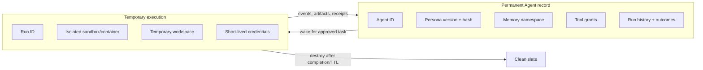
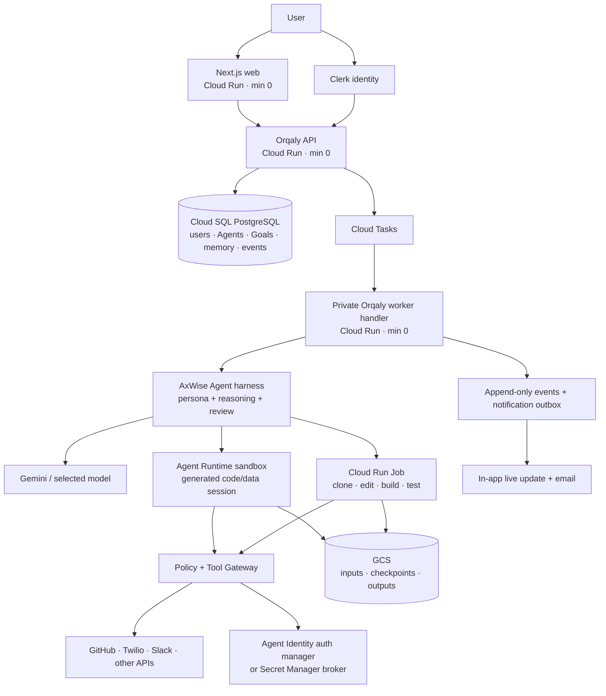
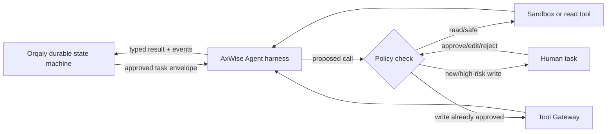

# Orqaly delegated-Agent runtime and harness proposal

**Date:** 4 September 2026
**Scope:** where an Orqaly/AxWise Agent exists, where it runs, how it is isolated, how its memory/files/credentials are stored, and which low-cost hosting model fits the current GCP transition.

> **Status: superseded background research.** The authoritative implementation baseline is [Orqaly universal delegated-Agent execution implementation plan](./orqaly-agentic-execution-implementation-plan-2026-09-04.md). Where this research note differs, the implementation plan wins: the current Orqaly Vite/MUI app requires a new non-Supabase Agent auth gateway; Orqaly owns the bounded Agent harness and canonical runtime state; AxWise supplies advisory persona/planning/evaluation contracts; and Google Agent Runtime remains an optional future adapter comparison rather than the selected baseline.

## Executive decision

Keep the Orqaly control plane and AxWise cognition on GCP. Do **not** create one permanently running VM for every Agent.

An Agent should exist permanently as a durable identity, persona version, memory boundary, permissions and history. Its compute should exist only while it has work:

1. Orqaly creates a task-Agent record for one user/workspace/Goal.
2. A short-lived isolated runtime starts for one execution.
3. The runtime receives only the approved scope, selected memories and narrow tool grants.
4. It completes or pauses, persists receipts/artifacts, and shuts down.
5. The Agent record remains and can later be resumed, promoted or expired.

The options below were evaluated before the ownership split was finalized. Refer to the authoritative plan for the selected deployment and current implementation status.

## 1. What “the Agent exists” means

The Agent is not primarily a continuously running process. It has two halves:



This is the same broad separation modern agent systems make between session/state and execution. Cloud Run instances are stateless and discarded when they terminate, while Google recommends external stores for persistent state. Each Cloud Run instance is isolated from others behind a VM-monitor boundary. [Cloud Run security design](https://docs.cloud.google.com/run/docs/securing/security)

### Isolation rule for every task

- A read-only chat or research step may run on a shared service, but every database query is still constrained by `workspace_id`, `project_id`, `agent_id` and `run_id`.
- Any task that changes code, sends a message, calls a customer system, publishes content or spends money receives a unique run envelope and isolated execution.
- Repository work, generated code and tests run in a disposable sandbox with no production credential access.
- The component that actually performs an external mutation is a narrow Tool Gateway, not arbitrary model-generated code.
- An independent reviewer gets read access to the output but never the executor's write credential.

The user therefore gets isolation even for a small operational action, without paying for a separate 24/7 VM.

## 2. Recommended deployment architecture



Cloud Tasks can securely invoke a private Cloud Run handler, preserve work through incidents, retry it and throttle calls to downstream services. [Cloud Tasks with Cloud Run](https://docs.cloud.google.com/run/docs/triggering/using-tasks)

Cloud Run Jobs run a container to completion rather than serving requests, support retries and tasks up to seven days, and require no permanent VM. [Cloud Run Jobs](https://cloud.google.com/run/docs/create-jobs)

Google Agent Runtime's code-execution tool provides a sandbox that persists files and variables across tool calls in one Agent session, is isolated at process level, and is deleted explicitly or by TTL. It is suitable for iterative generated code and data work. [Agent Runtime Code Execution](https://google.github.io/adk-docs/tools/google-cloud/code-exec-agent-engine/)

### What performs a GitHub change

1. The user approves the exact plan and action class.
2. Orqaly stores an `action_intent` and queues its `run_id`; it does not put secrets in the queue.
3. A Cloud Run Job creates an ephemeral checkout, prepares the change and runs local tests.
4. The sandbox returns a diff, test results and requested GitHub operation to the Tool Gateway.
5. The Tool Gateway revalidates the approved repository, branch, operation and budget.
6. A GitHub App installation token is obtained only for that operation.
7. The gateway pushes an `orqaly/<run-id>` branch and opens a PR using an explicit bot identity acting for the user.
8. A separate read-only reviewer examines the commit/diff/test evidence.
9. GitHub Actions performs repository CI; it is not the Agent server.
10. Orqaly stores the external IDs/URLs and notifies the user.

The model never receives the raw GitHub credential, and the writable sandbox cannot decide to broaden its own authority.

## 3. Identity: persona is not authority

“Impersonated Agent” should be renamed **delegated persona** or **task-derived Agent**. It may emulate a professional role and the user's preferred working style, but it must not pretend to be a real human or inherit permissions from its prompt.

Use six explicit identity layers:

| Layer | Meaning | Example |
|---|---|---|
| Human principal | Who requested and approved the work | Clerk user `user_…` |
| Workspace/project | Which data boundary applies | B2B SaaS / SMS integration |
| Durable Agent | Which digital worker owns learning/history | Integration Engineer Agent |
| Persona version | Which task-specific behavior was approved | SMS provider evaluator v1, immutable hash |
| Run | One attempt with a start/end and budget | `run_…` |
| Tool grant | Exact delegated external authority | GitHub repo X: create branch and PR; no merge |

Every event and receipt must carry all six relevant IDs.

Google's current Agent Identity model closely matches this requirement: it gives an Agent its own cryptographic identity, supports Agent access to Google resources, and supports delegated end-user OAuth for external systems. Its auth manager can keep raw credentials away from the Agent. [Google Agent Identity overview](https://docs.cloud.google.com/iam/docs/agent-identity-overview)

Recommended UI wording for external actions:

> **Orqaly SMS Integration Agent (AI)**, acting for Alice in Project Acme, opened PR #42 under approved run `run_…`.

Do not allow the Agent to say it *is* Alice, use Alice's personal signature invisibly, claim qualifications it does not have, or infer legal/financial authority from its persona.

## 4. How the modern Agent harness should operate

Current production harnesses usually combine five concerns:

1. **Model/tool loop:** structured tool schemas, observations, turn limits and budgets.
2. **Delegation:** manager-as-controller, specialist-as-tool or explicit handoffs.
3. **Durability:** checkpoints, retries, pause/resume and idempotent side effects.
4. **Security:** guardrails, least-privilege credentials, sandboxes and human approval.
5. **Observability:** trace every model call, handoff, tool request, approval and result.

For example, the OpenAI Agents SDK exposes tools, handoffs, guardrails, sessions and structured tracing; its tracing captures generations, tool calls, handoffs and guardrails. [Agent concepts](https://openai.github.io/openai-agents-python/agents/), [orchestration patterns](https://openai.github.io/openai-agents-python/multi_agent/), [tracing](https://openai.github.io/openai-agents-python/tracing/)

LangGraph persists checkpoints for fault recovery and human interruption/resumption. [LangGraph persistence](https://docs.langchain.com/oss/python/langgraph/persistence) Google ADK's Restate integration similarly journals LLM/tool calls and supports durable sessions, approvals and multi-Agent calls. [ADK + Restate](https://google.github.io/adk-docs/integrations/restate/)

### Exact Orqaly/AxWise split

Do not introduce a second competing workflow authority merely because a framework calls itself durable.

- **Orqaly Workflow V2 is the outer harness:** authorization, state transitions, approvals, retry/cancel policy, budgets, idempotency, events and notifications.
- **AxWise is the inner Agent harness:** compile scope, derive personas, choose specialists, run bounded reasoning/tool loops, evaluate and synthesize.
- **The sandbox is the execution plane:** generated code, temporary repository and tests.
- **The Tool Gateway is the authority plane:** credentials and irreversible/external mutations.



### One task-Agent lifecycle

1. Compile an exact user scope.
2. Determine required roles and risk class.
3. AxWise emits `ExecutorPersonaV1` for each role.
4. Orqaly validates it, labels it synthetic, hashes it and presents material behavior at Gate 2.
5. Approval creates `task_agent`, `persona_version`, `memory_scope` and preliminary `tool_grants`.
6. Retrieve only memory matching tenant, project, topic, purpose, Agent and relevance threshold.
7. Start a unique run and sandbox.
8. The Agent alternates model reasoning with structured tool proposals under turn/time/token/cost limits.
9. Policy either executes, pauses for human action, or rejects each proposal.
10. Checkpoint after every model call and tool observation.
11. A distinct reviewer Agent evaluates the artifact/action evidence.
12. Commit the external action, receipt, artifact hash and outcome.
13. Notify the user.
14. Extract candidate memories; store only policy-accepted items with provenance.
15. Expire the temporary Agent or let the user promote it.

### Persona precedence

The persona belongs below platform safety, user authority and tool policy:

```text
platform safety and legal policy
  > exact owner-approved scope
  > sealed tool and data grants
  > task-derived persona
  > retrieved untrusted memory/evidence
  > current observation/tool output
```

A persona may change *how* the Agent reasons and presents work. It may not decide *what it is allowed to access or do*.

## 5. Storage organization

### PostgreSQL: durable structured state

Keep the existing PostgreSQL direction and use `pgvector`; Cloud SQL officially supports storing and querying embeddings with that extension. [Cloud SQL vector support](https://docs.cloud.google.com/sql/docs/postgres/ai-overview)

Core tables:

```text
workspaces, projects, workspace_members
agents, agent_versions, task_agents
goals, runs, run_steps, run_events
memory_items, memory_embeddings, memory_use_events
tool_connections, tool_grants
action_intents, action_attempts, action_receipts
approvals, human_tasks
artifacts, evidence_sources
notifications, notification_deliveries
```

Rules:

- Every tenant-owned row includes `workspace_id`.
- Every execution row includes `agent_id` and `run_id`.
- Every memory includes project/topic/purpose/provenance/sensitivity/expiry metadata.
- Every side effect has a unique idempotency key.
- Database roles and row-level policies fail closed if workspace context is absent.
- PostgreSQL stores credential references, never credential values.

### GCS: files and immutable artifacts

```text
gs://orqaly-<environment>-artifacts/
  workspaces/{workspace-id}/
    projects/{project-id}/
      agents/{agent-id}/
        runs/{run-id}/
          inputs/
          checkpoints/
          workspace/
          outputs/
          evidence/
          test-results/
          receipts/
```

The object name is organization, not the security boundary. Users access objects through an authorization-checked API or short-lived signed URL. Apply lifecycle rules: temporary checkout/checkpoints for days, user artifacts per product retention, audit receipts per compliance policy.

### Secrets and external credentials

- Use user-delegated OAuth or a GitHub App wherever possible.
- Keep credentials in Agent Identity's auth manager or Secret Manager.
- Give the sandbox no direct vault-read role.
- Let the Tool Gateway obtain a short-lived token after validating the tool grant.
- Store only provider, connection ID, scopes, owner and secret reference in PostgreSQL.

Secret Manager supports versioned secret values, while Cloud Run service identities provide workload authentication to permitted Google APIs. [Secret Manager](https://docs.cloud.google.com/secret-manager/docs/creating-and-accessing-secrets), [Cloud Run service identity](https://docs.cloud.google.com/run/docs/configuring/services/service-identity)

## 6. Hosting choices

| Choice | Can host UI? | Can run durable workflow? | Can run isolated code/tests? | Fit for current Orqaly |
|---|---:|---:|---:|---|
| GCP Cloud Run + Cloud Tasks + Jobs/Agent Runtime | Yes | Yes | Yes | **Recommended: least rewrite and strongest integration** |
| Cloudflare Workers + Workflows + D1/R2 + Containers | Yes | Yes | Yes, but Containers require the $5 Workers Paid plan | Credible greenfield/replaceable sandbox option; full migration is unnecessary |
| GitHub Pages | Static content only | No | No | Documentation/public demo only; GitHub disallows using Pages as free commercial SaaS hosting |
| GitHub Actions | No | CI workflow only | Temporary CI runner | Use only to test Agent-created PRs and deploy images, not as the Agent backend |
| Small always-on VM | Yes | Yes, if self-operated | Yes | Avoid for MVP: fixed cost, patching, backups, supervision and weaker tenant operations |
| Local Docker runner | Local UI only | Only while machine is online | Yes | Excellent development path and optional privacy runner; not the public control plane |

GitHub Pages is static hosting and explicitly is not intended or allowed as free hosting for a commercial SaaS. [GitHub Pages limits](https://docs.github.com/en/pages/getting-started-with-github-pages/github-pages-limits) GitHub also says Actions should not be used as part of a serverless application; hosted jobs are capped and ephemeral. [GitHub Actions terms](https://docs.github.com/en/site-policy/github-terms/github-terms-for-additional-products-and-features), [Actions limits](https://docs.github.com/en/actions/reference/limits)

Cloudflare Workflows provide durable steps, waiting, retries and human events on free and paid plans. D1 and R2 have useful free allowances, while Linux Containers are available on the $5 Workers Paid plan and scale to zero. [Workflows](https://developers.cloudflare.com/workflows/), [Containers](https://developers.cloudflare.com/containers/), [D1 pricing](https://developers.cloudflare.com/d1/platform/pricing/), [R2 pricing](https://developers.cloudflare.com/r2/pricing/)

However, moving the present Python/FastAPI/PostgreSQL implementation to Cloudflare would require replacing runtime, database and IAM assumptions. Cloudflare is best treated as optional edge hosting or a later execution backend, not a reason to restart the transition.

## 7. Low-cost deployment proposal

### Recommended private Preview

1. Keep the Next.js web, Orqaly API and AxWise API on request-billed Cloud Run with `min-instances=0`.
2. Replace the continuously polling worker with Cloud Tasks calling a private worker endpoint.
3. Begin at approximately 1 vCPU / 1 GiB per service and increase only from measured demand.
4. Use Cloud Run Jobs or Agent Runtime sandboxes only while an approved task executes.
5. Keep one small Cloud SQL PostgreSQL instance initially, separating Orqaly/AxWise through databases/schemas/roles rather than paying for multiple instances.
6. Store files in an EU GCS bucket and secrets in Secret Manager.

Cloud Run has a monthly free compute allowance and scales services to zero when they have no requests. Cloud Run Jobs are billed only while their tasks run. [Cloud Run pricing](https://cloud.google.com/run/pricing)

Agent Platform currently includes monthly free allowances for Agent compute, memory and storage; usage beyond them is billed by vCPU-hour/GiB-hour. [Agent Platform pricing](https://cloud.google.com/products/gemini-enterprise-agent-platform/pricing)

Cloud SQL is the principal fixed baseline expense. It has trial credit rather than a general permanent production free tier. [Cloud SQL pricing](https://cloud.google.com/sql/pricing/)

### Zero-cash development/demo

- Use the repository's existing Docker Compose stack locally: PostgreSQL, FastAPI, worker and Next.js.
- Add a local queue adapter that invokes the same task handler without Cloud Tasks.
- Add a rootless isolated runner container for action tests.
- Persist development data in the named PostgreSQL volume and artifacts in a local S3/GCS-compatible store.
- If remote sharing is essential, a free serverless Postgres such as Neon can host a small development database; its current Free plan includes 0.5 GB storage, 100 CU-hours and scale-to-zero. [Neon pricing](https://neon.com/pricing)

This is suitable for development, not unattended production. Free Render instances sleep, have ephemeral files and its free PostgreSQL expires after 30 days. [Render free limitations](https://render.com/docs/free)

### Optional customer-local runner

For private source code or internal networks, offer an `orqaly-runner` Docker package:

1. It makes an outbound authenticated connection to Orqaly; no inbound port is required.
2. It receives only signed jobs for its workspace.
3. It creates a fresh rootless container per run with a read-only base image and temporary workspace.
4. Credentials are supplied only through the customer's local secret store.
5. It returns hashes, logs and receipts, then deletes the container/workspace.

The cloud remains the durable control plane; if the customer's machine is offline, the task stays queued instead of silently moving elsewhere.

## 8. Required changes to the current deployment

The repository's production deploy script currently configures both API and worker with 4 vCPU, 8 GiB and `min-instances=1`; the worker polls every second. This is not the low-cost serverless shape described above.

It also appears to use request-based billing. Google documents that CPU is disabled or severely limited outside active requests in this mode and advises against background routines; Cloud Tasks is the recommended asynchronous alternative. [Cloud Run billing/background guidance](https://docs.cloud.google.com/run/docs/configuring/billing-settings)

Required correction:

```text
API:     request-based Cloud Run, min 0, 1 vCPU/1 GiB initially
Worker:  private request handler, min 0, invoked by Cloud Tasks
Actions: Cloud Run Job or Agent Runtime sandbox, started per approved run
```

## 9. Implementation order

1. Add `task_agents`, immutable persona versions and identity/scope fields.
2. Add action intents, tool grants, idempotent receipts and the Tool Gateway.
3. Replace background polling with Cloud Tasks-triggered state transitions.
4. Implement one GitHub App path: branch + file changes + PR, with a read-only reviewer.
5. Add the execution sandbox adapter: Cloud Run Job first; Agent Runtime sandbox for iterative code sessions.
6. Add scoped memory and GCS Knowledge ingestion.
7. Add human-task pause/resume and durable notifications.
8. Add outcome learning only after complete tracing and evaluation.
9. Add customer-local runner support if privacy demand justifies it.

The first end-to-end proof should be:

> A user requests a small repository change. Orqaly retrieves only that project's memory, creates a temporary implementation Agent and separate reviewer, asks for exact approval, runs the change in an isolated sandbox, opens a GitHub PR through a narrow gateway, records the result, notifies the user and expires or promotes the Agent.

## 10. Immediate security issue discovered during this review

The tracked file `scripts/draft_migration_notification.py` appears to contain a plaintext production PostgreSQL connection credential. Its value is intentionally not reproduced here.

Treat it as compromised: rotate the database credential immediately, replace the code with a Secret Manager reference, inspect access logs, remove the secret from Git history and enable secret scanning. This should be completed before extending the runtime or inviting additional users.
